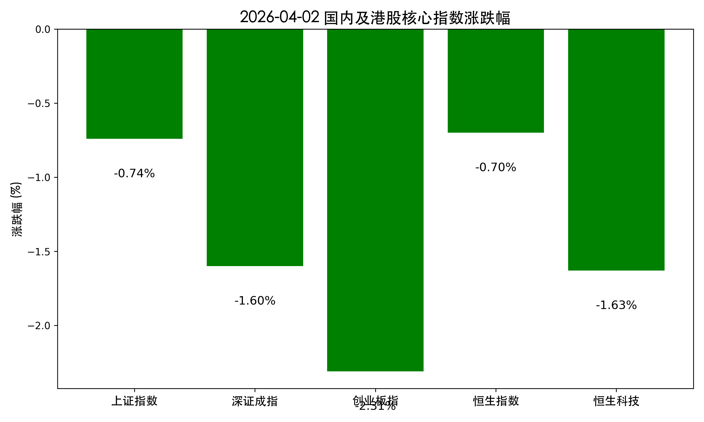

# 2026年4月2日 A股/港股收盘评述：避险情绪升温，石油医药逆势走强

**日期：2026年04月02日 (星期四)** &nbsp; **时段：Evening Run (国内收盘)**

> **核心摘要**：今日A股与港股在经历4月开门红后出现回踩，三大指数集体走弱。受中东地缘政治局势紧张及外围市场普跌影响，资金流向防御性板块，石油、医药、养殖逆势上涨，而前期活跃的AI应用与算力板块跌幅居前。

## 核心行情复盘

今日A股市场呈现分化态势，沪指回补缺口但4000点关口阻力显现。港股则受外部因素干扰震荡走低。

*   **上证指数**：报收 **3919.37点**，下跌 **0.74%**。
*   **深证成指**：报收 **10631.14点**，下跌 **1.60%**。
*   **创业板指**：报收 **2185.63点**，下跌 **2.31%**。
*   **恒生指数**：收报 **24620.60点**，下跌 **0.70%**。
*   **恒生科技**：收报 **4639.71点**，下跌 **1.63%**。

**两市成交额合计约 1.84 万亿元**，较前一交易日缩量约 1695 亿元。全市场逾 4300 只个股下跌，显示出明显的获利了结压力。

## 核心解读与市场逻辑

> **1. 地缘政治“黑天鹅”扰动**：美国总统特朗普关于中东局势的强硬讲话令市场对冲突迅速结束的预期降温。国际油价（布伦特）一度冲破106美元/桶，直接触发了全球范围内的风险偏好收缩。
>
> **2. 风格切换：防御性板块占优**：在外部风险升温背景下，避险资金加速向确定性较高的板块靠拢。油气开采、石油加工板块领涨（如博汇股份、和顺石油涨停）；医药生物板块亦表现活跃，创新药与医药商业展现出极强的韧性。
>
> **3. 科技成长股高位回落**：AI算力、液态金属等前期涨幅巨大的板块今日成为抛售重灾区。恒生科技指数表现逊于恒指，反映出资金对成长性资产估值的重新审视。

## 政策脉动

*   **能源安全新战略**：高层在调研时强调要实施能源安全新战略，持续扩大绿电供给。这一表态为电力设备与新型电网建设提供了中长期政策支撑。
*   **金融法（草案）征求意见**：司法部、央行等部门就《金融法（草案）》公开征求意见，标志着国内金融监管法律体系正向更加系统、严谨的方向迈进。
*   **猪肉收储启动**：国家发改委将开展第二批中央冻猪肉收储，对养殖板块形成直接利好刺激。

## 最新机构观点

*   **中信证券**：短期地缘动荡是风格切换的催化剂，A股正从存量博弈走向增量配置。坚定围绕“中国优势制造”布局，特别是具备全球定价权的化工、有色板块。
*   **中金公司**：预计A股风格将趋向“均衡”，驱动力从估值修复转向基本面驱动。在复杂国际环境下，应重视AI应用、创新药等景气成长板块的结构性机会。
*   **华尔街见闻**：市场高度关注霍尔木兹海峡通航情况。若封锁持续，布油价格可能冲向170美元以上，输入性通胀压力将是二季度全球经济的主要挑战。

## 今日市场情绪：石油之翼下的避险博弈

今日市场情绪趋于保守，投资者的关注点从“增长”转向“防御”。石油龙头的咆哮与医药板块的抱团，映射出在全球局势不明朗时，市场对实体资源与生存保障的回归。

> Prompt: Surrealism style, A colossal black dragon made of liquid crude oil rising from a desert of red and green candlestick charts, its wings casting a shadow over a shimmering financial district. In the foreground, a golden compass is spinning erratically while a human trader (real person) watches with a tense expression., masterpiece, high detail, intricate composition, cinematic lighting, 8k resolution

---
**免责声明**：内容仅供参考，不构成投资建议。市场有风险，入市需谨慎。
