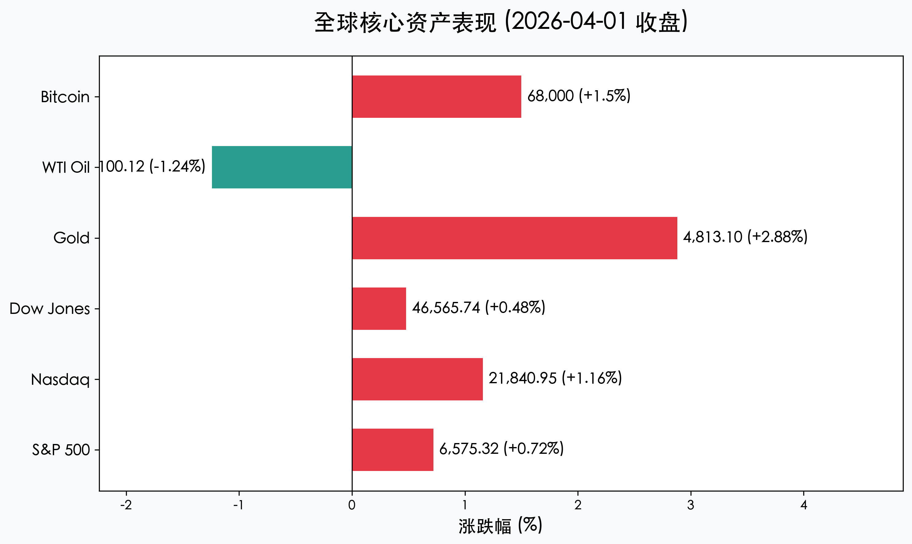
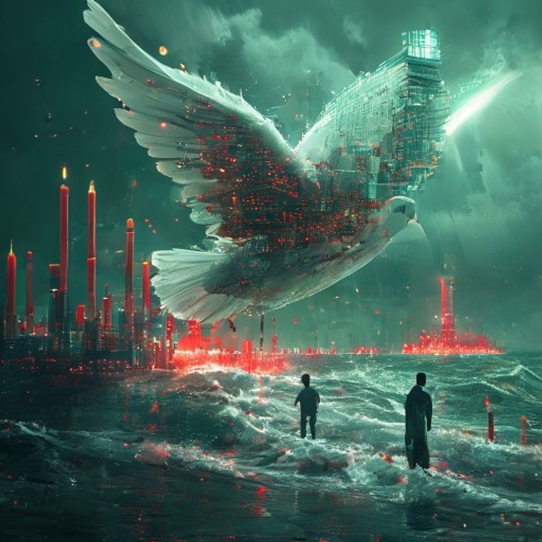

# 全球市场晨报：特朗普称伊朗寻求停火，美股迎“狂欢式”反弹

**日期：2026年04月02日 (星期四)** &nbsp; **时段：Morning Run (国际市场)**

> **核心摘要**：特朗普总统宣称伊朗寻求停火，引发全球市场风险偏好强力回归。美股三大指数连续两日收高，纳指大涨 **1.16%**；原油价格受地缘政治溢价消退影响重回 **100美元** 关口。尽管避险资产黄金依然高位震荡，但科技与消费板块的领涨预示着市场正从极度恐慌中苏醒。

## 核心行情复盘

周三（4月1日），美股市场在经历了长达数周的地缘政治阴霾后，迎来了显著的“解压式”上涨。

* **标普 500 指数**：收于 **6,575.32** 点，上涨 **0.72%**。
* **纳斯达克综合指数**：收于 **21,840.95** 点，上涨 **1.16%**，科技股表现强劲。
* **道琼斯工业平均指数**：收于 **46,565.74** 点，上涨 **0.48%**。
* **黄金 (COMEX 6月合约)**：收于 **4,813.10** 美元/盎司，上涨 **2.88%**（尽管风险偏好回归，但避险买盘依然支撑点位）。
* **WTI 原油 (5月合约)**：收于 **100.12** 美元/桶，下跌 **1.24%**。
* **比特币 (Bitcoin)**：报收于约 **68,000** 美元，出现明显回升。

在行业层面，科技和旅游板块领跑。**美光科技 (Micron)** 大涨 **8.88%**，**英特尔 (Intel)** 上涨 **8.78%**，显示出半导体行业对供应链稳定的预期。**礼来 (Eli Lilly)** 因减肥药获 FDA 批准上涨 **3.78%**。相比之下，**耐克 (Nike)** 因销售预测令人失望而暴跌 **15.51%**。

## 核心解读与市场逻辑

> **停火传闻引发的“空头回补”**：周三市场的核心驱动力来自于特朗普总统的公开表态，他声称伊朗政权已请求停火。尽管伊朗外交部初步称其为“虚假信息”，但市场选择“先买入再验证”，引发了大规模的空头回补和风险资产配置。

> **能源价格压力减轻**：随着霍尔木兹海峡可能重新开放的预期升温，布伦特原油一度暴跌近 15% 后稳定在 101 美元附近。能源价格的回落直接缓解了市场对“二次通胀”的极度担忧，为美联储未来的政策空间提供了想象力。

> **地缘政治溢价的重估**：分析人士指出，标普 500 指数今年以来仍下跌约 4%，目前的上涨更多是基于地缘风险从“失控”转向“可控”的估值修复。

## 政策脉动

* **白宫动态**：特朗普政府表示可能在数周内结束军事行动，这一言论是支撑当日市场情绪的定海神针。
* **FDA 批准**：FDA 批准了礼来的新型肥胖症药物，这不仅提振了医药板块，也为市场在宏观动荡中寻找到了具体的盈利增长点。

## 最新机构观点

* **高盛 (Goldman Sachs)**：对 4 月份的市场前景持“令人意外的建设性”态度。高盛预计 2026 年标普 500 指数盈利将增长 **12%**，认为市场目前过度估计了美联储未来的加息烈度。
* **摩根士丹利 (Morgan Stanley)**：首席股票策略师 **Mike Wilson** 观察到资金正从黄金轮动回股票。尽管由于业绩费下降下调了部分资管公司的 EPS 预期，但 Wilson 仍将标普 500 的 12 个月目标价设为 **7,800** 点。
* **Bernstein**：在加密货币领域，Bernstein 认为比特币已经找到了价格底部，基于 ETF 的持续流入，维持对 2026 年底的看涨预期。

## 今日市场情绪：鸽派曙光

> Prompt: Surrealism style, A futuristic white dove made of digital circuits flying over a stormy sea of red and green trading candlesticks, carrying a golden olive branch. In the background, a massive server tower stands like a lighthouse, casting a bright white light that calms the turbulent waves. A human trader (real person) stands on the shore, looking up with hope., masterpiece, high detail, intricate composition, cinematic lighting, 8k resolution

免责声明：内容仅供参考，不构成投资建议。
