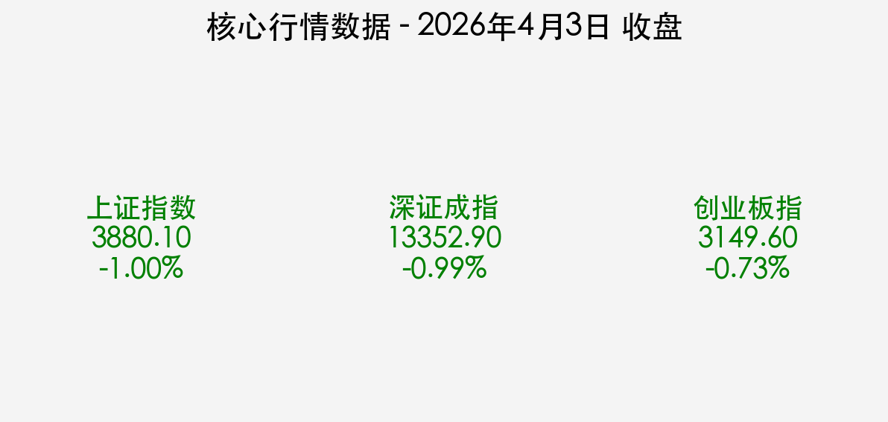
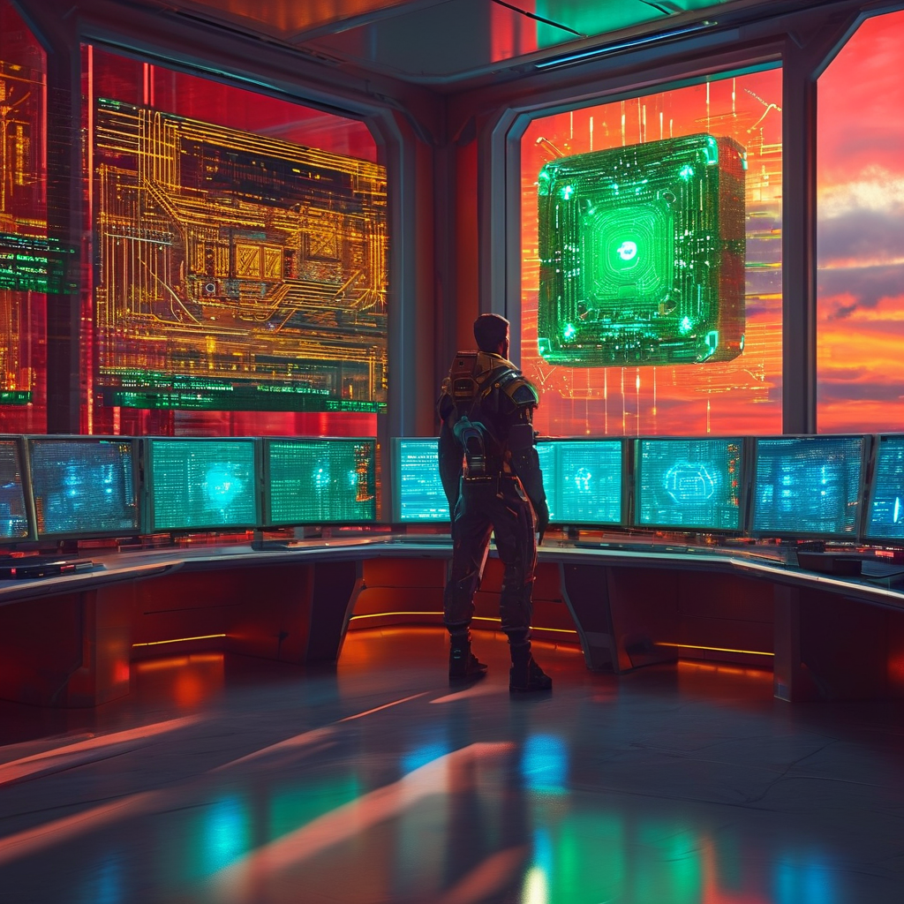

# 2026年4月3日 A股收盘评述：节前缩量洗盘，算力科技逆市突围

**日期：2026年04月03日 (星期五)** &nbsp; **时段：[Evening Run / 国内市场]**

> **核心摘要**：清明小长假前夕，A股市场呈现高开低走、显著缩量的调整态势。三大指数集体收跌，沪指再度失守3900点，全市场成交额创年内新低。尽管情绪面受地缘局势波动压制，但以AI算力、CPO为核心的硬科技板块展现出极强的资金韧性。

## 核心行情复盘

今日（4月3日）是清明假期前的最后一个交易日，受外围局势不确定性及节前避险情绪影响，市场整体表现低迷。两市合计成交约 **1.66万亿元**，较昨日显著缩量近 1900 亿元，反映出明显的“持币过节”效应。

*   **上证指数**：收报 **3880.10点**，下跌 **1.00%**。
*   **深证成指**：收报 **13352.90点**，下跌 **0.99%**。
*   **创业板指**：收报 **3149.60点**，下跌 **0.73%**。
*   **板块表现**：通信设备、CPO概念、半导体等科技板块逆市走强，主力资金净流入超百亿。相比之下，电力设备、公用事业及煤炭等红利防御板块跌幅居前。
*   **港股动态**：今日因耶稣受难日（Good Friday）假期，香港股市**全天休市**。

## 核心解读与市场逻辑

> 1. **节前避险与缩量筑底**：随着清明小长假临近，市场资金倾向于减仓以规避假期期间可能出现的国际地缘政治变数。1.66万亿的“地量”成交额显示出抛压已接近尾声，市场正在3900点下方进行情绪与筹码的二次出清。
> 2. **科技主线的“核心避风港”**：在普跌行情中，AI算力与CPO概念的强势回归，反映了机构资金对一季报业绩确定性的高度关注。在全球算力基建持续扩张的背景下，算力硬件已成为当前震荡市中最具共识的配置方向。
> 3. **地缘局势压制风险偏好**：中东局势的最新升级推升了全球原油价格，同时也加剧了输入性通胀的担忧，这对短期A股的风险资产偏好形成了明显挤压，导致顺周期板块出现被动杀跌。

## 政策脉动

*   **流动性维持精准投放**：央行今日开展 5 亿元 7 天期逆回购操作，精准滴灌维持流动性合理充裕。公告强调“全额满足需求”，显示出监管层对跨节资金面平稳运行的十足信心。
*   **数字人民币迈向“2.0时代”**：央行宣布数字人民币运营机构扩容至 22 家，新增中信、光大等 12 家银行。这一举措标志着数字金融基础设施的进一步普及，有利于提升支付结算效率及金融普惠性。
*   **打击金融黑产**：金融监管总局与公安部部署新一轮专项行动，严厉打击非法存贷款中介等乱象。合规监管的强化有助于重塑市场信任，为长期资本入市扫清障碍。

## 最新机构观点

*   **中信证券**：建议投资者在节后聚焦“一季报绩优品种”。重点关注受益于国产算力紧缺的**昇腾链**及**光模块**行业，预计二季度科技板块将从“情绪驱动”转向“业绩驱动”。
*   **中金公司**：维持对中国经济 5% 增长目标的信心。在当前“脆弱的平衡”下，建议采取均衡配置策略，看好**黄金**的中长期避险价值，并认为 A 股估值目前处于历史底部区间，具备长线吸引力。
*   **申万宏源**：认为今日的回调属于典型的“节前洗盘”，而非趋势性转折。随着年报披露进入密集期，具备分红能力的绩优股将在波动中表现出更强的防御性。

## 今日市场情绪：[科技韧性与缩量守望]

在红绿交织的 K 线森林中，虽然整体阴云密布，但算力核心的绿光依然耀眼。市场正处于一种“静默期”，等待假期后的逻辑重构。

> Prompt: Cyberpunk style, A human trader (real person) standing in a high-tech control room, looking at a wall of screens. On the main screen in the background, a giant glowing green AI chip is being woven with golden threads of data, representing the AI computing resilience, while outside the window, a pre-holiday red sunset casts a long shadow over a quiet trading floor with decreasing volume., masterpiece, high detail, intricate composition, cinematic lighting, 8k resolution

---
免责声明：内容仅供参考，不构成投资建议。市场有风险，入市需谨慎。
