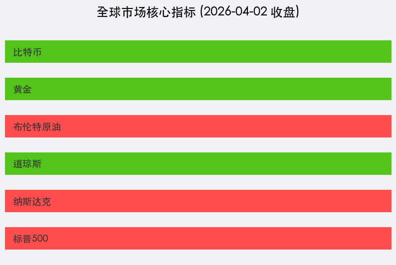

# 全球市场早报：地缘风暴下的油价狂飙与外交转机

**日期：2026年04月03日 (星期五)** &nbsp; **时段：[Morning Run / 国际市场]**

> **核心摘要**：美股周四在总统特朗普对伊朗发出强硬军事警告引发的剧烈波动中勉强收高。布伦特原油一度因“Operation Epic Fury”警告暴涨逾 10%，随后因伊朗与阿曼达成航运协议的消息而收窄涨幅。在 4 月 3 日耶稣受难日休市前夕，市场呈现典型的避险情绪与对通胀压力的重估。

## 核心行情复盘

周四（4月2日）美股三大指数表现分化。在经历了开盘后的恐慌性下跌后，科技股表现出较强韧性，带领纳指与标普500指数小幅收涨。

*   **标普500指数**：收于 **6,582.70** 点，上涨 **0.11%**。
*   **纳斯达克综合指数**：收于 **21,879.18** 点，上涨 **0.18%**。
*   **道琼斯工业平均指数**：收于 **46,504.60** 点，微跌 **0.13%**。
*   **大宗商品**：布伦特原油收报 **109.03** 美元/桶，单日涨幅达 **7.4%**；黄金因避险资金流向美元而回调 **2.4%**，报 **2,350** 美元/盎司。
*   **加密货币**：比特币（BTC）回落至 **65,727** 美元附近，反映风险资产偏好受到地缘政治抑制。

## 核心解读与市场逻辑

> 1. **“Operation Epic Fury”与能源冲击**：总统特朗普在周三晚间的讲话中称将对伊朗实施“极其严厉”的打击，导致全球能源供应担忧瞬间爆发。霍尔木兹海峡（Strait of Hormuz）的实际关闭导致每日数千万桶原油受阻，成为推升油价的核心动力。
> 2. **外交曙光的微弱利好**：周四尾盘，伊朗官方媒体报道称伊朗与阿曼正草拟一份关于霍尔木兹海峡交通管理的协议。这一消息极大缓解了市场对“全面封锁”的担忧，促使美股从日内低位回升。
> 3. **韧性十足的劳动力市场**：最新公布的初请失业金人数为 **20.2万**，低于预期的 21.5万。在战争阴云笼罩下，美国本土经济数据的强劲表现为联储的政策选择增添了复杂性。

## 政策脉动

*   **五角大楼动向**：美军“Operation Epic Fury”相关行动持续展开，地缘政治风险溢价已成为当前资产定价的最高权重。
*   **美联储博弈**：虽然油价飙升推高了通胀预期（2026年PCE预期上调至3%以上），但市场仍在定价联储可能因经济稳定性受损而在下半年降息。

## 最新机构观点

*   **高盛 (Goldman Sachs)**：维持“鸽派抗争”立场。尽管油价冲击显著，但美国经济对能源的依赖度已较1970年代大幅降低。高盛依然维持 9 月和 12 月各降息一次的预测，认为联储将“看穿”由能源驱动的短期通胀峰值。
*   **摩根大通 (JP Morgan)**：对能源供应中断表示深度担忧。JPM 警告称，若霍尔木兹海峡持续封锁至 5 月，布伦特原油可能突破 **150美元** 关口。由于通胀风险加剧，该行资产管理部门已开始增持 2-5 年期美债以对冲波动。
*   **摩根士丹利 (Morgan Stanley)**：观察到明显的“新旧更替”投资风格切换。资金正加速从高估值软件股撤出，流向具备防御属性的能源巨头、国防军工以及支撑 AI 基础建设的硬科技板块。

## 今日市场情绪：[地缘风暴中的守望]

在极端的冲突威胁与微妙的外交努力之间，市场正处于一种高度紧张的平衡态。

> Prompt: Surrealism style, A human trader (real person) standing on a lone sailboat navigating a stormy sea composed of red and green candlestick charts. In the background, a giant hourglass leaks black oil onto a golden scale, while a distant lighthouse emits a soft blue light., masterpiece, high detail, intricate composition, cinematic lighting, 8k resolution

---
免责声明：内容仅供参考，不构成投资建议。
