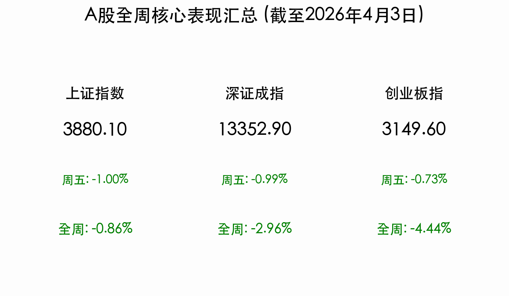

# 周末深度复盘：清明节前避险情绪浓厚，A股缩量守住3800关口

**日期：2026年04月04日 (星期六)** &nbsp; **时段：[Evening Run / 周末复盘]**

> **核心摘要**：本周（3月30日-4月3日）A股市场在3900点附近展开激烈拉锯，全周呈现震荡下行态势。受中东局势升级引发的全球风险厌恶及清明假期前的持币观望情绪影响，成交量在周五缩减至年内新低。尽管指数集体回落，但以AI算力、CPO为代表的硬科技主线展现出极强防御韧性，市场正在博弈一季报业绩确定性。

## 核心资产周度/日度表现回顾

本周市场受外部地缘压力及节前避险情绪双重压制，三大指数全周集体收跌。

*   **上证指数**：报收 **3880.10点**，周五下跌 **1.00%**，**全周累计下跌 0.86%**。
*   **深证成指**：报收 **13352.90点**，周五下跌 **0.99%**，**全周累计下跌 2.96%**。
*   **创业板指**：报收 **3149.60点**，周五下跌 **0.73%**，**全周累计下跌 4.44%**。
*   **成交额表现**：本周成交量呈现“先放后缩”。周三一度放量至 **2.02万亿元**，但周五受港股休市及节前效应影响，骤降至 **1.66万亿元**，创年内单日成交额新低。
*   **主力资金动向**：全周呈现净流出态势，但周三出现过一次显著的千亿级回流，主要集中在医药生物、半导体及CPO板块。

## 过去 48 小时重磅事件深度复盘

> **1. 中东局势“火药桶”点燃，全球流动性承压**：
> 特朗普政府近期对伊朗发出的强硬警告，直接推升布伦特原油价格一度突破140美元/桶的极端水平。虽然随后有所回落，但地缘溢价已显著抬升全球资产的通胀预期，导致短期风险资产偏好被大幅挤压。

> **2. 算力赋能政策加码，AI Agent 预期爆发**：
> 工信部印发《普惠算力赋能中小企业发展专项行动》，明确到2028年底降低算力获取门槛。这一政策与本周AI板块的强势形成了共振，市场对于2026年AI Agent（智能体）的大规模落地充满期待。

> **3. 数字人民币运营机构大扩容**：
> 央行新增12家银行为数字人民币运营机构，标志着数字金融基础设施建设进入提速期。这对金融科技板块的长远估值重构具有积极指导意义。

## 下周全球宏观大事预警

*   **一季报预告密集披露**：下周进入4月中旬，是A股一季报预告的法定期限临近窗口，业绩爆雷与超预期的博弈将进入白热化。
*   **美国CPI数据发布**：下周三（4月8日）美国将发布最新CPI，在地缘局势推高油价的背景下，通胀是否反弹将直接决定美联储5月的降息预期。
*   **中东局势的进一步演变**：市场正密切关注特朗普政府是否有更实质性的行动，这将持续扰动黄金与大宗商品的价格中枢。

## 顶级机构周末策略内参摘要

*   **中信证券**：
    > 建议节后“以稳为主”，寻找业绩确定性。重点看好受益于国产算力紧缺的**光模块、PCB及半导体设备**。当前1.66万亿的成交额是典型的底部信号，抛压已释放得非常充分。
*   **中金公司**：
    > 强调硬科技资产的“战略性重估”。在全球AI基建浪潮中，中国供应链具备不可替代的成本与技术优势。虽然短期受地缘风险扰动，但具备核心壁垒的科技蓝筹已进入价值配置区间。
*   **华泰证券**：
    > 推荐“红利+科技”双底仓策略。红利板块（银行、能源）可作为假期变数中的避风港，而科技主线（算力、医药）则是一季报业绩反弹的先锋。

## 今日市场情绪：清明守望与变局博弈

> Prompt: Surrealism style, A vast chessboard floating in a void of dark red mist, where giant obsidian chess pieces are being moved by invisible hands of fate. In the background, a traditional Chinese landscape of misty mountains (Qingming atmosphere) is merging with a digital green circuitry tree. A human trader (real person) stands at the edge of the board, holding a glowing lantern to light up the path between the market volatility and the long holiday ahead., masterpiece, high detail, intricate composition, cinematic lighting, 8k resolution

---
免责声明：内容仅供参考，不构成投资建议。市场有风险，入市需谨慎。
