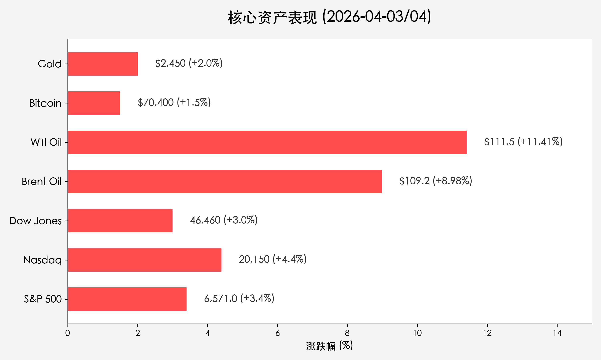

# 全球市场早报：非农数据“爆表”，原油价格点燃中东“火药桶”

**日期：2026年04月04日 (星期六)** &nbsp; **时段：[Morning Run]**

> **核心摘要**：美股周五因耶稣受难日休市，但当日发布的3月非农数据远超预期，显示经济仍具韧性；与此同时，中东局势骤然升级，美伊冲突隐忧导致原油价格单日暴涨近10%，引发全球通胀重燃的恐慌。

## 核心行情复盘

由于4月3日（周五）为耶稣受难日休市，以下点位代表美股周四收盘终值或周五期货/大宗商品活跃交易水平：

*   **S&P 500**：收于 **6,571.00** 点，全周累计上涨 **3.4%**。
*   **Nasdaq Composite**：约 **20,150** 点，全周累计上涨 **4.4%**。
*   **Dow Jones**：**46,460** 点，全周累计上涨 **3.0%**。
*   **布伦特原油 (Brent)**：报 **109.24 美元/桶**，单日剧增 **8.98%**。
*   **WTI原油**：报 **111.54 美元/桶**，单日暴涨 **11.41%**。
*   **现货黄金**：波动于 **2,450 - 2,500 美元/盎司** 之间，避险买盘强烈。
*   **比特币 (BTC)**：报 **70,400 美元**，单日上涨 **1.5%**，对地缘局势反应灵敏。

## 核心解读与市场逻辑

> **1. 非农数据“反直觉”暴击**：
> 美国劳工部周五公布，3月新增非农就业人数达 **17.8万**，远超市场预期的6万。失业率小幅降至 **4.3%**。尽管数据展现了经济韧性，但也彻底粉碎了短期内降息的幻想。市场普遍认为，在通胀受地缘风险推高的情况下，美联储可能被迫在2026年更长时间内维持高利率。

> **2. 中东“火药桶”被点燃**：
> 特朗普总统对伊朗发出严厉警告，暗示可能对伊朗基础设施（包括电厂和桥梁）进行为期数周的打击。此举直接导致全球约20%原油供应面临中断风险，原油价格瞬间冲破110美元大关。由于霍尔木兹海峡的潜在封锁，市场正对能源危机进行防御性计价。

## 政策脉动

*   **药品定价行政令**：特朗普签署了一项针对药品定价的行政命令，威胁如果制药公司不能就新协议达成一致，将对某些专利药品征收高达100%的关税。这一政策增加了医疗保健板块的不确定性。
*   **美联储货币路径**：非农数据公布后，掉期交易显示美联储在2026年上半年的降息概率大幅下降，市场甚至开始讨论如果通胀失控，下半年是否会存在加息风险。

## 最新机构观点

*   **高盛 (Goldman Sachs)**：
    > 认为劳动力市场虽有放缓迹象但依然“坚固”。高盛警告称，如果原油价格维持在100美元以上进入2027年，美国GDP每下降1%，标普500的每股收益可能下降4%。
*   **摩根大通 (JPMorgan) & 摩根士丹利 (Morgan Stanley)**：
    > 两大投行均已推迟降息预期至2026年下半年。他们发出预警，若中东冲突不能在4月下旬前得到遏制，标普500指数可能跌至 **5,500 - 5,800** 区间，较此前高位回撤20%进入技术性熊市。

## 今日市场情绪：中东风暴与非农之光

> Prompt: Surrealism style, A colossal stone lighthouse standing on a cliff of jagged red K-lines, emitting a blinding white light that reveals a hidden ocean of black crude oil below. In the foreground, a human trader (real person) holds a glowing tablet showing a massive green number '178k', while a fiery storm shaped like a Persian dragon looms in the background., masterpiece, high detail, intricate composition, cinematic lighting, 8k resolution

---
免责声明：内容仅供参考，不构成投资建议。
