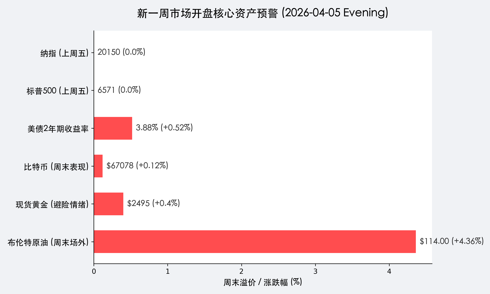

# 周一开盘预警：特朗普最后通牒倒计时，原油120美元关口博弈开始

**日期：2026年04月05日 (星期日)** &nbsp; **时段：[Evening Run / 新一周市场展望]**

> **核心摘要**：特朗普的48小时最后通牒将于周一开盘进入终极倒计时，市场正在定价“最坏情况”。周末布伦特原油场外价格已突破114美元，本周五的美国3月CPI数据将决定通胀是否会因能源危机而彻底失控，全球市场面临自2008年以来最不确定的开盘时刻。

## 周末财经要闻终极汇总

*   **特朗普最后通牒倒计时**：美东时间周一上午 10:05 到期，若无转机，中东海空战争一触即发。
*   **布油周末飙升**：受地缘溢价驱动，布伦特原油场外成交报 **114.00 美元**，创本轮冲突以来新高。
*   **美债收益率攀升**：2年期美债收益率升至 **3.88%**，市场开始担忧美联储可能不仅不降息，甚至会讨论加息。
*   **BTC 高位震荡**：比特币报 **67,078 美元**，作为“高贝塔风险资产”的表现优于纳指，但在地缘冲击面前仍显脆弱。

## 新一周市场核心博弈逻辑

> **1. 能源供应的物理确定性**：
> 霍尔木兹海峡的封锁程度决定了全球通胀的中期中枢。若伊朗坚持封锁，全球 20% 的原油供应缺口将无法由沙特或美国页岩油在短期内补足，这将迫使全球制造业进入“高能耗成本”模式。

> **2. “战时通胀”定价**：
> 市场逻辑正从“软着陆”向“战时通胀”急速切换。本周五的 CPI 将不再只是一个数据，而是对美联储货币政策独立性的终极考验。如果油价持续站稳 110 美元以上，任何降息讨论都将显得极其荒谬。

> **3. 黄金与避险资产的结构性韧性**：
> 在美元走强（受利率驱动）的同时，黄金依然维持在 **2,495 美元** 附近的高位。这表明在全球信用体系受到地缘政治割裂的背景下，市场正在寻找主权信用以外的“终极避险”。

## 本周重磅经济数据与会议前瞻

*   **周一 10:05 AM (美东时间)**：特朗普最后通牒到期。这是本周乃至本年度全球市场最重要的一个时间节点。
*   **周三**：**美联储3月会议纪要**。市场将从中寻找联储对于能源价格二次爆发的敏感度测试。
*   **周五**：**美国 3 月 CPI 数据**。市场预期同比增幅将因油价而显著回升。在“能源悬崖”边缘，通胀的粘性可能超乎想象。

## 头部券商/投行开盘策略点睛

*   **高盛 (Goldman Sachs)**：
    > 建议投资者在周一开盘后立即增配能源股及黄金，同时利用看跌期权对冲科技股的下行风险。如果油价突破 120 美元，标普 500 指数的公允估值将下降 5-8%。
*   **瑞银 (UBS)**：
    > 认为市场目前对“全面战争”的定价仍不充分。如果周一出现实质性交火，日元和瑞士法郎等传统避险货币将出现大幅脉冲，而 BTC 可能会面临短期的流动性踩踏。
*   **中金公司 (CICC)**：
    > 虽然 A 股周一继续休市，但需警惕 A50 期货及离岸人民币在周一的波动。预计长假后开盘将面临一定的补跌压力，但中国由于能源储备充足及制造链优势，能源板块及航运板块将成为结构性避风港。

## 今日市场情绪：开盘前的死寂

市场目前处于极度恐慌与观望的交织中，所有投资者都在屏息凝神等待周一那声“枪响”。

> Prompt: Surrealism style, A human trader (real person) standing on a giant chessboard that floats in a stormy sea. Across the board, a shadowy figure made of smoke and fire moves a giant oil barrel as a chess piece. In the sky, a massive clock shows 10:05 with a red laser beam pointing at a global map, masterpiece, high detail, intricate composition, cinematic lighting, 8k resolution

---
免责声明：内容仅供参考，不构成投资建议。
