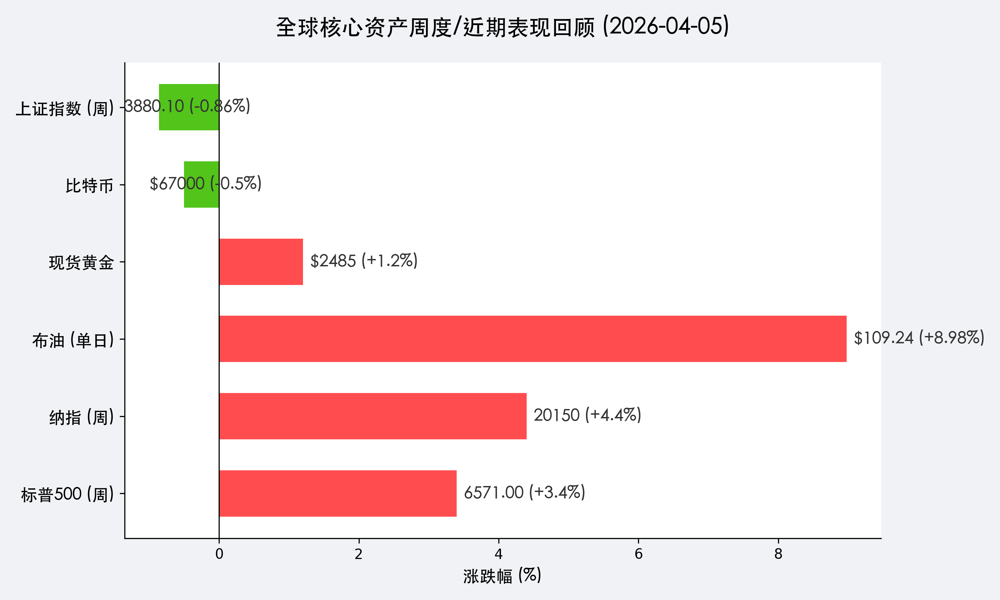
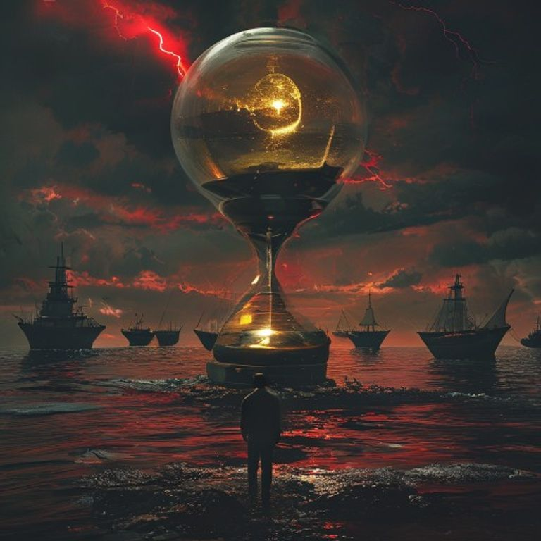

# 全球市场周末深度复盘：特朗普发出48小时最后通牒，能源市场“战火重燃”

**日期：2026年04月05日 (星期日)** &nbsp; **时段：[Morning Run / 全球周末复盘]**

> **核心摘要**：本周全球市场经历剧烈波动。美国3月非农数据远超预期，彻底粉碎短期降息幻想；而本周末中东局势的急剧恶化成为核心变量。特朗普总统发出的“48小时最后通牒”将于周一开盘后到期，霍尔木兹海峡的封锁传闻推升原油冲破110美元大关，全球正面临“能源悬崖”与“二战以来最严峻地缘危机”的双重考验。

## 核心资产周度/日度表现回顾

受地缘冲突与强劲非农数据双重挤压，全球资产呈现极端的“风险厌恶”特征，唯有能源与黄金成为避风港。

*   **美股周表现（截至周四收盘）**：
    *   **标普500指数**：报 **6,571.00** 点，全周累计上涨 **3.4%**（反映前期降息预期，未计入周五非农后的利率重定价）。
    *   **纳斯达克指数**：报 **20,150** 点，全周累计上涨 **4.4%**。
*   **A股周表现（截至周五收盘）**：
    *   **上证指数**：报 **3,880.10** 点，全周累计下跌 **0.86%**。
    *   **创业板指**：报 **3,149.60** 点，全周累计下跌 **4.44%**，受北向资金避险流出影响显著。
*   **大宗商品与避险资产**：
    *   **布伦特原油 (Brent)**：报 **109.24 美元/桶**，周五单日暴涨近 **9%**。
    *   **现货黄金**：报 **2,485 美元/盎司**，全周展现极强避险韧性。
*   **加密货币 (Sunday Morning)**：
    *   **比特币 (BTC)**：暂报 **67,000 美元** 附近，较 2025 年高位已大幅回撤，目前与纳指呈现 **85%** 的高度正相关。

## 过去 48 小时重磅事件深度复盘

> **1. 特朗普发出“48小时最后通牒”**：
> 周六，特朗普通过社交平台向德黑兰发出严厉警告，要求立即无条件重新开放霍尔木兹海峡，否则将面临“地狱般的军事打击”。此举令全球市场屏息，最后通牒到期时间精准设定在**美东时间周一上午 10:05**。

> **2. 非农数据“爆表”，降息预期幻灭**：
> 美国3月新增非农就业人数达 **17.8万**（预期 6万），失业率降至 **4.3%**。在通胀因油价狂飙而面临反弹的背景下，这份数据意味着美联储不仅无法降息，甚至可能在下半年讨论“加息”以抑制战时通胀。

> **3. 中东军事冲突实质性升级**：
> 过去48小时内，美伊双方发生直接摩擦。伊朗声称击落美军一架 F-15E 和一架 A-10 战机，而美方则对伊朗布什尔核电站周边及石化基地进行了“外科手术式”打击。目前全球 20% 的原油供应正处于物理封锁状态。

## 下周全球宏观大事预警

*   **周一 10:05 AM (美东时间)**：特朗普最后通牒到期。若无转机，中东可能爆发更大规模海空战争，直接冲击周一美股开盘表现。
*   **清明/复活节长假休市**：
    *   **A 股**：4月4日（周六）至4月6日（周一）休市，4月7日（周二）恢复交易。
    *   **港股**：4月3日（周五）至4月7日（周二）全天休市，4月8日（周三）恢复交易。
*   **美国 3 月 CPI 数据 (周三)**：能源价格的传导效应将在此次数据中初见端倪，这将是全球债市的又一个“火药桶”。

## 顶级机构周末策略内参摘要

*   **高盛 (Goldman Sachs)**：
    > 警告“油价 cliff (悬崖)”风险。如果霍尔木兹海峡封锁超过 72 小时，全球供应链将面临自 1970 年代石油危机以来最严重的冲击，标普 500 可能在二季度面临 15-20% 的防御性估值下调。
*   **摩根大通 (JPMorgan)**：
    > 认为 BTC 的避险属性已基本失效，目前正作为“杠杆化科技股”被抛售。建议投资者配置实物黄金及能源类大宗商品以对冲地缘尾部风险。
*   **中金公司 (CICC)**：
    > 认为 A 股在长假期间的避险情绪已通过周五的缩量回调得到初步释放。虽然面临外部流动性收紧，但中国由于能源储备充足及独立货币政策，有望在长假后展现出比美股更强的结构性韧性。

## 今日市场情绪：中东风暴与能源焦虑

市场正处于一种令人不安的“临战静默”，每一秒的倒计时都在考验着全球投资者的心理防线。

> Prompt: Surrealism style, A colossal sandglass standing in the middle of a dark ocean, with the top bulb containing a golden globe and the bottom bulb filling with thick black oil. In the background, a row of ominous black naval ships blocks the horizon under a red lightning sky. A human trader (real person) stands on a small rocky island in the foreground, looking at a digital pocket watch that shows a 48-hour countdown, masterpiece, high detail, intricate composition, cinematic lighting, 8k resolution

---
免责声明：内容仅供参考，不构成投资建议。
