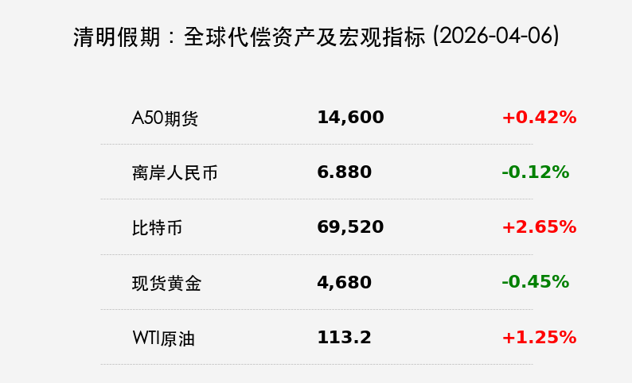
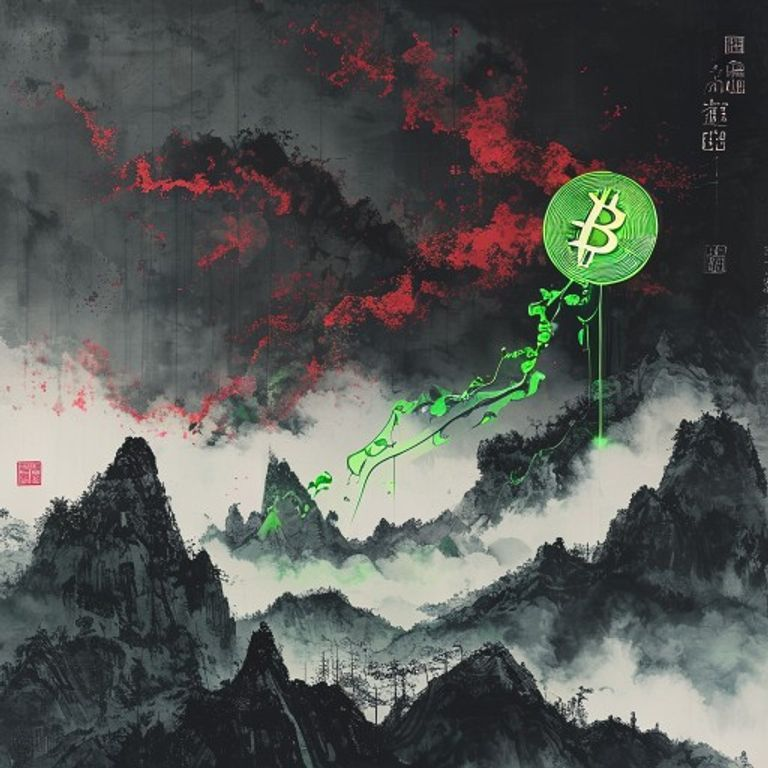

# 清明假期动态：春假效应拉动600亿消费，BTC与原油在地缘阴云中领涨

**日期：2026年04月06日 (星期一)** &nbsp; **时段：[Evening Run / 假期动态]**

> **核心摘要**：清明假期A股与港股休市，但代偿资产波动剧烈。BTC在美伊局势博弈中突破6.95万美元，原油高位运行；国内“春假效应”显著，跨区域人员流动突破8.4亿人次，亲子消费成为二季度开局的新增长极。

## 全球代偿资产表现

尽管国内休市，但全球市场依然在定价地缘风险与非农数据。

*   **富时中国A50期货**：小幅震荡上行，报 **14,600** 点（+0.42%）。显示市场对假期后开盘持稳健预期。
*   **离岸人民币 (USD/CNH)**：表现坚韧，汇率徘徊在 **6.88** 附近（升值 0.12%）。受出口数据支撑，人民币在避险情绪中展现抗跌性。
*   **比特币 (BTC)**：日内大涨 **2.65%**，冲破 **69,500 美元**。市场传闻美伊可能达成短期停火，空头爆仓推动价格脉冲。
*   **现货黄金**：高位震荡回调，报 **4,680 美元**（-0.45%）。强劲非农推高美债收益率，金价在高位面临技术性修正。
*   **WTI原油**：站稳 **113 美元**（+1.25%）。特朗普对伊朗的最后通牒令能源供应链担忧持续。

## 清明假期宏观热点：春假效应与消费升级

> **1. 8.45亿人次的“小黄金周”**：
> 2026年清明假期与多地中小学“春假”重叠，形成长达6天的连休。交通运输部预计跨区域人员流动量同比增长6%，显著超过2025年同期。
>
> **2. 600亿亲子消费热潮**：
> 亲子长线游订单同比翻倍。江苏、四川、安徽等地通过“春假大礼包”发放文旅券，仅亲子游群体在国内的总花费预计达600亿元。
>
> **3. 港人“北上”持续升温**：
> 香港复活节长假与清明重合，赴内地酒店预订量同比增长8倍。跨境消费已成为大湾区经济融合的强劲引擎。

## 机构后市展望：二季度布局“哑铃风格”

> **中金公司**：
> 建议关注“能源安全”与“产业链自主可控”主线。虽然地缘局势波动，但中期支撑市场“稳进”的逻辑依然成立。
>
> **多数机构建议**：
> 节后应采取“哑铃型”配置策略。一头抓**高股息红利资产**（如银行、公用事业）作为防御，另一头抓**硬科技成长方向**（如算力、半导体）博取弹性。

## 今日市场情绪：假期蛰伏与避险回流

今日市场在休市中呈现出“外冷内热”的特征。外围资产在定价战争风险，而国内消费数据则释放出强烈的复苏信号。

> Prompt: A traditional Chinese ink-wash landscape where the mountains are shaped like rising K-line charts. In the foreground, a family is flying a kite shaped like a glowing green Bitcoin symbol, while in the far background, dark red storm clouds representing geopolitical tension are gathered, but the kite remains high in the spring breeze.

免责声明：内容仅供参考，不构成投资建议。
