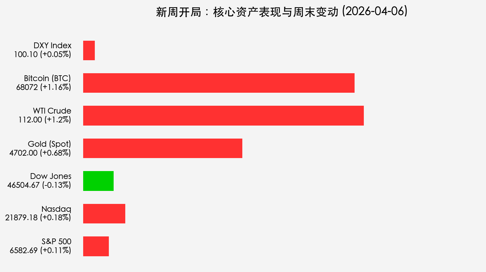

# 新周开局：复活节休市下的流动性低谷，高盛力挺Q1财季开启“战术反弹”

**日期：2026年04月06日 (星期一)** &nbsp; **时段：[Morning Run / 新周展望]**

> **核心摘要**：复活节周一全球多地休市，流动性枯竭可能放大市场对地缘政治的敏感度。尽管伊朗冲突阴云未散，但高盛与大摩纷纷上调美股预期，聚焦本周开启的Q1财报季及12%的盈利增长，市场逻辑正从“恐慌防御”转向“业绩驱动”。

## 周末财经要闻终极汇总

*   **美国3月非农“爆表”**：新增 **17.8万** 就业远超预期，失业率降至 **4.3%**。这在平时是利好，但在通胀高企时推升了美债收益率。
*   **金价登顶 4,702 美元**：避险情绪与抗通胀需求共振，金价创历史新高。
*   **复活节长假效应**：伦敦、香港及欧洲主要交易所今日继续休市，美股虽开盘但预计交投清淡，谨防波动率脉冲。
*   **BTC 韧性显现**：比特币守住 **68,000 美元** 关口，在风险资产中表现出较强的底部支撑力。

## 新一轮市场核心博弈逻辑

> **1. Q1 财报季的“业绩锚”**：
> 高盛预计 S&P 500 盈利增长将达 12%。如果本周开启的银行股财报能验证这一预期，市场将获得强有力的估值支撑，对冲掉部分利率上行的压力。

> **2. 通胀数据的“十字路口”**：
> 本周五的 CPI 是终极考验。在油价重回 110 美元上方的背景下，如果核心通胀依然坚挺，美联储“更高更久”的利率政策将成为定局。

> **3. 地缘政治的“降温期”？**：
> 尽管特朗普的最后通牒已到期，但目前尚未爆发全面冲突，市场正试探性地交易“冲突局限化”逻辑。

## 本周重磅经济数据与会议前瞻

*   **周一 22:00 (北京时间)**：**美国 3 月 ISM 服务业 PMI**。作为 80% GDP 的支撑，该数据将决定美元指数 100 关口的稳固度。
*   **周三**：**FOMC 3月会议纪要**。寻找联储对油价冲击的最新态度。
*   **周四**：**核心 PCE 物价指数**。
*   **周五**：**美国 3 月 CPI** & **中国 3 月 CPI/PPI**。全球通胀节奏的共振点。

## 头部券商/投行开盘策略点睛

*   **高盛 (Goldman Sachs)**：
    > 建议投资者在当前波动中“战术性做多”，认为 3 月的调整已出清浮筹。首选半导体板块，AI 硬件营收有望在 2026 年突破 7000 亿美元。
*   **摩根士丹利 (Morgan Stanley)**：
    > 将美股评级上调至“超配”，目标位 6,500 已提前触及，目前看好业绩确定性高的蓝筹股。
*   **摩根大通 (J.P. Morgan)**：
    > 强调“K型”复苏，资产持有者受益于 AI 浪潮，但需警惕工资增长放缓对消费端的长期压制。

## 今日市场情绪：谨慎乐观的曙光

随着 Q1 财报季的临近，市场正试图走出地缘政治的阴霾，寻找新的业绩驱动力。

> Prompt: Cyberpunk style, A futuristic lighthouse with glowing holographic screens stands firm on a jagged cliff, casting a steady beam of light through a swirling red electronic storm. In the distance, a massive golden mechanical phoenix is beginning to rise from the dark sea, symbolizing the rebirth of market hope through technology and earnings. In the foreground, a digital clock shows the opening of a high-tech exchange, masterpiece, high detail, intricate composition, cinematic lighting, 8k resolution

---
免责声明：内容仅供参考，不构成投资建议。
