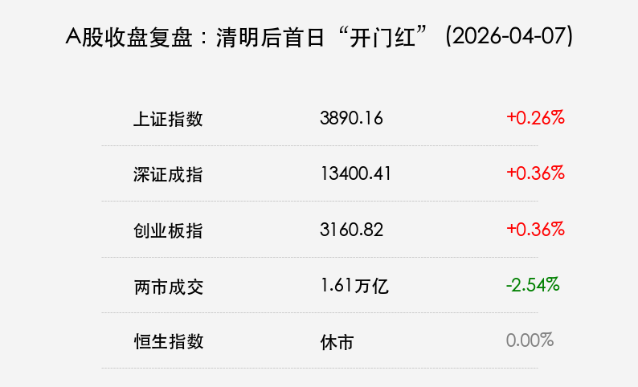

# A股收盘：清明后首日“开门红”，中东局势驱动化工/能源走强

**日期：2026年04月07日 (星期二)** &nbsp; **时段：晚间 (16:30)**

> **核心摘要**：A股在清明节后首个交易日迎来小幅反弹，全市场近4000只个股上涨。受中东局势升级影响，化工与石油石化板块爆发；硬科技赛道韧性十足，寒武纪股价再创新高。港股今日继续因复活节补假休市。

## 核心行情复盘

2026年4月7日，A股市场呈现普涨态势，三大指数震荡收红。虽然指数涨幅不大，但个股赚钱效应明显。

*   **上证指数**：报 **3890.16点**，上涨 **0.26%**。
*   **深证成指**：报 **13400.41点**，上涨 **0.36%**。
*   **创业板指**：报 **3160.82点**，上涨 **0.36%**。
*   **市场热度**：沪深两市全天成交额约 **1.61万亿元**，较前一交易日缩量约421亿元，显示出市场在反弹中仍有一定的观望情绪。

### 行业板块动态
*   **领涨板块**：
    *   **化工/石油石化**：中东局势（美以伊博弈）引发原油与化工品供应担忧。有机硅、草甘膦、PTA等细分板块掀起涨停潮。
    *   **国产算力/AI**：龙头股 **寒武纪** 大涨超9%，股价突破1100元，科技自主可控逻辑持续深化。
    *   **体育概念**：受2026世界杯及亚运会预期提振，板块表现活跃。
*   **领跌板块**：大金融（银行、保险）表现低迷，贵金属及风电整机板块跌幅居前。

## 核心解读与市场逻辑

> **1. 地缘政治重塑定价主线**：中东冲突的升级不仅直接推高了能源价格预期，也通过通胀传导机制影响了全球宏观定价。化工板块的爆发本质上是资金在寻找具有确定性涨价逻辑的资产。
>
> **2. 监管新规正式落地**：今日起《关于短线交易监管的若干规定》施行，市场解读为对高频量化的精细化约束。这有助于引导资金回归长周期投资逻辑，对提升市场公平性具有积极意义。
>
> **3. 缩量反弹下的业绩博弈**：尽管个股普涨，但量能并未同步放大，说明市场仍处于“二次筑底”阶段。随着4月中下旬年报与一季报密集披露，市场风格将从情绪驱动转向业绩驱动。

## 政策脉动

*   **监管端**：证监会进一步明确高频量化申报费及短线交易豁免规则。
*   **宏观端**：财政部有关负责人表示，2026年财政赤字率将保持在合理区间，重点支持新质生产力发展。

## 最新机构观点

*   **中信证券**：
    > 2026年是“十五五”开局之年，中国优势制造企业正逐步将份额优势转化为**定价权**。建议投资者关注具备全球竞争力的传统制造提质升级及AI端侧应用。
*   **中金公司**：
    > 中美经贸关系目前处于“**脆弱的平衡**”。这种平衡为中国资产提供了估值修复空间。在不确定性中，**黄金**与具备基本面改善支撑的化工、资源板块是较好的防御工具。

## 今日市场情绪：清明后的生机

市场在节后展现出了较强的韧性，尽管外部风险仍存，但国产科技与涨价逻辑双轮驱动，市场正试图建立新的平衡点。

> Prompt: Manga style, A golden lion standing on oil barrels, glowing digital mane, sunrise background, stock market theme, masterpiece, high detail, intricate composition, cinematic lighting, 8k resolution

---

免责声明：内容仅供参考，不构成投资建议。
