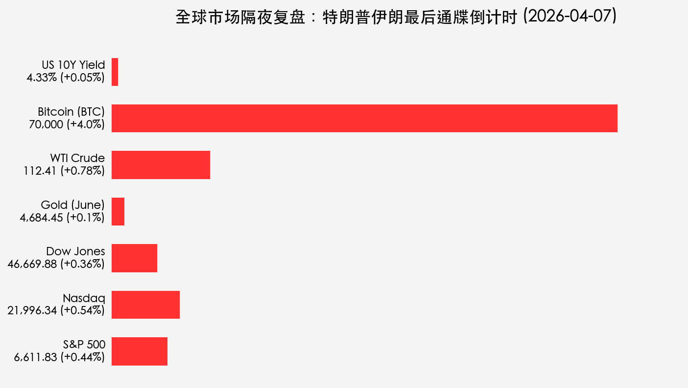
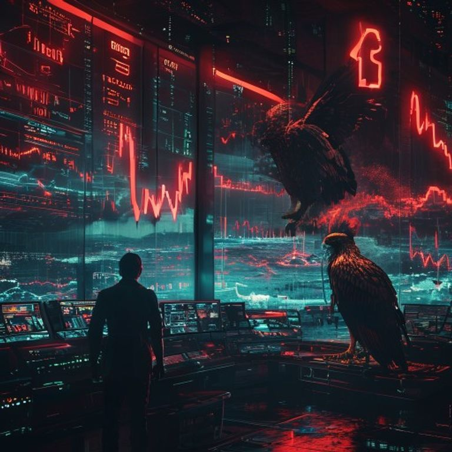

# 特朗普“最后通牒”进入24小时倒计时：美股顽强收涨，油价触及4年高点

**日期：2026年04月07日 (星期二)** &nbsp; **时段：[Morning Run / 隔夜复盘]**

> **核心摘要**：随着特朗普对伊朗“最后通牒”进入最终决胜局，全球市场在周一经历了极度敏感的震荡。美股三大指数在科技股带动下小幅收高，但原油已站上 112 美元上方，市场正屏息凝视周二晚间的地缘政治博弈。

## 核心行情复盘

周一美股市场表现出惊人的韧性，在巨大的地缘政治不确定性面前，科技股扮演了“避风港”角色。

*   **S&P 500**：收于 **6,611.83** 点，上涨 **+0.44%**。
*   **Nasdaq Composite**：收于 **21,996.34** 点，上涨 **+0.54%**，领涨三大指数。
*   **Dow Jones**：收于 **46,669.88** 点，上涨 **+0.36%**。
*   **WTI 原油**：结算价 **112.41 美元/桶**，上涨 **+0.78%**，创下近四年新高。
*   **现货黄金**：报 **4,684.45 美元/盎司**，小幅上涨 **+0.10%**，避险溢价依然高企。
*   **比特币 (BTC)**：大幅反弹至 **70,000 美元** 关口，涨幅达 **+4.0%**。

### 领涨行业分析
*   **半导体板块**：费城半导体指数 (SOX) 上涨 **1.06%**，美光科技 (+3.2%) 与希捷科技 (+5.6%) 表现强劲，市场博弈 AI 硬件在动荡时期的确定性收益。
*   **能源板块**：随着霍尔木兹海峡封锁担忧加剧，油气巨头股价随油价水涨船高。

## 核心解读与市场逻辑

> **1. “45天停火协议”的流言与现实**：
> 周一盘中曾传出有关 45 天临时停火协议的非官方报道，这曾一度引发油价高位回落，但随着白宫重申“周二晚间是最后期限”，市场情绪再度绷紧。这种“走钢丝”般的平衡反映了交易员对地缘政治极度敏感。

> **2. 经济韧性 vs. 通胀粘性**：
> 尽管美债 10 年期收益率持稳于 **4.33%** 的高位，但美股并未出现剧烈杀估值。这表明市场正在消化“高利率将维持更久”的预期，同时将赌注押在即将到来的 Q1 财报季业绩增长上。

## 政策脉动

*   **美联储动向**：虽然周一无重大官方声明，但市场已开始定价“2026年零降息”的极端情况。
*   **白宫警告**：特朗普总统通过社交媒体重申，若伊朗不在周二晚间开放霍尔木兹海峡，美军将打击其能源基础设施。

## 最新机构观点

*   **摩根大通 (J.P. Morgan) - 杰米·戴蒙**：
    > 戴蒙在年度股东信中发出鹰派警告，认为伊朗冲突可能引发严重的商品冲击，导致通胀比市场预期的更加粘稠。他甚至预测美联储可能在 2027 年重启加息，而非降息。

*   **摩根士丹利 (Morgan Stanley) - 迈克·威尔逊**：
    > 威尔逊维持防御性立场，指出 **4.5%** 的美债收益率是股市的“红线”。如果收益率进一步突破，估值压缩将不可避免。他建议配置业绩确定性高的质量增长股。

*   **高盛 (Goldman Sachs)**：
    > 保持审慎乐观。高盛认为即便地缘风险存在，全球经济 2.8% 的增长预测依然稳固。预计 2026 年仍有两次降息机会（分别在 6 月和 9 月），当前波动是布局 AI 半导体的“战术性良机”。

## 今日市场情绪：暴风雨前的宁静

市场在周一的表现更像是一种“战术性观望”。在周二晚间最后通牒到期前，避险资产（黄金、国债）与风险资产（科技股、BTC）并存，显示出投资者对地缘结局的极度分歧。

> Prompt: Cinematic style, A human trader (real person) standing in a high-tech obsidian control room, his silhouette cast against a wall of massive glowing screens displaying a 24-hour countdown clock in intense red. In the background, a digital window reveals a turbulent ocean of thick black oil under a sky lit by crimson lightning bolts shaped like stock tickers. A massive golden mechanical eagle is perched on a server tower, watching the horizon where a fleet of ships is gathered, masterpiece, high detail, intricate composition, cinematic lighting, 8k resolution

---
免责声明：内容仅供参考，不构成投资建议。
