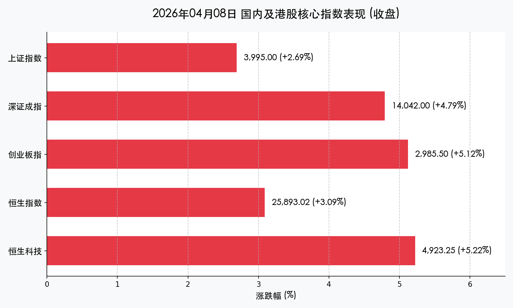
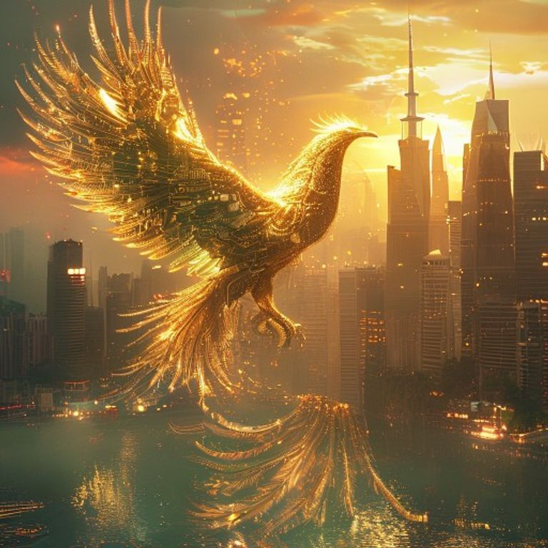

# 中国市场收盘报：美伊停火引燃“百点长阳”，两市成交额突破2.4万亿创纪录

**日期：2026年04月08日 (星期三)** &nbsp; **时段：下午 (国内市场收盘)**

> **核心摘要**：随着美伊正式达成临时停火协议及霍尔木兹海峡的重启，全球避险情绪瞬间瓦解。A股今日上演史诗级单边上攻行情，沪指大涨 **2.69%** 逼近 4000 点，两市成交额突破 **2.43万亿元** 创下历史级高点。科技与半导体板块在油价崩跌后的成本下行预期中全线爆发。

## 核心行情复盘

今日市场呈现极强的“普涨”格局，资金疯狂涌入成长性板块，北向资金连续第三日净流入，市场情绪被地缘政治反转彻底点燃。

*   **上证指数**：上涨 **2.69%**，收报 **3,995.00** 点，百点长阳直指 4000 点。
*   **深证成指**：大涨 **4.79%**，收报 **14,042.00** 点。
*   **创业板指**：飙升 **5.12%**，收报 **2,985.50** 点。
*   **恒生指数**：上涨 **3.09%**，收报 **25,893.02** 点。
*   **恒生科技指数**：暴涨 **5.22%**，收报 **4,923.25** 点。
*   **成交额**：沪深两市全天成交达 **2.43万亿元**，较前一交易日放量逾 **8,200亿**。

### 领涨与领跌行业
*   **领涨：半导体与AI**。**兆易创新 (GigaDevice)**、**澜起科技 (Montage)** 涨停，**中际旭创** 涨超 **8%**。受 AI Agent 应用爆发及算力成本下降预期驱动。
*   **领涨：互联网巨头**。港股 **美团** 暴涨近 **10%**，带动恒生科技指数大幅跑赢大盘。
*   **领跌：传统能源**。由于国际油价（WTI）今日狂泻 **15%-22%**，石油采掘板块逆市走低，**中国石油**、**中国海油** 下跌 **4%-6%**。

## 核心解读与市场逻辑

> **“和平红利”引发的估值修复**：
> 市场昨日还笼罩在特朗普“最后通牒”的战争阴云下，今日早间美伊停火的消息无疑是一剂强效强心针。霍尔木兹海峡的重启意味着全球能源供应链风险解除，这对作为能源进口大国的中国制造业和对成本敏感的科技行业是重大利好。

> **增量资金的集体调仓**：
> 今日 2.43 万亿的惊人成交额显示，大量场外资金在“拐点”出现后加速进场。中金公司指出，市场已从前期的“零寸博弈”转向“增量入场”阶段，北向资金全天成交占比超 12%，显示外资对中国核心资产的风险偏好迅速回归。

## 政策脉动

*   **能源价格管控**：国家发改委今日表示，尽管国际油价出现极端波动，国内零售汽柴油价格将保持相对稳定，以确保国内物流与生产成本的确定性。
*   **金融监管基调**：证监会与央行近期密集释放引导长期资金入市的信号，今日市场的爆发被视为对“增量资金配置时代”开启的提前反应。

## 最新机构观点

*   **中金公司 (CICC)**：对中长期表现持乐观态度。认为美国通胀有望在 6 月见顶，届时全球降息预期将进一步推升权益资产估值。
*   **中信证券 (CITIC)**：市场已达关键“拐点”。强烈看好 Q2 煤炭价格的新周期，并建议重点布局云产业链与算力租赁，认为 AI 多模态生态正进入“量价齐升”周期。
*   **摩根大通 (JPMorgan)**：将中国及香港股市 2026 年全年预期上调，认为盈利修复与监管压力缓解将驱动指数继续上行。

## 今日市场情绪：凤凰涅槃，长阳破晓

> Prompt: Surrealism style, A majestic golden phoenix with digital circuit patterns on its wings rising from a calm, sunlit harbor. In the background, the skyscrapers of a futuristic financial district (Shanghai Lujiazui) are bathed in a warm golden sunset. The stormy red K-lines from the morning have dissolved into a peaceful green glow., masterpiece, highly detailed, cinematic lighting, 8k.

**情绪简述**：晨曦破晓，战争的阴霾在夕阳中消散。市场如凤凰涅槃，不仅在点位上完成了收复，更在成交额上创下历史，预示着一轮由信心驱动的“和平长牛”可能正在开启。

---
免责声明：内容仅供参考，不构成投资建议。
