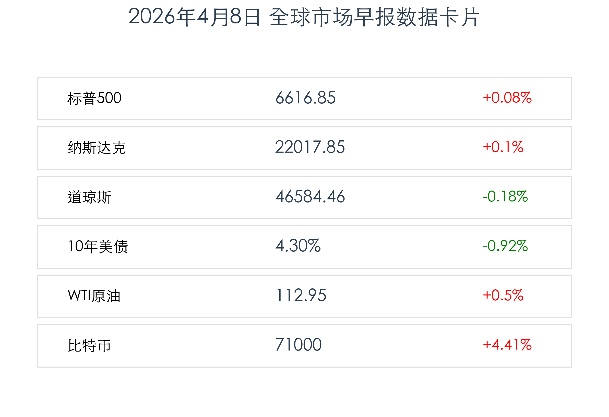
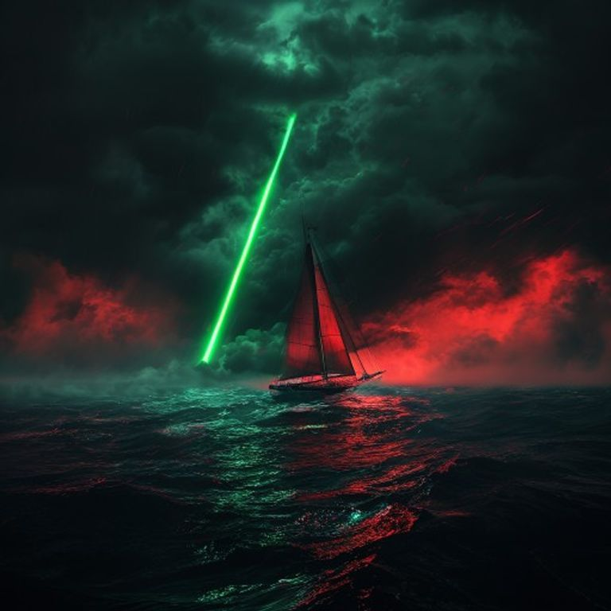

# 全球市场早报：特朗普“最后通牒”惊魂12小时，外交调解带来深夜反转

**日期：2026年04月08日 (星期三)** &nbsp; **时段：上午 (国际市场复盘)**

> **核心摘要**：隔夜美股在极度波动中惊险收平，市场一度因伊朗“最后通牒”迫近而重挫。随着外交斡旋传出延期信号，三大股指全线反弹收复失地。加密市场受摩根士丹利比特币 ETF 落地刺激表现强劲，比特币站稳 71,000 美元。

## 核心行情复盘

隔夜美股上演“V型”反转，市场情绪在 8:00 p.m. ET 的地缘博弈最后期限前极度紧绷，随后因外交斡旋转机而迅速修复。

*   **标普 500 指数**：上涨 **0.08%**，收于 **6,616.85** 点。
*   **纳斯达克综合指数**：上涨 **0.10%**，收于 **22,017.85** 点。
*   **道琼斯工业平均指数**：小幅下跌 **0.18%**，收于 **46,584.46** 点。
*   **10年期美债收益率**：回落至 **4.30%**，避险资金一度涌入债市。
*   **WTI 原油**：收报 **$112.95** 桶（+0.5%），盘中一度突破 $117。
*   **比特币 (BTC)**：大幅拉升至 **$71,000** 上方，受机构采纳消息提振。

### 核心个股动向
*   **博通 (AVGO)**：暴涨 **6.1%**，公司宣布与 Google 及 Anthropic 达成深度 AI 算力协作。
*   **联合健康 (UNH)**：大涨 **9.4%**，受益于 2027 年 Medicare Advantage 支付利率的超预期利好。
*   **环球音乐 (UMG)**：狂飙近 **14%**，比尔·阿克曼的潘兴广场宣布对其发起 640 亿美元的收购邀约。
*   **苹果 (AAPL)**：下跌 **2.1%**，折叠屏 iPhone 据传因工程挑战面临进度延迟。

## 核心解读与市场逻辑

> **地缘政治博弈的“惊魂一刻”**：
> 市场昨日的核心博弈点在于特朗普总统为伊朗设定的“停火并重启霍尔木兹海峡”最后通牒。在截止日期前数小时，美股一度出现踩踏式抛售。然而，深夜传来巴基斯坦总理提议将期限延长两周进行外交调停的消息，且白宫方面表现出考虑倾向。这一反转直接触发了空头回补，带领市场在收盘前一小时抹平跌幅。

> **能源市场的极端拉锯**：
> 原油市场经历了剧烈的“过山车”行情。在最后通牒威胁到伊朗基础设施的预期下，油价瞬间冲高至 117 美元上方。随着外交转机的出现，油价回落至 113 美元附近。目前能源价格依然维持在高位震荡，反映出市场对中东供应端的脆弱性仍持有高度警惕。

## 政策脉动

*   **摩根士丹利 (Morgan Stanley)**：正式确认将于明日推出其首只比特币现货 ETF（代码：MSBT）。作为华尔街最后一家入场的头部行，此举被视为加密货币主流化进程中的里程碑事件。
*   **医保政策红利**：美国联邦政府公布了 2027 年 Medicare Advantage 支付标准。由于此前市场普遍预期偏低，此次实际利率的公布对大型保险服务商构成了实质性的利润安全垫，极大提振了道指权重股的信心。

## 最新机构观点

*   **高盛 (Goldman Sachs)**：尽管地缘风险尚未完全解除，但外交空间的出现为“停火交易”创造了窗口。建议关注前期受压制的 AI 龙头，认为当前回调是财报季前的战术性布局机会。
*   **摩根大通 (JPMorgan)**：随着 MSBT 挂牌，比特币将迎来新的流动性高峰。虽然宏观环境依然波动，但数字资产作为“另类避险工具”的属性在本次霍尔木兹海峡危机中得到了进一步验证。

## 今日市场情绪：外交博弈下的孤帆远影

> Prompt: A lonely sailboat (real vessel) navigating a violent storm of red glowing K-lines on a dark ocean. In the distance, a brilliant green beam of light (symbolizing hope and mediation) breaks through the heavy black clouds. Cinematic lighting, masterpiece, high detail.

**情绪简述**：市场在狂风暴雨中徘徊，但天际线已现微光。地缘冲突的阴云并未消散，但外交斡旋的介入为恐慌的市场注入了一剂强心针。

---
免责声明：内容仅供参考，不构成投资建议。
