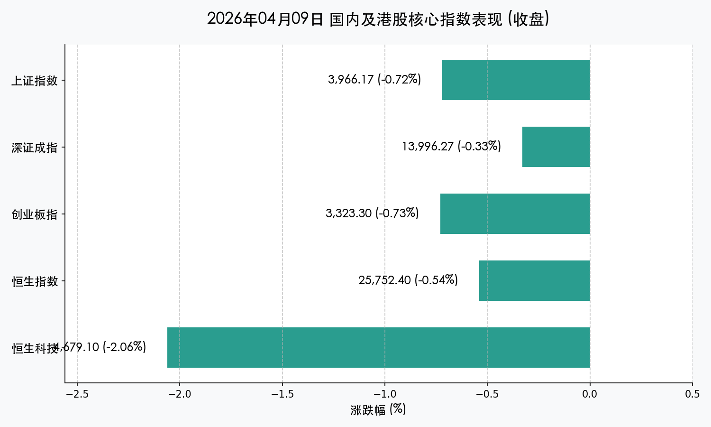
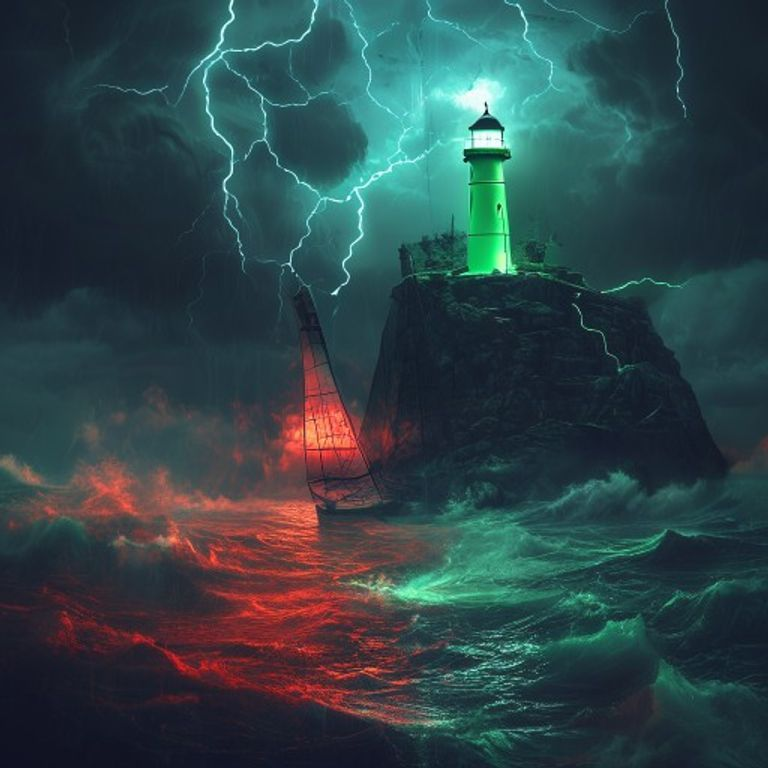

# 每日市场报告：震荡回调，AI应用端逆市突围

**日期：2026年04月09日 (星期四)** &nbsp; **时段：[收盘]**

> **核心摘要**：A股与港股在连续大涨后迎来缩量回调，主要指数集体收绿。受中东地缘局势不确定性、美联储纪要偏鹰以及获利盘离场等多重压力，恒生科技指数重挫逾2%。然而，以智谱为首的AI应用端受大模型更新刺激逆势爆发，显示市场在寻找由技术驱动的结构性避险方向。

## 核心行情复盘

今日市场全天震荡调整，沪深两市成交额合计约 **2.15万亿元**，较昨日虽有缩量，但仍处于高活跃区间。

*   **上证指数**：报收 **3966.17点**，下跌 **0.72%**。
*   **深证成指**：报收 **13996.27点**，下跌 **0.33%**。
*   **创业板指**：报收 **3323.30点**，下跌 **0.73%**。
*   **恒生指数**：报收 **25752.40点**，下跌 **0.54%**。
*   **恒生科技**：报收 **4679.10点**，大跌 **2.06%**。

> **板块分析**：
> *   **强势板块**：**AI应用/智谱概念**逆势走强，智谱大涨超13%；**算力硬件**（CPO、光纤）维持热度，东山精密录得2连板。
> *   **领跌板块**：受油价回落及避险情绪升温影响，**旅游、保险、汽车股**表现疲软；科技巨头普遍回调，小米、快手跌幅居前。

## 核心解读与市场逻辑

> **1. 涨后震荡与获利回吐**：在前几日大幅收复失地后，市场积压了大量获利盘。今日成交额缩减至2.15万亿，显示出资金在重要点位附近的谨慎态度，部分资金选择暂时离场观望。
>
> **2. 地缘局势与美联储阴霾**：中东局势虽有短期停火协议，但以色列的新一轮空袭令局势再度紧绷。同时，隔夜美联储会议纪要释放的偏鹰信号，压制了全球成长股估值，恒生科技指数因此承压明显。
>
> **3. AI应用端的结构性亮点**：尽管大盘回调，但由智谱发布GLM-5.1模型引发的AI应用热潮，证明了资金对“新质生产力”和“应用落地”的极高兴趣，这成为今日震荡中唯一的避险亮色。

## 政策脉动

*   **中国人民银行 (PBOC)**：一季度例会重申将继续实施**适度宽松**的货币政策，并开展了8000亿元的3个月期买断式逆回购，向市场传递了中长期流动性无虞的信号。
*   **中国证监会 (CSRC)**：新版《关于短线交易监管的若干规定》正式施行，标志着监管对大股东交易行为的规范化进入新阶段，有利于维护长期投资者利益。

## 最新机构观点

*   **中金公司 (CICC)**：认为当前回调属于“牛市初期的技术性整固”。鉴于央行流动性投放稳定，且科技金融政策持续加码，建议投资者继续关注算力与AI赋能的制造业。
*   **中信证券 (CITIC)**：市场已进入由“估值驱动”向“业绩预期驱动”的转折期。虽然短期受外部扰动有波动，但 A 股整体估值仍具吸引力，重点看好低位回补的成长龙头。
*   **高盛 (Goldman Sachs)**：指出近期中国资产的流动性改善具有持续性，维持对中资股的“增持”评级，尤其看好能够在此轮技术变革中率先变现的AI应用类标的。

## 今日市场情绪：狂风中的微光

> Prompt: Surrealism style, A lonely sailboat navigating a turbulent sea made of jagged red K-line waves. In the distance, a small, glowing green AI chip lighthouse stands on a dark, rocky cliff, casting a faint but steady emerald light through the mist. The sky is filled with dark, heavy clouds and flashes of lightning shaped like Middle Eastern daggers, representing geopolitical tensions. A human trader (real person) is seen on the boat, looking at a small compass with a focused expression., masterpiece, high detail, intricate composition, cinematic lighting, 8k resolution

**情绪简述**：大盘如在狂风恶浪中颠簸的孤舟，中东的“匕首”划破长空，外部金融市场的鹰派寒流袭来。然而，在那远处闪烁的微弱绿光（AI 技术）却成为了海面上唯一的指引，带给那些坚持前行的投资者一线生机。

---
免责声明：内容仅供参考，不构成投资建议。
