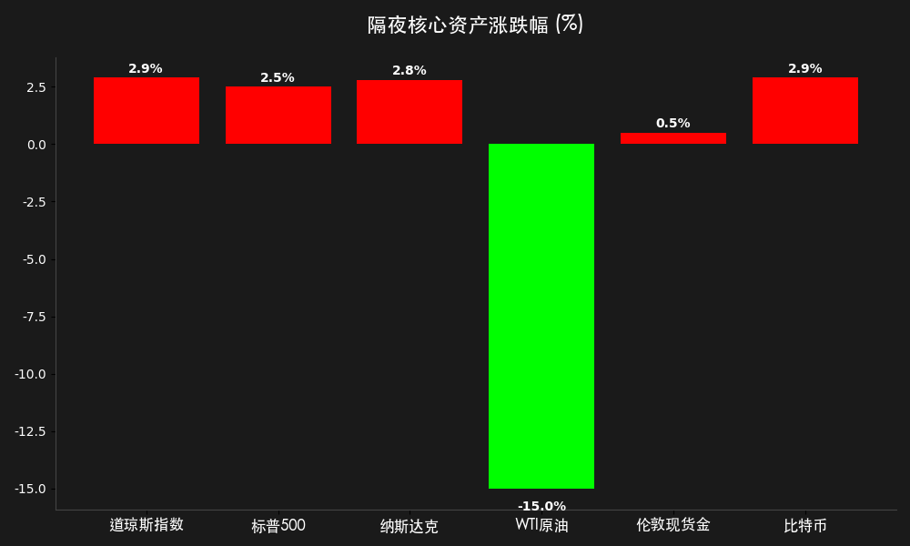

# 全球市场晨报：美伊停火协议达成，原油崩盘 15% 助力美股狂欢

**日期：2026年04月09日 (星期四)** &nbsp; **时段：上午 (国际市场复盘)**

> **核心摘要**：隔夜美股迎来一年来最佳交易日，美伊达成两周停火协议并重启霍尔木兹海峡，地缘政治风险瞬间消退。WTI 原油暴跌 15% 创六年最大单日跌幅，大幅缓解通胀焦虑。摩根大通正式宣布 Marianne Lake 为下任 CEO，标志着“戴蒙时代”即将谢幕。

## 核心行情复盘

隔夜全球风险资产全线爆发，地缘政治压力的解除引发了剧烈的空头回补与多头反扑。

*   **标普 500 指数**：上涨 **2.50%**，收于 **6,782.81** 点。
*   **纳斯达克综合指数**：上涨 **2.80%**，收于 **22,634.99** 点。
*   **道琼斯工业平均指数**：上涨 **2.90%**，收于 **47,909.92** 点。
*   **10年期美债收益率**：小幅回落至 **4.29%**，避险溢价消退。
*   **WTI 原油**：暴跌 **15.00%**，收报 **$96.06**/桶，重回百元大关下方。
*   **比特币 (BTC)**：上涨 **2.90%**，报 **$71,339.09**，风险偏好显著回升。
*   **伦敦现货金**：上涨 **0.50%**，收报 **$4,731.59**/盎司。

## 核心解读与市场逻辑

> **地缘政治风险的“瞬间消散”**：
> 隔夜市场最大的变动来源于美伊达成的为期两周的停火协议。随着霍尔木兹海峡的重新开放，全球能源供应中断的尾部风险被有效移除。这一消息直接点燃了华尔街的做多热情，三大股指均创下阶段性新高。

> **通胀焦虑的强力缓解**：
> 原油价格单日 15% 的跌幅是过去六年来最剧烈的波动之一。油价重回 100 美元下方，极大地减轻了市场对于“滞胀”的担忧，也让投资者重新开始押注美联储在 2026 年下半年的降息可能。

## 政策脉动

*   **美联储 3 月会议纪要**：纪要虽然显示部分官员对粘性通胀持鹰派立场，但在停火协议达成后，市场已将其视为“过时信息”。目前交易员预计 2026 年降息的概率已从接近 0% 飙升至 60%。
*   **银行业监管松绑**：美联储可能削减对大型银行的资本要求（Basel III 修正案），预计将为华尔街银行释放约 3200 亿美元的超额资本，直接利好高盛、摩根士丹利等机构。

## 最新机构观点

*   **高盛 (Goldman Sachs)**：维持 2026 年美股看涨观点，并预测美联储将在年内进行两次降息，认为地缘政治降温是市场回归基本面的重要拐点。
*   **摩根士丹利 (Morgan Stanley)**：分析师指出，由于监管政策利好，美系大行有望开启新一轮大规模回购潮，预计回购规模将比此前预期增加 20%。
*   **摩根大通 (JPMorgan)**：Jamie Dimon 在其年度股东信中提醒，尽管短期停火带来利好，但全球能源定价结构的长期转变仍可能让通胀保持在目标上方。

## 今日市场情绪：重压释放后的狂欢

> Prompt: Surrealism style, A massive hourglass, but instead of sand, it's filled with thick black oil that is rapidly draining out through a narrow gap. In the background, a golden scale is slowly tilting upwards, signifying a rebalancing of the global economy. Cinematic lighting, photorealistic, 8k., masterpiece, high detail, intricate composition, cinematic lighting, 8k resolution

**情绪简述**：压抑已久的市场情绪在停火消息后得到彻底释放。油价的崩盘如同沙漏中流逝的阴霾，而平衡的恢复正为全球资产估值打开新的空间。

---
免责声明：内容仅供参考，不构成投资建议。
