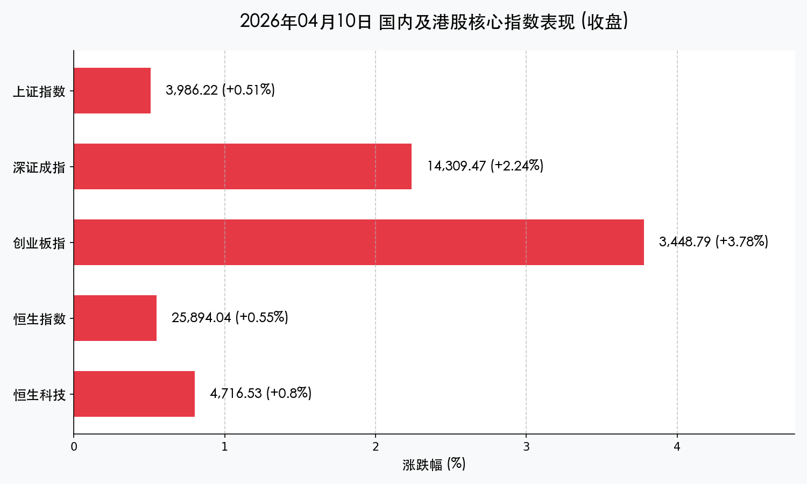

# A股创业板指暴涨3.78%创四年半新高：电池AI全线爆发，成交额重回2.3万亿

**日期：2026年04月10日 (星期五)** &nbsp; **时段：收盘报 (Evening)**

> **核心摘要**：今日市场在券商“行情风向标”和AI/电池等成长赛道的共同带动下全线爆发。创业板指大涨3.78%创四年半新高，两市成交额突破2.3万亿元，交投极其活跃，呈现明显的普涨格局。

## 核心行情复盘

今日A股与港股市场集体走强，尤其是A股成长风格表现极其亮眼：

*   **上证指数**：报收 **3986.22点**，涨 **0.51%**，盘中一度重回4000点大关。
*   **深证成指**：报收 **14309.47点**，涨 **2.24%**。
*   **创业板指**：报收 **3448.79点**，暴涨 **3.78%**，刷新2021年12月底以来的阶段新高。
*   **科创综指**：报收 **1747.04点**，涨 **1.27%**。
*   **恒生指数**：涨 **0.55%**。
*   **恒生科技指数**：涨 **0.80%**。

**成交与资金面**：
沪深两市全天成交额合计达 **2.32万亿元**，较前一交易日显著放量约1888亿元。

**板块热点分析**：
*   **领涨**：电池产业链表现最强，宁德时代涨超6%；能源金属、证券板块（中信证券涨超7%）作为行情风向标发力；存储芯片、AI算力硬件（CPO概念）多股创历史新高。
*   **领跌**：贵金属、港口航运、光纤概念表现相对低迷。

## 核心解读与市场逻辑

> 今日市场的爆发具有标志性意义。创业板指创下四年半新高，不仅是技术层面的突破，更反映了市场对成长股估值重塑的共识。券商股的大幅拉升通常被视为牛市中期的确认信号，配合两市2.3万亿的巨额成交，显示场外资金正在加速入场。电池产业的走强则得益于政策端对行业秩序的规范，预期由“价格战”转向“高质量发展”。

## 政策脉动

1.  **规范电池行业秩序**：工信部、发改委等四部门部署规范动力及储能电池行业竞争秩序，坚决抵制“内卷式”不合理竞争，利好头部优质企业。
2.  **香港稳定币牌照落地**：香港金管局公布首批稳定币牌照，带动相关概念股及港股券商板块走强，体现了香港在Web3与数字资产领域的领先地位。
3.  **境外国资监管强化**：国资委成立境外国资工作局，加强央企境外资产监管及风险防控。

## 最新机构观点

*   **中信建投**：3月A股新开户数达460万户，环比增长超80%，显示投资者入市意愿显著修复，情绪改善有望带动成交量持续回升。
*   **银河证券**：外部地缘政治仍具不确定性，全球市场处于高波动环境，A股短期或维持震荡轮动特征，需关注量价配合情况。
*   **华泰证券**：建议短期博弈超跌板块的反弹机会，随着流动性回暖，AI算力、软件及港股科技等成长板块具有更高弹性。

## 今日市场情绪：凤凰涅槃，创四年半新高

今日市场情绪极其高昂，成长赛道的全面爆发让投资者信心倍增。创业板指的突破象征着长期压抑后的力量释放。

> Prompt: A massive green phoenix made of glowing laser light rising from the Shenzhen and Shanghai skylines, symbolizing the ChiNext index breaking a four-year high and the explosion of the battery and AI sectors.

免责声明：内容仅供参考，不构成投资建议。
