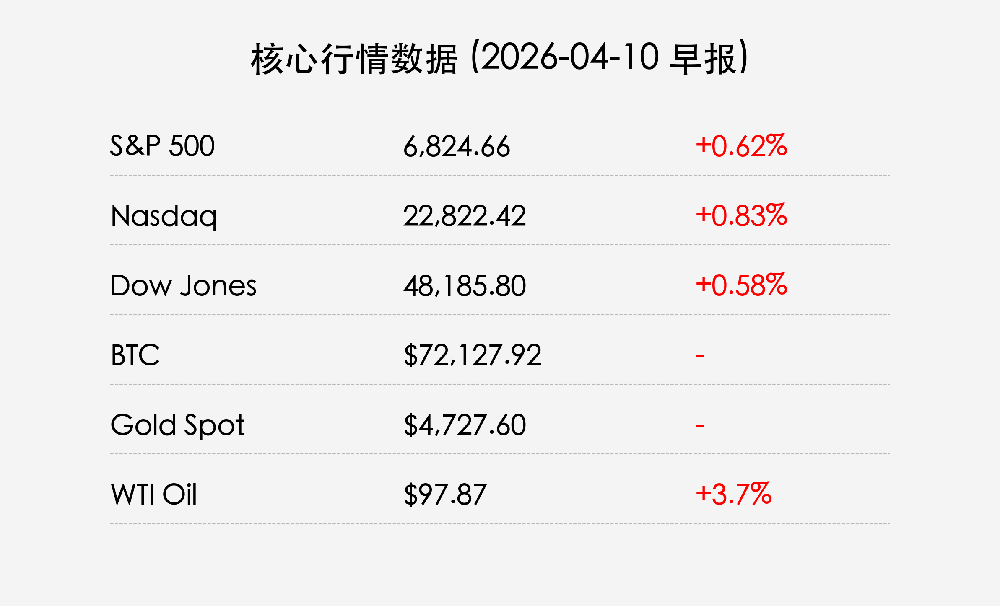

# 全球市场晨报：停火协议初显成效，美股连涨三日；中东和平进程步入关键期

**日期：2026年04月10日 (星期五)** &nbsp; **时段：上午 (国际市场复盘)**

> **核心摘要**：随着美伊达成的两周停火协议进入第三天，全球风险资产延续反弹势头，标普500与纳指录得三连阳。以色列总理内塔尼亚胡授权与黎巴嫩进行直接谈判，进一步缓和了地区紧张情绪。然而，由于霍尔木兹海峡依然处于“有限度封锁”状态，WTI原油价格逆市上涨近4%，凸显出能源供应链修复的长期性。

## 核心行情复盘

隔夜全球市场继续定价“地缘政治降温”，风险偏好持续回升。尽管油价走高对通胀预期有所扰动，但和平谈判的实质性进展成为驱动股价上行的主旋律。

*   **标普 500 指数**：上涨 **0.62%**，收报 **6,824.66** 点。
*   **纳斯达克综合指数**：上涨 **0.83%**，收报 **22,822.42** 点。
*   **道琼斯工业平均指数**：上涨 **0.58%**，收报 **48,185.80** 点。
*   **10年期美债收益率**：小幅上升至 **4.292%**。
*   **WTI 原油**：上涨 **3.70%**，收报 **$97.87**/桶。
*   **比特币 (BTC)**：报 **$72,127.92**，高位震荡。
*   **伦敦现货金**：报 **$4,727.60**/盎司，基本持平。

## 核心解读与市场逻辑

> **1. “和平曙光”下的风险回补**：
> 市场目前处于极度敏感的“协议确认期”。内塔尼亚胡授权与黎巴嫩谈判的消息，被华尔街视为地缘政治风险从“全面冲突”向“外交斡旋”转化的关键信号。副总统万斯（J.D. Vance）率团前往伊斯兰堡进行更广泛的调停，为市场注入了信心，推动了成长股（尤其是科技板块）的持续走强。

> **2. 能源供应链的“最后梗阻”**：
> 尽管政治氛围回暖，但霍尔木兹海峡的实物通航并未完全恢复。这种“政治冷、经济慢”的背离导致了油价在停火协议下反而出现报复性反弹。摩根士丹利指出，只要海峡封锁不彻底解除，能源价格的波动将继续成为压制通胀下行速度的“灰犀牛”。

## 政策脉动

*   **美国外交行动**：白宫确认万斯副总统已抵达巴基斯坦，将与伊朗代表进行间接磋商。这标志着美伊自2026年初冲突爆发以来最高级别的外交接触。
*   **美联储立场监控**：随着油价再次逼近100美元，美联储内部对于“二次通胀”的担忧并未完全消除。摩根大通指出，若油价持续在100美元上方震荡，美联储可能会在5月会议上释放更强烈的维持高利率（Higher for Longer）信号。

## 最新机构观点

*   **高盛 (Goldman Sachs)**：将第二季度布伦特原油预期下调至 **$90**（原为 $99），认为风险溢价已部分消退，但警告若黎巴嫩谈判破裂，金价可能再次冲击 $5,000。
*   **摩根大通 (JPMorgan)**：分析师 Michael Feroli 维持 2026 年不降息的判断，认为能源冲击已造成通胀粘性，建议配置科技股以对抗潜在的长期高利率环境。
*   **摩根士丹利 (Morgan Stanley)**：首席分析师 Michael Wilson 建议增加对**周期性板块**和**高质量成长股**的配置，认为标普 500 指数正在形成阶段性底部。

## 今日市场情绪：狂风过后的生机

> Prompt: Surrealism style, A giant glass dove with glowing light inside, flying over a stormy sea of red and green digital candles, with a blocked golden channel in the background symbolizing the Strait of Hormuz. A human trader (real person) is on a small raft, looking up at the dove with hope., masterpiece, high detail, intricate composition, cinematic lighting, 8k resolution

**情绪简述**：海面上风暴虽未完全平息，但那一抹透亮的玻璃鸽已衔来和平的信笺。在波涛汹涌的数字海洋（K线图）上，投资者正小心翼翼地驾驭着小舟，望向远方渐渐开启的金光，那是通往新平衡的希望。

---
免责声明：内容仅供参考，不构成投资建议。
