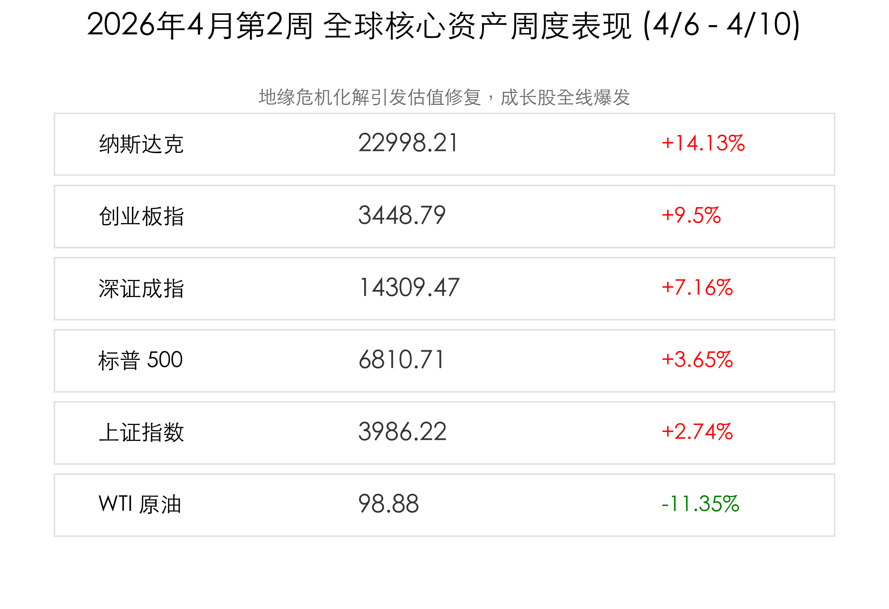

# [全球市场周报] 战云消散后的狂欢与通胀阴霾：创业板指创四年半新高，纳指周涨14%

**日期：2026年04月11日 (星期六)** &nbsp; **时段：周末复盘 (Evening)**

> **核心摘要**：本周全球市场经历从“战争边缘”到“和平红利”的剧烈反转。美伊停火协议引爆全球风险资产，纳指全周飙升14%，创业板指刷新四年半高位。然而，周五爆表的美国CPI数据（3.3%）与油价的低位回升，正为这场狂欢蒙上通胀反复的阴影。

## 核心资产周度/日度表现回顾

本周（4月6日-4月10日）是见证历史的一周，地缘政治的“黑天鹅”转化为“金凤凰”，推动各大指数创下近年最佳单周表现。

| 核心指数 | 周五收盘 | 日涨跌幅 | 全周累计涨跌 |
| :--- | :--- | :--- | :--- |
| **纳斯达克 (Nasdaq)** | 22,998.21 | +0.77% | **+14.13%** |
| **创业板指 (ChiNext)** | 3,448.79 | +3.78% | **+9.50%** |
| **深证成指 (SZSE)** | 14,309.47 | +2.24% | **+7.16%** |
| **标普 500 (S&P 500)** | 6,810.71 | -0.20% | **+3.65%** |
| **上证指数 (SSE)** | 3,986.22 | +0.51% | **+2.74%** |
| **道琼斯 (Dow)** | 47,872.65 | -0.65% | **+3.04%** |
| **比特币 (BTC)** | $73,000 | +3.50% | **+3.69%** |
| **WTI 原油** | $98.88 | +2.34% | **-11.35%** |
| **现货黄金** | $4,765.60 | -1.10% | **+1.7%** (周五回调) |

*(注：黄金价格在本周初受地缘极度紧张刺激曾一度剧烈波动，随后在停火协议后维持高位震荡。)*

## 过去 48 小时重磅事件深度复盘

> **1. 美国 3 月 CPI 意外爆表，降息预期再度“冻结”**：
> 周五晚间公布的数据显示，美国 3 月 CPI 同比上涨 **3.3%**，显著高于市场预期的 3.1%。核心 CPI 亦表现顽固。这一数据直接导致美债收益率飙升，美股周五表现分化，道指与标普承压，仅靠 AI 龙头的强势支撑纳指微涨。市场开始定价 2026 年上半年“零降息”的可能性。
>
> **2. 创业板指跨越“四年半之巅”**：
> 周五 A 股创业板指暴涨 3.78%，刷新 2021 年底以来的新高。这主要得益于电池产业链（宁德时代等）与 AI 算力龙头的共振。两市成交额重回 2.3 万亿上方，显示国内投资者信心已彻底被“和平红利”激活。
>
> **3. 能源价格的“回马枪”**：
> 尽管停火协议让油价从 $112 回落至 $98 附近，但周五晚间油价再度回升 2.3%。反映出市场在狂欢后开始意识到，供应链的修复仍需时日，且中东协议的脆弱性依然让空头不敢轻举妄动。

## 下周全球宏观大事预警

下周（4月13日-17日）市场将从“地缘驱动”转向“数据与业绩驱动”，建议重点关注：

*   **4月13日 (周一)**：**高盛 (GS)** 开启财报季；**日本央行 (BoJ)** 行长植田和男讲话。
*   **4月14日 (周二)**：**美国 3 月 PPI** 数据（上游通胀信号）；**摩根大通 (JPM)** 财报。
*   **4月15日 (周三)**：**美国工业产出**数据；**贝莱德 (BLK)**、**花旗 (C)** 财报。
*   **4月16日 (周四)**：**中国 Q1 GDP、工业、消费“数据全家桶”**（核心关注）；**TSMC (台积电)** 财报（AI 风向标）。
*   **4月17日 (周五)**：**IMF/世界银行春季年会** 闭幕，全球央行行长或释放新的政策风向。

## 顶级机构周末策略内参摘要

*   **中信建投**：市场已进入“信心正循环”。建议坚守成长主线，尤其是具备全球竞争力的**电池产业链**与**AI硬件**。目前 2.3 万亿的成交额足以支撑指数进一步突破 4000 点大关。
*   **高盛 (Goldman Sachs)**：虽然 CPI 爆表，但我们认为 Q1 财报季将是“遮羞布”。重点关注下周美股大行的坏账拨备，这反映了高利率对实体经济的真实侵蚀。
*   **摩根士丹利 (Morgan Stanley)**：维持对美股的“战术性防御”。14% 的周涨幅已透支了利好，PPI 若再超预期，市场可能迎来剧烈的获利回吐压力。

## 今日市场情绪：狂欢后的深思

> Prompt: Surrealism style, A giant glass clock tower where the gears are made of glowing green computer chips and liquid battery cells. The clock face shows '3.3%' in glowing red numbers. Outside the tower, a vibrant green valley is blooming with electronic flowers after a massive red storm. In the background, a few dark clouds shaped like skulls labeled 'Inflation' are gathering on the horizon. A human trader (real person) stands at the balcony, holding a golden telescope and looking at the distant clouds with a mixture of awe and caution., masterpiece, high detail, intricate composition, cinematic lighting, 8k resolution

**情绪简述**：当战争的雷鸣消散，成长股的繁花在“和平红利”的雨露下疯狂绽放。然而，在那 3.3% 的钟声里，通胀的阴云正悄然汇聚。这是一个值得庆祝的周末，但也需要我们举起望远镜，警惕下一次风暴的酝酿。

---
免责声明：内容仅供参考，不构成投资建议。
