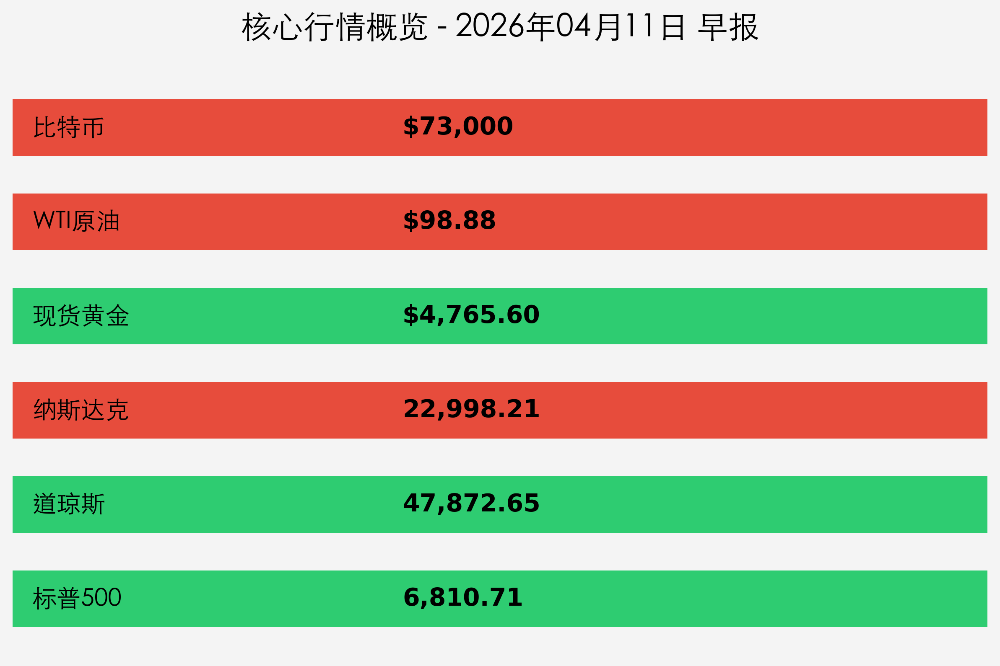
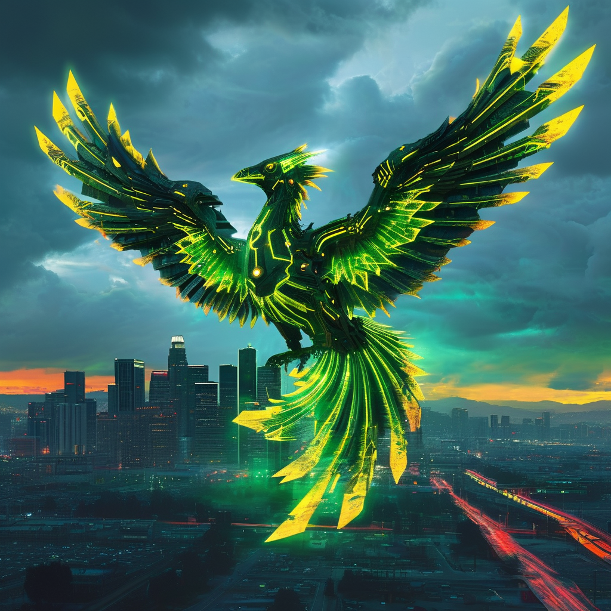

# [全球市场早报] CPI 意外“爆表”触及两年高点，科技股韧性护盘纳指逆势收涨

**日期：2026年04月11日 (星期六)** &nbsp; **时段：上午**

> **核心摘要**：美国3月CPI同比上涨3.3%，创两年新高，显著超预期的数据强化了美联储“更高更久”的利率立场。尽管大盘承压，但英伟达、博通等芯片巨头领涨，支撑纳指逆势收红；中东停火协议进展不一，国际油价高位波动，比特币冲破7.3万美元关口。

## 核心行情复盘

周五（4月10日）美股三大股指涨跌互现。通胀数据的意外反弹令价值股与大金融板块普遍受挫，但AI与芯片领域的持续强势为市场注入了强心针。

*   **纳斯达克综合指数**：收盘 **22,998.21** 点，上涨 **0.77%**。
*   **道琼斯工业平均指数**：收盘 **47,872.65** 点，下跌 **0.65%**（跌313点）。
*   **标普 500 指数**：收盘 **6,810.71** 点，下跌 **0.20%**。
*   **比特币 (BTC)**：早间交易于 **$73,000** 附近，24小时上涨 **3.5%**。
*   **现货黄金**：结算至 **$4,765.60**，下跌 **1.1%**，受美债收益率攀升挤压。
*   **WTI原油**：报 **$98.88**，全天波动剧烈，涨幅约 **2.34%**。

**领涨/领跌板块：**
*   **领涨**：半导体板块（费城半导体指数创历史新高）、软件服务、加密货币概念。
*   **领跌**：传统金融（高盛领跌）、公用事业、房地产。

## 核心解读与市场逻辑

> **1. 通胀“幽灵”回归：**
> 美国3月CPI同比增速达 **3.3%**，环比增长亦超预期。这主要归因于能源价格（同比飙升13%）的持续走高，反映出中东冲突对美国本土供应链的传导效应已进入实质化阶段。
>
> **2. AI 信仰的护城河：**
> 尽管宏观环境恶化，英伟达（+1.8%）和博通（+4.4%）的强劲表现证明，投资者仍将AI视为抵御通胀和经济增长放缓的“避风港”。Anthropic与CoreWeave的大单成交进一步验证了算力需求的持久性。
>
> **3. 降息预期再次修正：**
> 市场目前预测美联储在4月28-29日的会议上将维持 **3.50%–3.75%** 的利率区间不变。多位经济学家预测，2026年全年的降息空间已被大幅压缩，甚至有机构开始讨论“重启加息”的极端情景。

## 政策脉动

*   **美联储 (Fed)**：多位官员重申“Higher for Longer”立场，强调在通胀未显现明确回落至2%目标的路径前，不急于调整现行政策。
*   **密歇根大学消费者信心指数**：4月初步数据下跌 **10.7%**，显示高通胀已开始压制终端消费意愿，一年期通胀预期跳升至 4.8%。
*   **中东外交进展**：在伊斯兰堡举行的停火谈判陷入僵局，伊朗与美方在撤军细节上存在显著分歧，这也是支撑油价在收盘前拉升的主因。

## 最新机构观点

*   **高盛 (Goldman Sachs)**：尽管CPI数据不佳，但我们认为Q1财季将开启“战术性反弹”，重点关注下周摩根大通等大型银行的业绩预警与息差表现。
*   **摩根士丹利 (Morgan Stanley)**：市场正在经历从“通胀见顶论”到“韧性通胀论”的认知切换，防御性资产的权重应适度提升，尤其关注具备强现金流的科技龙头。
*   **渣打银行 (Standard Chartered)**：比特币冲破7.3万美元是机构资金流入的直接结果。贝莱德IBIT的创纪录流入显示，在法币通胀担忧加剧时，数字资产的“数字黄金”属性正在被主流资金认可。

## 今日市场情绪：凤凰涅槃

> Prompt: Cyberpunk style, A phoenix made of glowing green laser lines rising from the skyline of Silicon Valley, its wings spanning across the horizon, representing resilience and hope in the tech sector despite the dark clouds of inflation gathering in the background., masterpiece, high detail, intricate composition, cinematic lighting, 8k resolution

**情绪简述**：尽管宏观数据如乌云压境，但科技巨头展现出的盈利确定性正如同硅谷上空的绿色凤凰，在焦虑中孕育着新的升力。

---
免责声明：内容仅供参考，不构成投资建议。
