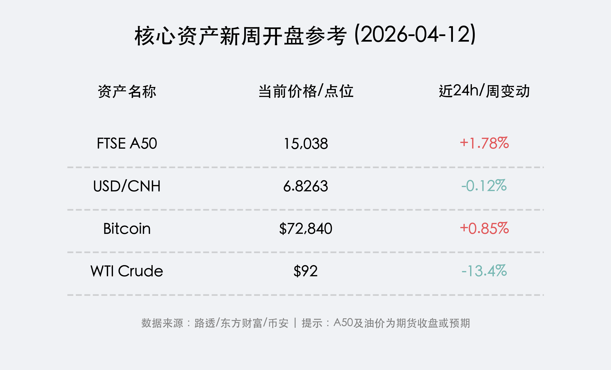

# 2026年04月12日 (星期日) 晚报：美伊谈判未果阴影再现，一季报财报季与4000点关口开启新局

**日期：2026年04月12日 (星期日)** &nbsp; **时段：[下午 (16:30)]**

> **核心摘要**：美伊伊斯兰堡谈判未能达成协议，霍尔木兹海峡地缘风险溢价面临重估。随着全球一季报财报季由华尔街大行正式揭幕，叠加 A 股沪指逼近 4000 点心理关口及创业板改革新规落地，市场博弈将进入“业绩实证”与“政策预期”的双重关键期。

## 周末财经要闻终极汇总

过去 48 小时，全球金融市场在短暂的平静后再度迎来多重变数：

*   **美伊伊斯兰堡谈判陷入僵局**：美伊第三轮“面对面”谈判于 12 日结束，双方在霍尔木兹海峡通行权等关键议题上仍存严重分歧。尽管目前处于两周临时停火期，但谈判破裂增加了中东局势二次升温的风险，周一开盘原油价格可能面临反弹压力。
*   **证监会深化创业板改革**：证监会发布支持“新质生产力”发展的八项举措，增设第四套上市标准，旨在放宽对优质未盈利创新企业的限制。同时，上交所拟将 ST 股涨跌幅限制由 5% 调整为 10%，显著提升市场活跃度。
*   **两岸交流新政落地**：中共中央台办受权发布促进两岸交流合作的十项措施，包括推动福建沿海与金马地区“四通”及空中直航正常化，区域经济合作预期显著增强。
*   **AI 资安监管升级**：美联储与财政部本周与银行巨头紧急会晤，重点讨论 Anthropic 最新模型“Claude Mythos”可能带来的金融系统性资安风险。

## 新一周市场核心博弈逻辑

*   **地缘溢价的“回头草”**：上周五 WTI 原油录得 13.4% 的断崖式下跌，但随着周末谈判未果，市场将重新评估供应中断的可能性。避险资产黄金与美元在周初或将获得支撑。
*   **A 股 4000 点保卫战**：沪指在 4000 点整数关口附近震荡加剧。一季度绩优股的走强（如中信证券净利超百亿）与创业板改革新规的落地，将引导资金流向“新质生产力”与“低估值蓝筹”两条主线。
*   **汇率韧性**：离岸人民币 (USD/CNH) 维持在 **6.82** 区间强势震荡。受美元走弱及国内政策红包影响，人民币资产的全球配置吸引力持续回升。
*   **加密货币高位震荡**：比特币在突破 **72,000 美元** 后于高位寻找支撑，显示在宏观不确定性下，部分资金仍将其视为“数字黄金”。

## 本周重磅经济数据与会议前瞻

*   **周一至周二：IMF/世界银行春季会议**。IMF 将发布最新《世界经济展望》报告，关注其对地缘冲突下全球通胀与增长路径的重新定调。
*   **周二：美国 3 月 PPI 数据**。作为 CPI 的领先指标，若 PPI 超预期下行，将大幅缓解市场对美联储 6 月“按兵不动”的担忧。
*   **周四：欧元区 3 月 CPI 终值**。若通胀持续回落，欧洲央行先于美联储降息的预期将进一步强化。

## 头部券商/投行开盘策略点睛

*   **高盛 (Goldman Sachs)**：随着 **高盛、摩根大通、花旗** 本周陆续发布财报，华尔街将进入“业绩驱动阶段”。高盛维持对 AI 算力及投行复苏板块的“强推”评级。
*   **中信证券**：认为 A 股“业绩预增行情”已正式开启。建议重点关注锂电材料（如 **宁德时代** 将于周三披露一季报）、AI 存储模组及具备估值修复空间的非银金融板块。
*   **摩根大通 (JPMorgan)**：特别强调了港股的估值修复机会。随着阿里巴巴、腾讯一季报前瞻向好及香港稳定币牌照的发放，港股互联网平台与金融科技板块具备较高弹性。

## 今日市场情绪：星空下的僵局与引擎

> Prompt: Surrealism style, A giant stone chessboard suspended in space. On one side, a Persian lion and an American eagle are in a stalemate. On the other side, massive golden skyscrapers with the logos of Goldman Sachs and JPMorgan are rising from a sea of digital numbers. A Chinese dragon is coiling around a mountain peak marked '4000', looking towards the horizon with determination. A human trader (real person) watches from a small floating platform, holding a tablet reflecting the data., masterpiece, high detail, intricate composition, cinematic lighting, 8k resolution

**情绪简述**：星空深处，古老的对手在棋盘前陷入沉默，地缘局势的阴影未曾散去；而在地球的另一端，金色的金融引擎已轰然启动，4000 点的雄关前，巨龙正蓄势待发。市场在不确定性的迷雾中，正竭力捕捉一季报透露的每一丝繁荣曙光。

---
免责声明：内容仅供参考，不构成投资建议。
