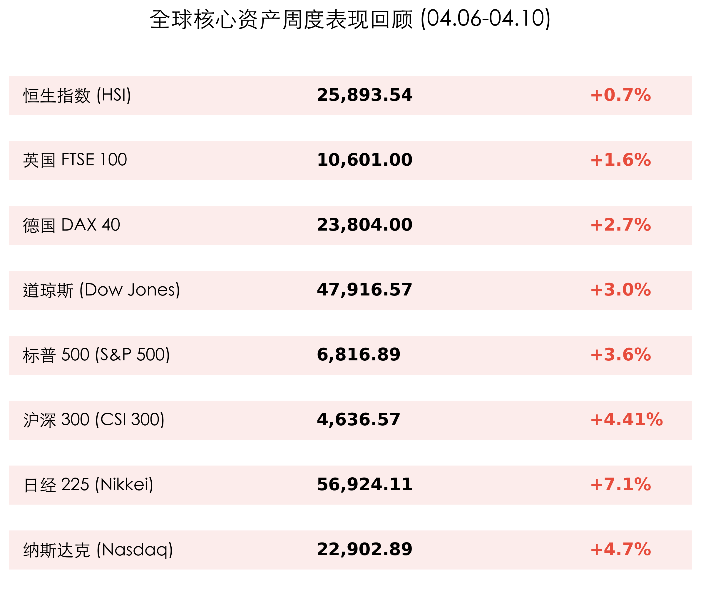
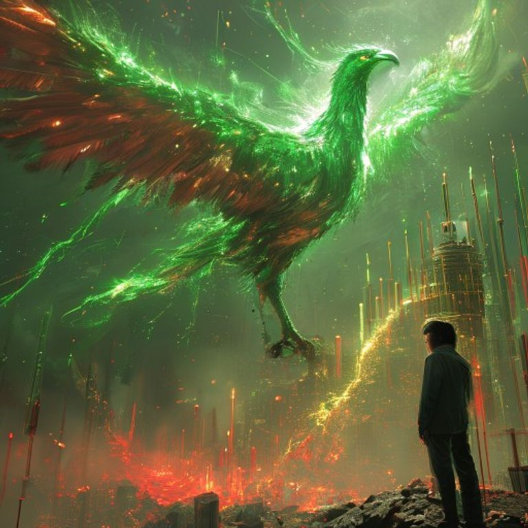

# 2026年04月12日 (星期日) 晨报：全球休战协议引发避险退潮，多国指数录得单周最佳表现

**日期：2026年04月12日 (星期日)** &nbsp; **时段：[上午 (08:00)]**

> **核心摘要**：美伊临时停火协议意外达成，驱动全球市场风险偏好集体回升。纳指单周大涨 4.7%，日经指数飙升 7.1% 领涨全球。尽管美国 3 月 CPI 数据超预期达到 3.3%，但地缘局势的降温有效抵消了通胀忧虑，市场情绪从“战时状态”转向“增长预期”。

## 核心资产周度/日度表现回顾

本周（04.06 - 04.10），在全球地缘局势缓和的重大利好刺激下，全球核心资产集体迎来爆发式反弹：

*   **纳斯达克 (Nasdaq)**：周涨幅 **+4.7%**。科技股表现强劲，TSMC 及 AI 相关板块领涨。
*   **日经 225 (Nikkei)**：周涨幅 **+7.1%**。作为对能源价格最敏感的市场之一，日股因油价大跌而录得近年来最大单周涨幅。
*   **沪深 300 (CSI 300)**：周涨幅 **+4.41%**。国内政策预期改善叠加海外风险溢价下行，A 股核心资产显著回流。
*   **标普 500 (S&P 500)**：周涨幅 **+3.6%**。指数继续向 7000 点关口迈进。
*   **大宗商品**：由于停火协议，WTI 原油单周重挫约 **15%**，降至 92 美元附近。

## 过去 48 小时重磅事件深度复盘

> **1. 美伊达成为期两周的临时停火协议**
> 这是本周乃至本年度最重要的地缘政治变转。该协议不仅直接导致了原油价格的断崖式下跌，更重要的是它打破了市场此前担心的“中东全面战争 + 恶性滞胀”的噩梦模型。避险资金（黄金、美债）出现适度获利回吐，风险资产（股票、加密货币）重获动能。

> **2. 美国 3 月 CPI 数据：通胀的“回光返照”？**
> 周五公布的数据显示，美国 3 月 headline CPI 同比增长 **3.3%**，高于预期的 3.1%。然而，市场对此反应相对平淡。核心解读认为，通胀的上行几乎完全由 3 月份飙升的油价贡献，随着停火协议达成，4 月份通胀预期已显著下调。

## 下周全球宏观大事预警

*   **顶级投行财报季（周一至周三）**：**高盛 (GS)**、**摩根大通 (JPM)** 和 **摩根士丹利 (MS)** 将陆续发布 Q1 财报。市场将重点关注其投资银行业务（IPO 与 M&A）的复苏情况。
*   **美国 3 月 PPI 数据（周二）**：作为 CPI 的领先指标，PPI 的走势将决定市场是否会重新修正美联储在 6 月份的降息概率。
*   **TSMC (台积电) 财报（周四）**：作为 AI 硬件领域的“压舱石”，其业绩指引将直接决定下周半导体板块的生死。

## 顶级机构周末策略内参摘要

*   **高盛 (Goldman Sachs)**：维持对全球股票的“超配”建议。高盛认为“IPO 超级周期”已经开启，尤其是 AI 基础设施领域的融资需求将为投行带来巨额收益。
*   **摩根大通 (JPMorgan)**：虽然短期地缘降温，但 Jamie Dimon 警告通胀可能具有“粘性”，利率将在更高水平维持更久。建议在反弹中保持适度防御性，关注黄金作为长期对冲。
*   **摩根士丹利 (Morgan Stanley)**：相信新一轮牛市已经于 4 月正式确立。建议投资者关注从大市值科技股向中盘绩优成长股的“风格切换”机会。

## 今日市场情绪：凤凰涅槃

> Prompt: Surrealism style, A giant green phoenix made of glowing digital circuits rising from a valley of red and green candlestick charts. In the background, a massive oil barrel is leaking black sand that turns into gold coins as it hits the ground. A human trader (real person) stands on a skyscraper balcony, watching the phoenix with a look of relief and hope., masterpiece, high detail, intricate composition, cinematic lighting, 8k resolution

**情绪简述**：地缘政治的冰霜融化，数字凤凰在和平的曙光中涅槃而生。当黑色的石油化作金色的财富，市场终于告别了战战兢兢的旧章，开启了追逐增长的新篇。这是一个充满希望的周日晨光。

---
免责声明：内容仅供参考，不构成投资建议。
