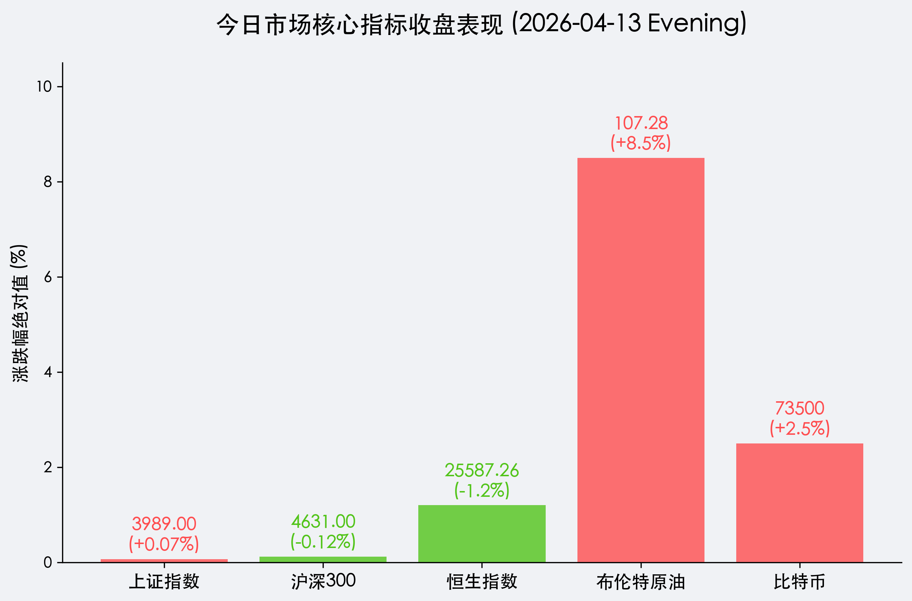

# 2026年04月13日 (星期一) 收盘报：A 股惊险“绝地反击”，能源铁幕下的独立行情

**日期：2026年04月13日 (星期一)** &nbsp; **时段：[下午 (16:30)]**

> **核心摘要**：美伊谈判破裂及霍尔木兹海峡封锁危机引发全球避险浪潮，但在央行“适度宽松”表态与新质生产力板块（宁德时代、海光信息）领涨下，A 股走出独立行情，上证指数艰难收红。市场正在博弈地缘冲突与国内流动性宽松的双重逻辑。

## 核心行情复盘

今日 A 股表现出极强的抗压韧性。受周末及早间地缘利空冲击，三大指数全线大幅低开，随后震荡回升。

*   **上证指数**：收盘 **3,989.00** 点，微涨 **0.07%**，盘中一度跌破 3980 点，但在午后电力与半导体板块发力下翻红。
*   **沪深 300**：收盘 **4,631.00** 点，下跌 **0.12%**，大盘蓝筹受外资避险情绪影响表现偏弱。
*   **恒生指数**：收盘 **25,587.26** 点，大跌 **1.2%**，港股作为离岸市场对地缘风险更为敏感。
*   **领涨板块**：
    *   **半导体/AI**：海光信息飙升 **9.4%**，国产替代逻辑在地缘冲突背景下进一步强化。
    *   **锂电池/新技术**：宁德时代上涨 **3.9%**，受益于出口预期改善及行业重组政策。

## 核心解读与市场逻辑

> 面对外部“油价爆表”与“海上封锁”的极限压力，今日 A 股的“低开高走”传递了三个核心信号：
> 
> 1. **避险资产角色分化**：资金不再仅仅涌向黄金（今日由于高美债收益率而承压），而是开始流入具备独立经济周期的中国核心资产。
> 2. **能源安全红利**：布伦特原油站上 **$107**，虽对传统航运不利，但极大刺激了国内绿电、核能及煤炭替代逻辑。
> 3. **内需韧性预期**：尽管 IMF 下调增长预期，但国内制造业 PMI 的扩张趋势为市场提供了坚实的心理底座。

## 政策脉动

*   **央行 (PBOC)**：行长潘功胜今日下午重申，2026 年将维持“适度宽松”货币政策，暗示 RRR（准备金率）仍有下调空间，旨在对冲地缘政治导致的输入型成本上涨。
*   **证监会 (CSRC)**：发布《关于进一步推动上市公司并购重组的指导意见》，鼓励跨行业并购，特别是向新质生产力方向转型，今日多只重组潜力股封板。

## 最新机构观点

*   **中信证券 (CITIC)**：在其强劲的 Q1 财报预告（净利增 54%）后表示，A 股牛市已进入“中场休息后的突围期”，地缘波动提供了极佳的调仓换股机会，建议聚焦“安全”与“成长”。
*   **中金公司 (CICC)**：发布《战略正常化》展望，维持超配中国股票。中金认为，在全球货币体系动荡中，中国资产的“结构性溢价”正在显现，能源韧性将是 2026 年的核心竞争力。
*   **高盛 (Goldman Sachs)**：将 MSCI 中国指数的年底目标位上调，认为当前估值仍具备 14%-20% 的上涨空间。

## 今日市场情绪：金甲神龟与黑金风暴

> Prompt: Surrealism style, A majestic golden turtle (representing A-share stability) standing firm on a floating island made of green jade. In the distance, a dark stormy cloud shaped like a giant oil barrel looms over a turbulent red sea, but the turtle's island is surrounded by a gentle mist of glowing blue code. Above, the sun is shaped like a PBOC coin, radiating a soft, warm light that pierces through the gloom. A human trader (real person) stands beside the turtle, looking at a golden compass with a calm and determined expression., masterpiece, high detail, intricate composition, cinematic lighting, 8k resolution

**情绪简述**：尽管远方海面黑云压城、油气翻涌，金色的稳定力量依然定格在翡翠般的陆块之上。在央行“金币阳光”的照耀下，指北针依然清晰，市场在风暴中寻找着属于自己的航线。

---
免责声明：内容仅供参考，不构成投资建议。
