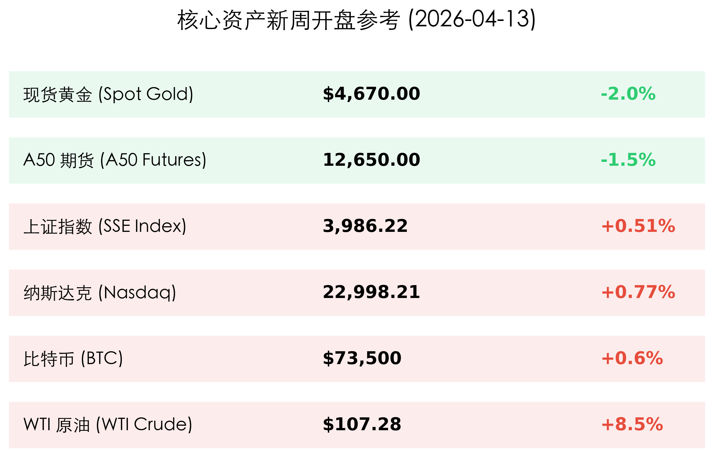
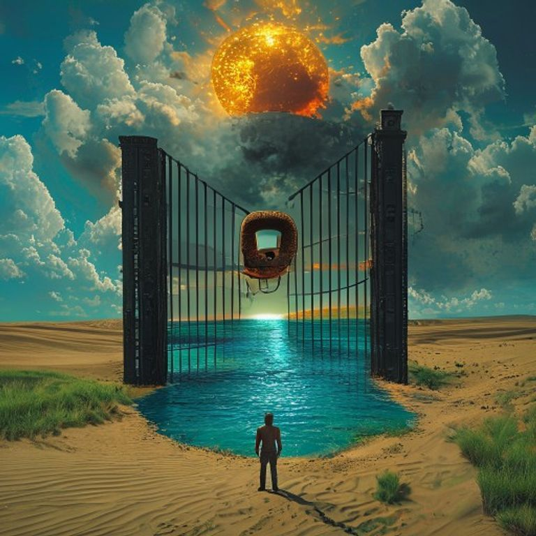

# 2026年04月13日 (星期一) 早报：伊核谈判决裂引爆油路封锁危机，IMF 下调增长预期开启“动荡周”

**日期：2026年04月13日 (星期一)** &nbsp; **时段：[上午 (08:00)]**

> **核心摘要**：美伊伊斯兰堡谈判正式破裂，白宫宣布将对霍尔木兹海峡实施全面海上封锁，国际油价开盘暴涨 8.5%。随着 IMF 与世界银行春季年会开幕，全球经济增长预期面临下修，本周市场将进入地缘冲突与通胀高企双重压力下的“极度防御模式”。

## 周末财经要闻终极汇总

过去 48 小时，全球地缘政治与宏观经济天平发生了剧烈倾斜：

*   **美伊伊斯兰堡谈判宣告失败**：经过 21 小时的极限博弈，美方代表团于周日宣布因双方在核查机制与主权议题上存在“不可逾越”的分歧，谈判正式结束。伊朗方面随即重申对霍尔木兹海峡的控制权，地区局势重回“战争边缘”。
*   **白宫宣布“全面海上封锁”**：针对谈判破裂，美国总统特朗普在社交媒体宣布，美国海军将从今日美东时间上午 10:00 起，对进出伊朗港口的所有海上交通实施封锁，旨在彻底截断其能源出口。
*   **IMF/世界银行春季年会启幕**：2026 年春季年会在华盛顿正式召开。IMF 总裁格奥尔基耶娃预警，受能源价格震荡及供应限制影响，将下调 2026 年全球经济增长预期（原为 3.3%），“滞胀”风险已成为全球央行面临的最大敌人。

## 新一周市场核心博弈逻辑

*   **能源冲击的“二次探头”**：WTI 原油开盘跳涨 **8.5%** 至 **$107.28**。封锁威胁直接威胁到全球 20% 的油气运输通道，市场正紧急定价供应中断的极端情景。
*   **“更高更久”的通胀铁律**：受 3 月 CPI 爆表（3.3%）与油价回升双重挤压，市场已基本放弃 2026 年上半年降息的幻想。现货黄金因美债收益率攀升及避险资金流向美元而承压，开盘跌至 **$4,670** 区间。
*   **A 股 4000 点前的“倒春寒”**：受外部地缘因素影响，A50 期货开盘下跌 **1.5%**。尽管上周五沪指站上 3986 点，但今日能源成本上升及外部不确定性可能压制大金融与高能耗板块。
*   **加密货币的避险角色分化**：比特币在 **73,500 美元** 高位窄幅震荡，显示在数字黄金与风险资产的双重属性中，资金正处于观察期。

## 本周重磅经济数据与会议前瞻

*   **周二：美国 3 月 PPI 数据**。继 CPI 之后，PPI 被视为通胀传导的最前沿。市场预期月度涨幅或达 1.1%，这将进一步夯实美联储的鹰派底色。
*   **周四：中国 Q1 GDP 及“数据全家桶”**。这是观察中国经济能否顶住外部压力实现 5% 增长目标的关键视窗。若数据超预期，将为 A 股提供坚实的防御垫。
*   **周五：IMF 发布《世界经济展望》详细报告**。关注对主要经济体通胀路径的重新定调。

## 头部券商/投行开盘策略点睛

*   **高盛 (Goldman Sachs)**：认为市场已进入“地缘溢价驱动期”。短期建议超配上游能源股及国防军工板块，同时警惕高负债消费股在“高利率+高通胀”环境下的基本面坍塌。
*   **摩根大通 (JPMorgan)**：强调随着本周大行财报季揭幕，市场焦点将从宏观叙事转向微观业绩。重点关注息差收益是否足以覆盖潜在的地缘政治信贷风险。
*   **中信证券**：建议国内投资者在 4000 点关口保持冷静。短期避险逻辑占优，可关注煤炭、有色等“影子能源”板块及具备避险属性的电力公用事业。

## 今日市场情绪：铁幕下的沙漏

> Prompt: Surrealism style, A massive black iron gate closing slowly on a narrow strait of blue water (Strait of Hormuz), with a giant red lock representing the blockade. Above the gate, a golden sun is being eclipsed by a dark cloud labeled 'Inflation 3.3%'. In the foreground, a field of green grass (representing growth stocks) is being parched by a sudden desert wind. A human trader (real person) stands at the edge of the desert, holding an hourglass with oil instead of sand, looking at the closing gate with deep concern., masterpiece, high detail, intricate composition, cinematic lighting, 8k resolution

**情绪简述**：海峡的铁门正在缓缓关闭，黑金的阴影遮蔽了成长的阳光。在 3.3% 的通胀钟声里，每一粒滑落的“油沙”都在考验着市场的韧性。

---
免责声明：内容仅供参考，不构成投资建议。
