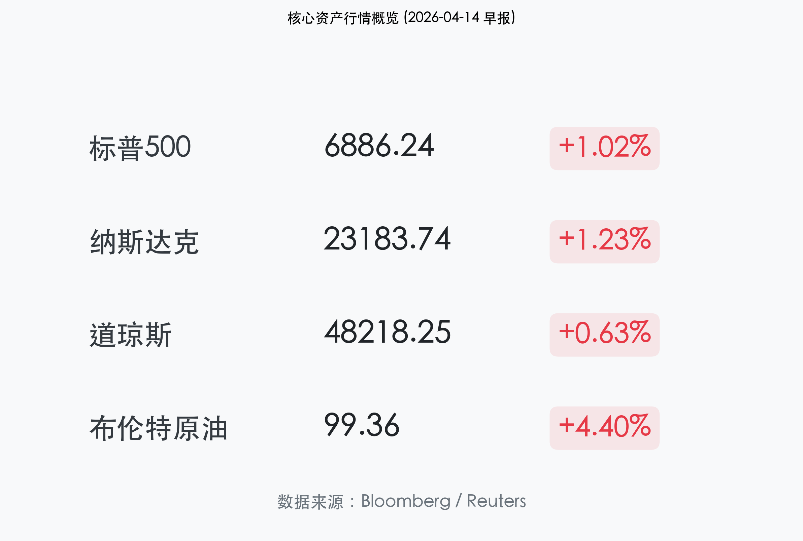

# 全球市场晨报：波斯湾阴云下的“AI 奇迹”

**日期：2026年04月14日 (星期二)** &nbsp; **时段：早报**

> **核心摘要**：美军封锁霍尔木兹海峡引发全球能源紧张，原油价格飙升至 $100 关口，但市场在“AI 卖盘过度”的共识中迎来强劲反弹。标普 500 指数收涨 1.02%，科技股引领纳指反攻 1.23%，展现出极强的韧性。

## 核心行情复盘

隔夜美股全线走高，投资者在消化地缘政治风险后重新拥抱增长资产。

*   **标普 500 (S&P 500)**：收于 **6,886.24** 点，上涨 **1.02%**。
*   **纳斯达克 (Nasdaq)**：收于 **23,183.74** 点，上涨 **1.23%**，软件与 AI 板块领跑。
*   **道琼斯 (Dow Jones)**：收于 **48,218.25** 点，上涨 **0.63%**。
*   **布伦特原油 (Brent Oil)**：收于 **$99.36**，上涨 **4.4%**，盘中一度突破 $104。
*   **美债 10 年期收益率**：小幅回落至 **4.29%**。

## 核心解读与市场逻辑

> **1. 地缘政治与能源冲击**：
> 特朗普总统宣布封锁霍尔木兹海峡以向伊朗施压，这一消息最初引发市场恐慌，油价应声暴涨。然而，由于 3 月份 CPI 数据已部分反映了能源上涨预期，市场在午后逐渐形成“利空出尽”的共识，避险资金开始回流股市。
> 
> **2. 软件板块的“绝地反击”**：
> 软件股录得一年来最佳单日表现。高盛 CEO David Solomon 的评论起到了定心丸作用，他指出市场对 AI 基础设施投入产出比（ROI）的担忧被显著夸大。Salesforce (+4.04%) 和微软 (+2.52%) 的大涨带动了整个科技板块的情绪修复。

## 政策脉动

*   **白宫动向**：政府发言人表示，封锁行动旨在促使伊朗回到谈判桌，目前无意长期切断能源供应。
*   **联储关注**：市场紧盯即将公布的 U.S. Producer Price Index (PPI) 数据，以评估能源价格上涨对后续加息路径的影响。

## 最新机构观点

*   **摩根士丹利 (Michael Wilson)**：
    > “地缘政治风险已被市场进行了‘外科手术式’的计价。我们认为当前的调整正处于最后阶段，建议投资者在波段低点积极配置优质周期股和 AI 领头羊。”
*   **摩根大通 (Mislav Matejka)**：
    > “历史证明，突发地缘事件往往会带来 V 型反弹的机会。当前的估值回落是加仓的信号，而非离场的借口。”
*   **贝莱德 (Larry Fink)**：
    > “AI 是自计算机问世以来最重要的技术飞跃。作为一种‘超级力量’，它将持续驱动企业毛利率扩张，长期持有的逻辑并未改变。”

## 今日市场情绪：波斯湾上空的数字曙光

今日市场情绪在初期的地缘阴云下展现了惊人的反弹力，仿佛在汹涌的红色浪潮中，AI 的灯塔依然为投资者指引方向。

> Prompt: A futuristic merchant ship navigating a digital ocean of glowing green K-line waves, while in the background, a massive blockade of dark warships is illuminated by the light of a giant AI crystal. Cinematic, high contrast, vibrant colors, cyberpunk anime style.

---
免责声明：内容仅供参考，不构成投资建议。
