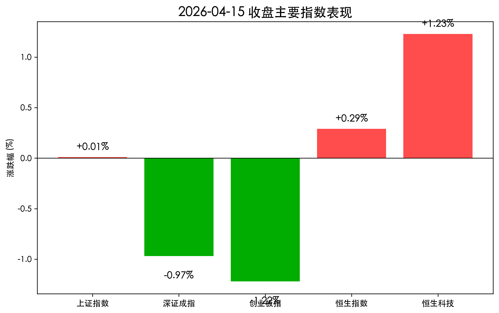
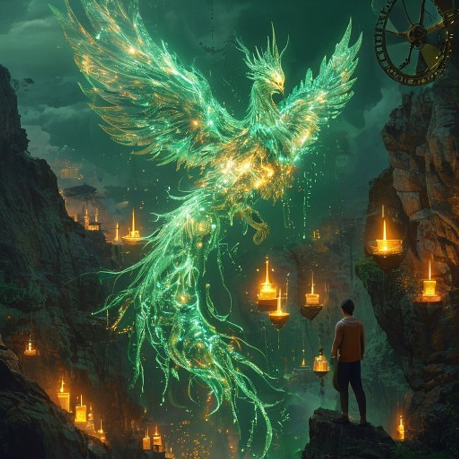

# A 股韧性尽显：医药电网联手护盘，两市成交连续超 2 万亿

**日期：2026年04月15日 (星期三)** &nbsp; **时段：收盘报 (16:30)**

> **核心摘要**：尽管创业板指在创下近 11 年新高后出现高位震荡，但上证指数成功守稳 4000 点大关，沪深两市成交额连续维持在 2.4 万亿元以上的历史高位。创新药价格新政与电网投资提速成为支撑今日市场的核心支柱，显示出存量资金在不同景气赛道间的良性轮动。

## 核心行情复盘

今日 A 股市场呈现出极具张力的“冲高回落”走势，市场多空博弈在 4000 点上方显著加剧。

*   **上证指数**：报收 **4027.21点**，微涨 **0.01%**。虽然涨幅有限，但日线实现四连阳，显示出指数在 4000 点整数关口的强劲支撑力。
*   **深证成指**：报收 **14498.45点**，下跌 **0.97%**。
*   **创业板指**：报收 **3514.96点**，下跌 **1.22%**。盘中一度冲高至 **3599.98点**，刷新了 2015 年 6 月以来的最高纪录，随后触发部分获利盘兑现。
*   **恒生指数**：报收 **25947.32点**，上涨 **0.29%**。
*   **恒生科技指数**：表现亮眼，报收 **4911.79点**，上涨 **1.23%**。
*   **成交额**：沪深两市全天成交额达 **2.42万亿元**，较前一交易日继续小幅放量约 315 亿元，量能充沛。

## 核心解读与市场逻辑

> **1. 医药“新政”重塑估值体系**：
> 国务院办公厅印发关于健全药品价格形成机制的意见，明确支持高水平创新药在上市初期自主定价。这一政策直接击中了创新药行业研发回报率低、估值承压的痛点，博瑞医药等个股的涨停象征着市场对医药板块从“集采恐慌”转向“创新溢价”的逻辑重塑。
>
> **2. 电网投资：确定的基建增量**：
> 2026 年一季度电网投资突破 1600 亿元的规模超出了市场普遍预期。在全球 AI 算力大爆发背景下，对电力基础设施的刚性需求已成为新型基建的最强确定性，特高压与电网设备板块正逐渐从周期品演变为成长品。
>
> **3. 2.4 万亿成交背后的“筹码交换”**：
> 创业板指在 3600 点附近的剧烈波动配合天量成交，显示出市场正在进行深度的筹码换手。虽然锂电池等前期强势板块出现调整，但创新药、算力租赁与银行板块的及时补位，确保了市场情绪没有出现系统性崩塌。

## 政策脉动

*   **医药政策定调**：国务院办公厅印发《关于健全药品价格形成机制的若干意见》，旨在通过市场主导、科学定价，鼓励药企加大颠覆性创新投入。
*   **新型电力系统建设**：三大电网投资进入高峰期，国家层面明确将特高压工程作为支撑清洁能源外送与算力中心能效的关键，政策红利持续释放。

## 最新机构观点

*   **中原证券 (Central China Securities)**：
    > “目前市场核心压制因素主要来自海外流动性扰动，但国内基本面支撑依然扎实。上证指数守稳 4000 点具有重要的心理意义，预计指数将维持震荡上行的慢牛态势。”
*   **兴业证券 (Industrial Securities)**：
    > “4 月份是港股的关键做多窗口。随着地缘局势不确定性降低，避险情绪回落，恒生科技指数作为全球估值洼地，具备极高的修复性价比。”
*   **财信证券 (Caixin Securities)**：
    > “虽然短期存在获利回吐压力，但长期向好趋势不变。建议投资者在季报披露期聚焦‘景气赛道’，特别是一季报业绩超预期的核心科技资产。”
*   **招商证券 (CMS)**：
    > “医药价格治理正式转向‘市场主导’。这将倒逼国内药企从仿制转向真创新，未来具备全球竞争力的医药龙头将迎来‘戴维斯双击’。”

## 今日市场情绪：创新的火种，电网的脊梁

今日市场情绪如同一团在深谷中熊熊燃起的生命之火。在科技板块震荡之时，医药的创新灵丹与电网的金色脊梁共同撑起了市场的蓝天。

> Prompt: Surrealism style, A majestic phoenix made of glowing emerald medicinal herbs and pulsing golden electrical circuits rising from a deep green valley of trading candlesticks. In the background, a giant stone scale is balancing a golden vial of medicine against a heavy black gear, with the vial tipping the scale towards the light. A human trader (real person) stands on a cliff, watching the phoenix with a look of awe and determination. Atmosphere of healing and power., masterpiece, high detail, intricate composition, cinematic lighting, 8k resolution

**情绪简述**：在绿色的 K 线深谷之上，由草药与电路组成的凤凰正涅槃而生。天平的一端是创新的金丹，正有力地压过沉重的黑铁齿轮。每一个投资者都在这交织的光芒中，感受到了结构性牛市的韧性与希望。

---
免责声明：内容仅供参考，不构成投资建议。
