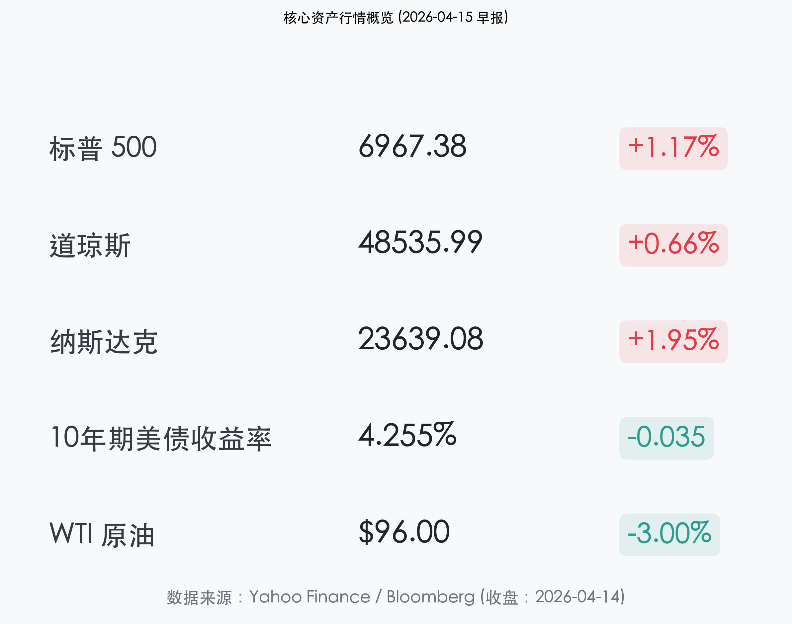
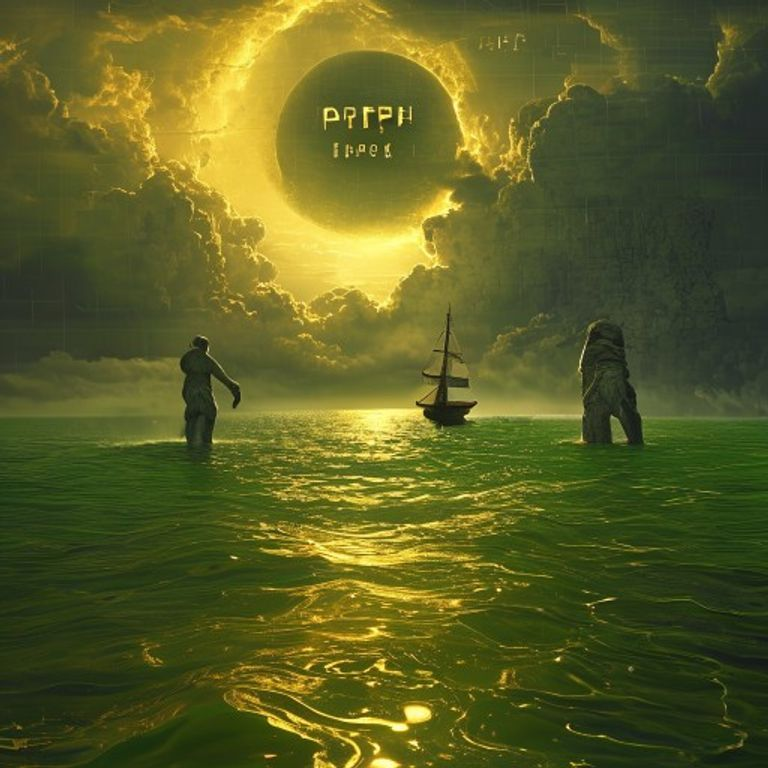

# 全球市场晨报：PPI 降温点燃“通胀见顶”希望，高盛财报开启“华尔街复苏”

**日期：2026年04月15日 (星期三)** &nbsp; **时段：早报**

> **核心摘要**：低于预期的 PPI 数据（核心 PPI 仅 0.1%）显著缓解了市场对通胀持续性的焦虑，驱动美债收益率回落并助力纳指大涨近 2%。高盛爆表的一季报为财报季奠定了乐观基调，加之美伊谈判预期转暖带动油价跌破 $96，市场风险偏好迎来全面修复。

## 核心行情复盘

隔夜美股全线报复性反弹，通胀压力的减轻让成长股与金融股并驾齐驱。

*   **标普 500 (S&P 500)**：收于 **6,967.38** 点，上涨 **1.17%**，逼近历史新高。
*   **道琼斯 (Dow Jones)**：收于 **48,535.99** 点，上涨 **0.66%**。
*   **纳斯达克 100 (Nasdaq 100)**：收于 **23,639.08** 点，上涨 **1.95%**，录得十连涨。
*   **10 年期美债收益率**：回落至 **4.255%**，显示债市对通胀见顶的初步定价。
*   **WTI 原油**：大幅下跌 **3.00%**，收于 **$96.00** 附近。

## 核心解读与市场逻辑

> **1. 通胀“冷信号”：PPI 的实质性降温**：
> 3 月生产者价格指数 (PPI) 环比仅增长 0.5%，而核心 PPI 更是录得 0.1% 的极低增幅，均远低于此前市场的一致预期。这一数据有效对冲了此前 CPI 带来的恐慌，市场重新评估“粘性通胀”的叙事。
>
> **2. 高盛业绩：华尔街的“文艺复兴”**：
> 高盛 Q1 每股收益 (EPS) 达 $17.55，远超预期的 $16.49。随着 Marcus 消费者业务的精简以及核心投行、交易业务的爆发，高盛的强劲表现预示着全球 IPO 与 M&A 市场的春暖花开，带动整个金融板块信心回归。
>
> **3. 地缘政治：从冲突边缘到谈判定价**：
> 关于美国与伊朗可能在伊斯兰堡恢复谈判的消息，成为压低油价的关键因素。WTI 原油单日重挫 3%，缓解了市场对能源驱动型通胀的二次冲击担忧。

## 政策脉动

*   **美联储领导层变动**：Jerome Powell 的任期将于 5 月 15 日到期，尽管特朗普提名的 Kevin Warsh 资产披露引发关注（超过 1 亿美元），但市场更关注的是鲍威尔是否会作为“代理主席”留任以确保政策平稳过渡。
*   **PPI 对降息路径的影响**：温和的 PPI 数据让市场再次看到了下半年降息的微光。联邦基金利率目前维持在 3.75%，但掉期市场对 9 月降息的定价概率已回升至 60% 以上。

## 最新机构观点

*   **高盛 (Goldman Sachs)**：
    > “我们正处于一个新的‘创新超级周期’的起点。随着 AI 基础设施从实验转向规模化应用，投资银行的业务管道已经排到了 2027 年。我们维持对美股的超配评级。”
*   **摩根士丹利 (Michael Wilson)**：
    > “尽管地缘政治仍有杂音，但基本面正在改善。PPI 数据是真正的转折点，它告诉我们成本压力正在向消费端传导前就已经开始减弱。风格切换已经从大盘科技股扩散到了绩优金融股。”
*   **中金公司 (CICC)**：
    > “全球通胀周期的错位为中国市场提供了难得的观察期。美债收益率的回落将减轻人民币汇率压力，利好北向资金重新流入 A 股核心资产。”

## 今日市场情绪：暴风雨后的金色海平线

今日市场情绪如同一场久违的晴天，在地缘与通胀的双重暴雨后，投资者终于在金色的 K 线浪潮中看到了和平与增长的曙光。

> Prompt: Surrealism style, A lone sailing ship navigating through a calm golden sea of green K-line ripples, while in the background, two massive stone giants are shaking hands across a narrow strait. Above them, a giant golden sun labeled 'PPI 0.1%' is breaking through the last of the dark storm clouds., masterpiece, high detail, intricate composition, cinematic lighting, 8k resolution

**情绪简述**：海峡两岸的石巨人终于握手言和，PPI 的金色太阳驱散了最后一丝乌云。在平静的数字海洋上，每一条绿色的波纹都承载着市场对复苏的坚定信念。

---
免责声明：内容仅供参考，不构成投资建议。
