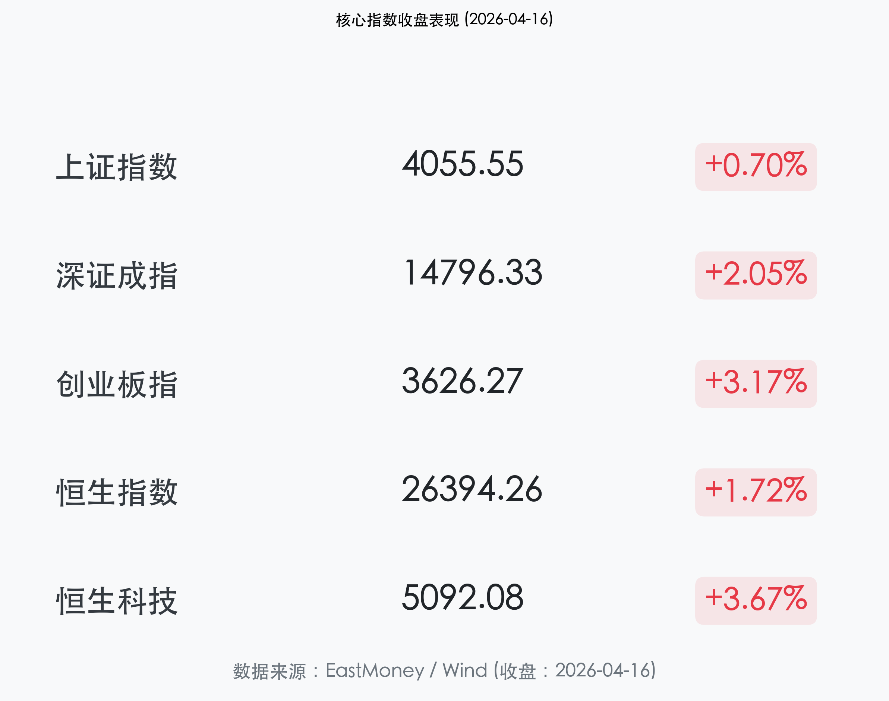
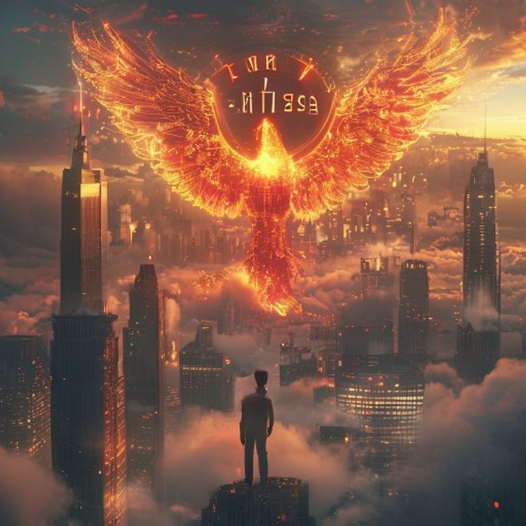

# A 股创业板刷新 11 年新高：算力与能源金属全线爆发，GDP 数据超预期点燃市场

**日期：2026年04月16日 (星期四)** &nbsp; **时段：收盘报 (16:30)**

> **核心摘要**：A 股与港股今日迎来强劲反弹，创业板指大涨 3.17% 刷新 2015 年 6 月以来新高。一季度 GDP 增长 5.0% 好于预期，叠加算力产业链与能源金属板块的全线爆发，两市成交额维持在 2.35 万亿元的极高活跃水平，市场呈现出显著的“绩优驱动”特征。

## 核心行情复盘

今日 A 股市场展现出极强的进攻性，三大指数集体走强，特别是代表新质生产力的创业板指领涨两市。

*   **上证指数**：收报 **4055.55点**，上涨 **0.70%**，成功守住 4000 点整数关口。
*   **深证成指**：收报 **14796.33点**，上涨 **2.05%**。
*   **创业板指**：收报 **3626.27点**，大涨 **3.17%**，盘中及收盘均刷新近 11 年新高，成为全市场最亮眼的风景。
*   **恒生指数**：收报 **26394.26点**，上涨 **1.72%**。
*   **恒生科技指数**：报收 **5092.08点**，大涨 **3.67%**。
*   **成交额**：沪深两市合计成交约 **2.35万亿元**，尽管较前一交易日略有缩量，但已连续多日维持在 2 万亿以上的极高热度。全市场超 4200 只个股上涨，赚钱效应极佳。

## 核心解读与市场逻辑

> **1. GDP 数据定下复苏基调**：
> 国家统计局今日发布数据，一季度 GDP 同比增长 **5.0%**，不仅好于市场普遍预期，更证明了宏观经济已稳健步入复苏通道。这种从“预期改善”到“实证确认”的转变，为大盘在 4000 点上方的进一步突破提供了坚实的基本面支撑。
>
> **2. 算力产业链：万亿 Token 催化的爆发**：
> 3 月份 AI 大模型日均 Token 调用量突破 140 万亿次的震撼数据，直接点燃了市场对算力租赁、数据中心及通信设备的投资热情。今日算力产业链主力资金净流入超 190 亿元，显示出人工智能正从“算法博弈”全面转向“算力基建”的落地阶段。
>
> **3. “反内卷”政策与龙头溢价**：
> 国办发文对光伏、锂电等竞争过度行业实施临时性调控，旨在引导行业从价格战回归利润率改善。宁德时代总市值突破 2 万亿元、股价再创新高，正是市场对“核心资产”与“行业利润率修复”双重逻辑的高度认可。

## 政策脉动

*   **金融杠杆上调**：央行、外汇局上调银行境外贷款杠杆率，释放出支持企业“走出去”与人民币国际化的明确信号，有助于提升跨境资本流动效率。
*   **产业审批改革**：国务院办公厅深化投资审批制度改革，重点针对无序竞争明显的产业进行调控，政策重心从“规模扩张”转向“质量效益”，利好行业龙头的长期估值修复。
*   **未来产业布局**：国家能源局发文加快培育氢能等未来产业，为能源金属与新型储能板块注入了长效政策催化剂。

## 最新机构观点

*   **中信证券 (CITIC Securities)**：
    > “Token 调用量的井喷式增长意味着云计算产业链正进入‘量价齐升’的黄金大年。目前算力基建的确定性最高，建议重点配置具备全球竞争力的服务器与光模块龙头。”
*   **银河证券 (Galaxy Securities)**：
    > “稀有金属的资源端约束已成为中长期定价的核心。随着锂、钴等能源金属价格企稳及下游需求的复苏，整个板块正经历从‘周期波动’向‘价值重估’的转变。”
*   **华辉创富 (Huahui Capital)**：
    > “尽管外部美联储政策仍有不确定性，但国内充沛的流动性与强劲的一季报业绩预增已构成‘戴维斯双击’的基础。创业板创新高并非终点，建议聚焦绩优科技成长股。”

## 今日市场情绪：金羽重鸣，十载新篇

今日市场情绪如同一只涅槃重生的金凤凰，在 11 年的历史巅峰上振翅高飞。算力的脉动与能源的火花交织成最绚丽的羽翼，划破了长久以来的不确定性迷雾。

> Prompt: Surrealism style, A majestic golden phoenix with glowing red circuit patterns on its wings, rising from a sea of clouds above a futuristic financial district. In the background, a giant digital clock showing '11 Years' is breaking through the mist, illuminated by a warm sunrise. A human trader (real person) stands on a skyscraper balcony, looking at the phoenix with a look of triumph and awe. Atmosphere of peak performance and revival., masterpiece, high detail, intricate composition, cinematic lighting, 8k resolution

**情绪简述**：当 11 年的时间之墙被那声高亢的凤鸣震碎，金色的光芒瞬间洒满了陆家嘴的天际。每一条跳动的红色 K 线，都是对这个时代的礼赞；每一分成交的博弈，都是对未来的加注。今日的 A 股，已在复苏的曙光中，开启了属于新质生产力的壮阔新篇。

---
免责声明：内容仅供参考，不构成投资建议。
