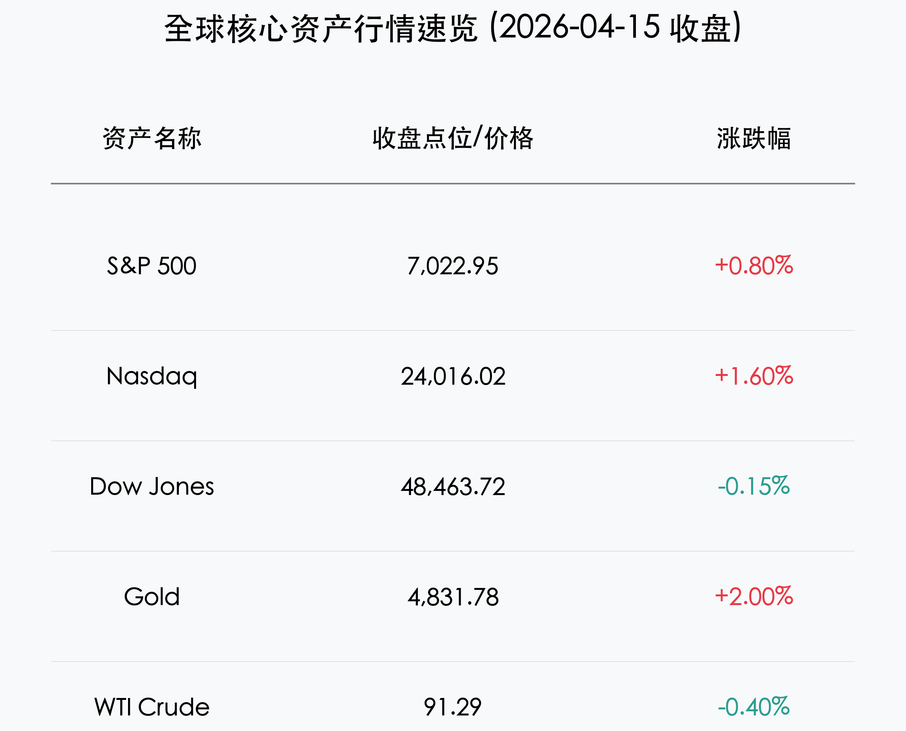
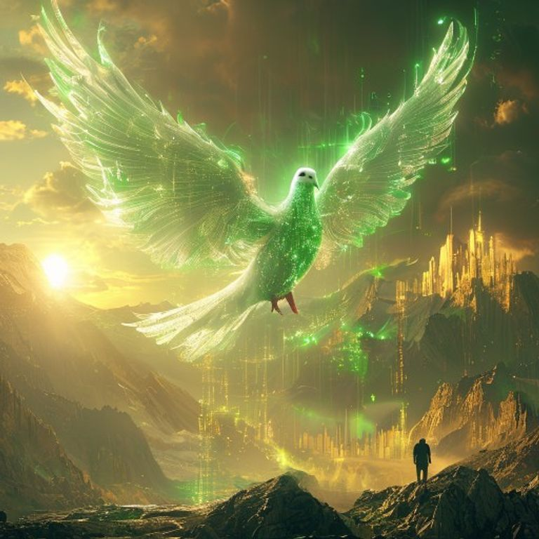

# 全球市场早报：停火曙光与科技狂欢

**日期：2026年04月16日 (星期四)** &nbsp; **时段：早报**

> **核心摘要**：美伊停火谈判现曙光带动避险情绪回落，标普500与纳指双双创下历史新高。科技巨头集体走强，特斯拉、微软领涨；尽管美联储官员释放鹰派信号，但企业盈利超预期为市场提供了有力支撑。

## 核心行情复盘

*   **标普 500 指数 (S&P 500)**：收于 **7,022.95** 点，上涨 **+0.80%**，首次突破 7,000 点大关。
*   **纳斯达克综合指数 (Nasdaq)**：收于 **24,016.02** 点，大涨 **+1.60%**，受人工智能板块强劲拉动。
*   **道琼斯工业平均指数 (Dow Jones)**：收于 **48,463.72** 点，微跌 **-0.15%**，受 Caterpillar 等工业股拖累。
*   **黄金 (Gold)**：收于 **$4,831.78**，上涨 **+2.00%**。尽管美元回落，但停火谈判的不确定性仍维持了部分避险需求。
*   **WTI 原油 (WTI Crude)**：收于 **$91.29**，小幅回落。市场正在消化“战争溢价”的消退。

> **核心解读**：隔夜市场的主导逻辑在于“避险降温”与“科技溢价”。由于市场预期美伊在巴基斯坦的谈判可能达成框架性协议，地缘政治风险溢价显著消退，资金大规模回流成长股板块。

## 核心解读与市场逻辑

*   **地缘政治转折点**：特朗普总统暗示与伊朗的谈判将在巴基斯坦重启。这一信号直接消解了市场对霍尔木兹海峡长期封锁的担忧，原油价格企稳，而全球权益类资产风险偏好显著提升。
*   **科技巨头“AI 狂欢”**：**微软 (+4.6%)** 和 **特斯拉 (+7.6%)** 表现抢眼。特别是 **博通 (+4.3%)** 宣布与 **Meta** 展开为期三年的 AI 芯片研发合作，极大提振了半导体行业的增长信心。
*   **财报季开门红**：**摩根士丹利 (+4.5%)** 和 **高盛 (+19% 利润增长)** 的强劲业绩显示，投资银行业务正走出寒冬，并购（M&A）市场的回暖为金融板块注入了强心针。

## 政策脉动

*   **美联储 (Fed)**：克利夫兰联储主席梅斯特释放鹰派信号，暗示在油价冲击导致的通胀担忧下，利率可能长期维持在 **3.50%–3.75%** 的高位，甚至不排除再次加息的可能。
*   **中国央行 (PBOC)**：重申“稳健略宽”的货币政策，并将重点通过 1 万亿元再贷款额度支持民营小微企业及技术创新，维持人民币汇率在 6.85 附近的合理区间波动。

## 最新机构观点

*   **高盛 (Goldman Sachs)**：对 2026 年股市持建设性态度，预计标普 500 指数成分股盈利将增长 **12%**，牛市将向金融、防御和公用事业等价值板块扩散。
*   **摩根士丹利 (Morgan Stanley)**：CEO Ted Pick 将当前阶段描述为行业的“青春期时刻”——增长迅猛但风险管理至关重要。该行对美国股票和另类资产投资保持乐观。

## 今日市场情绪：和平预期下的多头共鸣

> Prompt: Surrealism style, A majestic white dove made of glowing green digital circuits, flying over a serene valley of golden mountains and rising crystal trading charts. In the background, the sun rises, casting a warm light that dissolves dark clouds of conflict. A human trader (real person) stands on a peak, releasing a golden olive branch towards the horizon., masterpiece, high detail, intricate composition, cinematic lighting, 8k resolution

免责声明：内容仅供参考，不构成投资建议。
