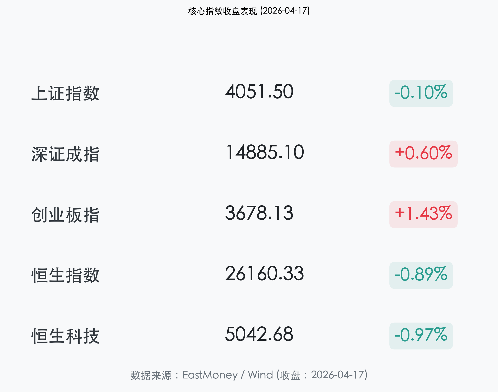
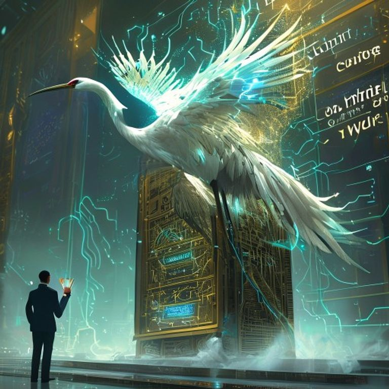

# A 股创业板刷新 11 年新高：算力霸主位移，GDP 强劲增长点燃成长溢价

**日期：2026年04月17日 (星期五)** &nbsp; **时段：收盘报 (16:30)**

> **核心摘要**：创业板指今日上涨 1.43% 再创 11 年新高。算力产业链（CPO、PCB、液冷服务器）掀起涨停潮，源杰科技股价正式超越贵州茅台成为 A 股新“股王”，标志着市场审美从“传统消费”向“硬核科技”的深层次切换。一季度 GDP 增长 5.0% 的亮眼数据，为成长股的持续估值修复提供了坚实的宏观底座。

## 核心行情复盘

今日 A 股市场呈现出显著的“指数分化、局部火爆”特征。虽然上证指数微跌，但代表科技成长的创业板指与科创板表现强劲。

*   **上证指数**：收报 **4051.50点**，微跌 **0.10%**。在 4050 点附近维持高位整理。
*   **深证成指**：收报 **14885.10点**，上涨 **0.60%**。
*   **创业板指**：收报 **3678.13点**，上涨 **1.43%**。盘中最高触及 3680 点，刷新近 11 年来的历史高位。
*   **恒生指数**：收报 **26160.33点**，下跌 **0.89%**。受外资获利盘回流及美联储政策预期扰动。
*   **恒生科技指数**：报收 **5042.68点**，下跌 **0.97%**。
*   **成交额与赚钱效应**：沪深两市成交额维持在 **2 万亿元** 以上。AI 算力产业链成为吸金黑洞，CPO（光电共封装）板块全天领涨。源杰科技以 1410 元的收盘价正式超越贵州茅台，加冕 A 股单价第一高价股。

## 核心解读与市场逻辑

> **1. “股王”更替的时代隐喻**：
> 源杰科技超越贵州茅台，不仅是股价位次的更迭，更是 A 股定价权从“白酒周期”向“光通信与半导体”迁移的里程碑事件。当算力成为数字时代的“石油”，光芯片龙头的估值溢价正在被重新定义。
>
> **2. GDP 5.0% 的韧性支撑**：
> 一季度 GDP 数据超出市场预期，显示出制造业与出口的强劲拉动作用。在宏观经济“超额完成任务”的背景下，市场对“十五五”重大工程开工的预期进一步升温，推动了顺周期与成长板块的共振。
>
> **3. 算力基建：从逻辑到报表的兑现**：
> 随着 CPO 板块龙头一季报预告超预期，市场已完全走出对 AI 的“概念博弈”期，正进入“业绩兑现”的高增长期。液冷服务器、PCB 等配套环节的爆发，验证了算力产业链整体景气度的向下兼容性。

## 政策脉动

*   **内需战略新蓝图**：国家发改委明确将制定 **2026-2030年扩大内需战略实施方案**。政策重心聚焦于“十五五”重大工程的尽早开工，特别是新型基础设施（算力网络、清洁能源）的投资占比将显著提升。
*   **港股新股活跃**：群核科技等高科技公司在港交所首日暴涨，显示出境外资本对中国硬科技资产的关注度正在回暖。

## 最新机构观点

*   **中银国际 (BOC International)**：
    > “当前市场的主线已完成由地缘政治博弈向科技产业趋势的彻底回归。创业板创新高揭示了‘确定性景气成长’的稀缺性，建议继续持有 AI 核心基建板块。”
*   **东兴证券 (Dongxing Securities)**：
    > “市场对海外地缘风险已逐步脱敏。随着一季度宏观数据尘埃落定，风险偏好正处于本轮修复周期的黄金期，成长股具备持续向上的弹性空间。”
*   **瑞银 (UBS)**：
    > “尽管全球流动性仍受美联储政策扰动，但中国经济的基本面修复速度优于预期。我们维持美联储晚些时候降息 50 个基点的预测，这对于新兴市场科技资产是重大利好。”

## 今日市场情绪：算力加冕，科技称王

今日市场情绪如同一只身披蓝色回路羽翼的白鹤，稳稳地立于算力王座之上。当 11 年的巅峰被新时代的火光点亮，旧有的“茅台信仰”正在被新质生产力的“光电信仰”所取代。

> Prompt: Surrealism style, A majestic white crane (symbolizing longevity and status) with glowing blue circuit patterns on its feathers, perched on top of a giant golden server rack. The server rack is shaped like a throne and is labeled 'Computing Power'. In the background, a massive screen shows the A-share ChiNext index breaking through an 11-year peak with a radiant green light. A human trader (real person) in a business suit stands in front of the throne, offering a digital crown. Atmosphere of high-tech royalty and breakthrough., masterpiece, high detail, intricate composition, cinematic lighting, 8k resolution

**情绪简述**：当鹤鸣于九皋，声闻于天。今日的 A 股，已不再仅仅是点位的突破，更是一场关于“谁是未来”的宏大叙事。在算力筑起的王座前，新时代的“股王”已然加冕，创业板的 11 年之约，已在今日的金色阳光中完美赴约。

---
免责声明：内容仅供参考，不构成投资建议。
