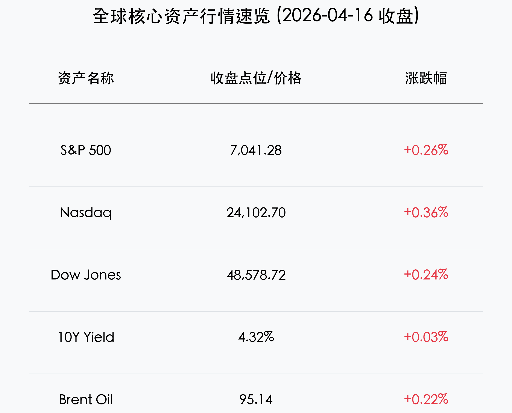

# 全球核心资产早报：美股三大指数同创历史新高，强劲财报助力牛市狂欢

**日期：2026年04月17日 (星期五)** &nbsp; **时段：早报**

> **核心摘要**：美股周四集体走高，标普500、纳指与道指均创历史收盘新高。尽管10年期美债收益率攀升至4.32%，且联储官员释放鹰派信号，但摩根士丹利强劲财报与稳健的劳动力市场数据提振了投资者信心，市场呈现极强韧性。

## 核心行情复盘
周四，美股市场再次展现其不可阻挡的上升势头，三大基准指数在科技股和金融股的带领下全线收高。

*   **标普500指数**：上涨 **0.26%**，报 **7,041.28** 点，录得近12个交易日内的第11次上涨。
*   **纳斯达克综合指数**：上涨 **0.36%**，报 **24,102.70** 点，AI相关科技股表现稳健。
*   **道琼斯工业平均指数**：上涨 **0.24%**，报 **48,578.72** 点，金融权重股表现卓越。
*   **10年期美债收益率**：小幅攀升至 **4.32%**，反映了市场对长期高利率环境的定价。
*   **大宗商品**：布伦特原油收报 **$95.14** (+0.22%)，WTI原油收报 **$91.52** (+0.25%)。现货黄金小幅回落至 **$4,791** 附近。
*   **国内关联指标**：富时中国A50期货（4月17日早间）报 **15,447** (-0.27%)；离岸人民币兑美元 (USD/CNY) 持稳于 **6.8212**。

## 核心解读与市场逻辑
> 尽管宏观层面面临地缘政治紧张局势（美伊潜在停火协议）和联储官员的持续鹰派表态，但企业盈利能力的爆发式增长（以摩根士丹利为代表）成为市场的主要推动力。
> 
> 劳动力市场方面，周四公布的首申失业金人数为 **20.7万**，低于预期的 21.3万，进一步印证了美国经济的“高韧性、低波动”状态。费城联储制造业指数大幅飙升至 **26.7**，远超预估，表明制造业正从低迷中加速复苏。

## 政策脉动
> 美联储多位官员（包括威廉姆斯和古尔斯比）警告称，由于能源价格高企和中东冲突，通胀风险依然显著，2026年内启动降息的可能性进一步降低。
> 
> 与此同时，政治压力有所抬头。特朗普总统再次对联储主席鲍威尔表示不满，并暗示可能在其5月任期届满时进行人事更迭，这为未来的货币政策走向增添了一层不确定性。

## 最新机构观点
*   **摩根士丹利 (Morgan Stanley)**：第一季度财报大幅超预期，财富管理业务利润率创下31%的历史新高。其认为市场已进入“运营卓越”驱动的新阶段。
*   **高盛 (Goldman Sachs)**：将摩根士丹利的目标价上调至 **$205**，虽然维持中性评级，但对整体市场持建设性看法，认为近期波动已使投资者预期回归平衡。
*   **摩根大通 (JPMorgan Chase)**：CEO 杰米·戴蒙发出预警，呼吁市场不要“过度舒适”，认为通胀仍是当前最大的潜在威胁，随时可能由能源冲击引发。

## 今日市场情绪：牛市狂欢下的谨慎乐观

> Prompt: Surrealism style, A majestic golden bull made of glowing liquid circuits charging through a digital ocean of emerald K-line waves. In the background, a massive stone clock tower with gears shaped like gold coins is rising through a storm of red lightning. A human trader (real person) stands on a skyscraper balcony, looking at the charging bull with awe while a golden sunset dissolves the dark clouds., masterpiece, high detail, intricate composition, cinematic lighting, 8k resolution

---
免责声明：内容仅供参考，不构成投资建议。
