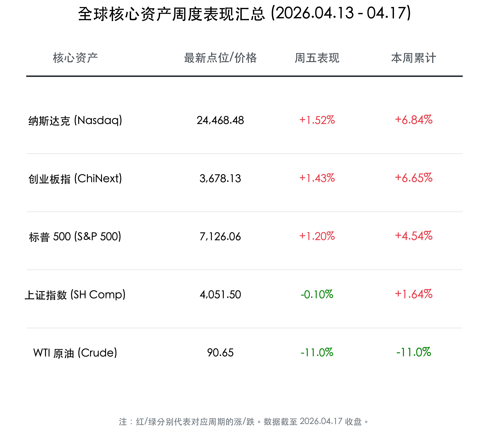
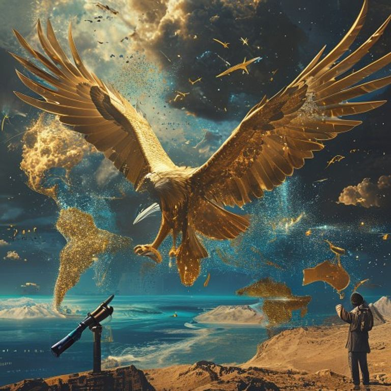

# [周末深度复盘] 全球共振狂欢：纳指 13 连涨创纪录，A 股创业板刷新 11 年高点

**日期：2026年04月18日 (星期六)** &nbsp; **时段：晚报**

> **核心摘要**：本周全球市场经历了一场从地缘博弈到和平转机的戏剧性大反转。随着霍尔木兹海峡重启引发原油价格“雪崩式”回归，全球通胀预期显著缓解，推动纳指录得 1992 年以来最长的 13 连涨纪录。国内市场同样不遑多让，创业板指在本周 GDP 5.0% 超预期数据及算力“股王”更替的利好刺激下，大涨 6.6% 刷新 11 年新高，全球科技牛市正进入共振爆发期。

## 核心资产周度/日度表现回顾

本周（04.13 - 04.17）是属于风险资产的“超级红利周”。科技股领跑全球，而能源大宗商品则由于地缘风险的骤然降温而遭遇重创。

*   **纳斯达克 (Nasdaq)**：本周累计大涨 **6.84%**，报 **24,468.48** 点。周五单日上涨 **1.52%**，豪取 13 连阳。
*   **创业板指 (ChiNext)**：本周累计大涨 **6.65%**，报 **3,678.13** 点。周五单日上涨 **1.43%**，刷新 2015 年以来的最高点。
*   **标普 500 (S&P 500)**：本周累计上涨 **4.54%**，报 **7,126.06** 点。周五单日上涨 **1.20%**，再创收盘历史新高。
*   **上证指数 (SH Comp)**：本周累计上涨 **1.64%**，报 **4,051.50** 点。周五在高位维持窄幅震荡，小幅回落 **0.10%**。
*   **WTI 原油 (Crude)**：本周累计暴跌 **11.0%**，报 **$90.65**。几乎所有的跌幅都集中在周五，地缘溢价被瞬间抹去。

## 过去 48 小时重磅事件深度复盘

> **1. 霍尔木兹海峡“警报解除”：油价的黑色星期五**
> 过去 48 小时最震撼市场的事件莫过于霍尔木兹海峡的全面重新开放及中东多方达成停火共识。这一咽喉要道的重启，直接终结了原油市场此前计入的“战争封锁溢价”。WTI 原油单日 11% 的跌幅不仅让通胀担忧化为乌有，更成为了全球股市尤其是科技股进一步向上突破的催化剂。
>
> **2. 中国一季度 GDP 5.0%：成长股的“压舱石”**
> 17 日发布的宏观数据证实了中国经济复苏的内生韧性。5.0% 的增速超出了国际投行的普遍预期，尤其是高技术制造业的强劲表现，为 A 股创业板刷新 11 年新高提供了底气。
>
> **3. A 股“股王”易主：从白酒到光电的权力交接**
> 本周五，光芯片龙头源杰科技股价超越贵州茅台，加冕 A 股单价第一高价股。这标志着资本市场对“新质生产力”的认可已达到新高度，算力替代消费成为新时代的定价核心。

## 下周全球宏观大事预警

*   **美股科技巨头财报季开启**：下周市场将进入密集的一季报披露期，谷歌、微软等 AI 核心玩家的业绩将验证 13 连涨后的估值合理性。
*   **美国 PCE 物价指数**：作为美联储最青睐的通胀指标，下周五发布的 PCE 数据将决定降息窗口是否会因为油价下跌而提前打开。
*   **国内“十五五”规划预期**：市场将密切关注相关部门关于扩大内需战略实施方案的进一步解读，特别是算力基建投资的明确指标。

## 顶级机构周末策略内参摘要

*   **中银国际 (BOC International)**：
    > “创业板指刷新 11 年新高，标志着市场主线已由地缘博弈彻底转向科技产业趋势。AI 算力基建是当前最具景气度确定性的方向，建议投资者在回调中继续增加科技资产配置。”
*   **摩根士丹利 (Morgan Stanley)**：
    > 迈克·威尔逊认为美股当前的强势并非泡沫，而是“盈利复苏+通胀回落”的完美组合。他将标普 500 的长期目标价维持在 **7,800** 点，并建议关注此前受压制的消费与航空板块。
*   **东兴证券 (Dongxing Securities)**：
    > “一季度 GDP 数据的强势表现让风险偏好进入了黄金修复期。在内生增长动力充足的背景下，A 股有望走出独立于全球货币收紧周期的结构性牛市。”

## 今日市场情绪：金雕巡航，牛市之巅

今日市场情绪如同一只身披金光的巨雕，展开写有 13 个发光羽节的翅膀，轻盈地翱翔在全球资本市场的顶端。当霍尔木兹海峡的黑色阴霾散去，露出波光粼粼的湛蓝海面，牛市的巅峰已不再遥不可及。

> Prompt: Surrealism style, A majestic golden eagle with 13 glowing tail feathers (representing a 13-day win streak) soaring over a stylized world map where the Strait of Hormuz is filled with sparkling blue water, pushing away dark oily clouds. In the far distance, two golden peaks represent the all-time high of Nasdaq and ChiNext. A human trader (real person) in a pilot's jacket watches from the ground with a telescope, smiling., masterpiece, high detail, intricate composition, cinematic lighting, 8k resolution

**情绪简述**：当和平的讯号传遍大洋，全球资本正以前所未有的速度达成共识。金雕的俯瞰象征着本周完美的收官，而纳指与创业板共同构筑的双峰，不仅是历史的记录，更是新时代的起点。所有的焦虑都随着油价的暴跌而消散，留在投资者眼中的，是跨越山海而来的牛市曙光。

---
免责声明：内容仅供参考，不构成投资建议。
