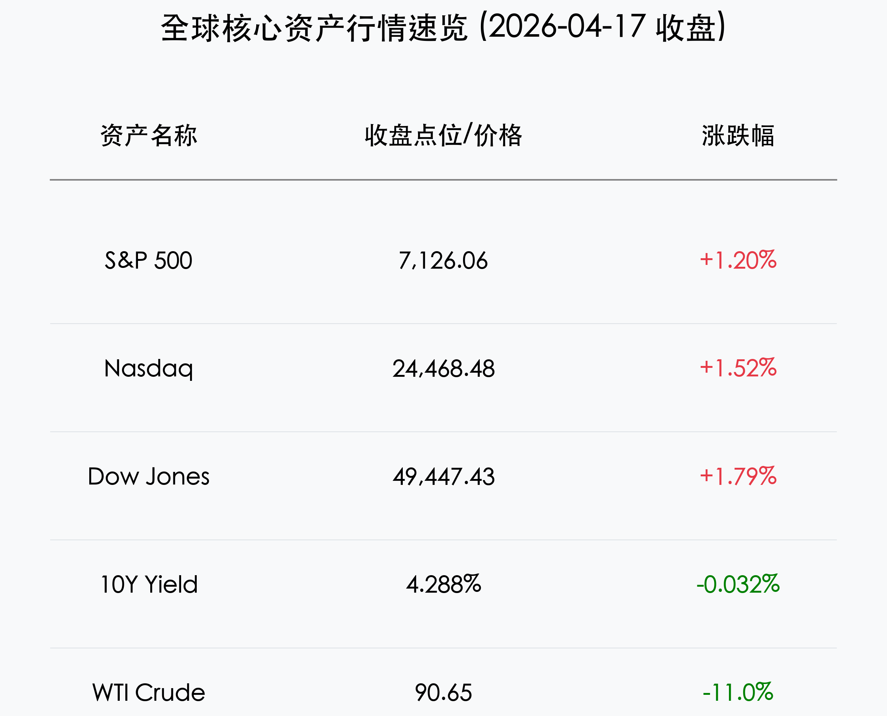

# 全球核心资产早报：霍尔木兹海峡重启引发油价暴跌，美股三大指数同创收盘历史新高

**日期：2026年04月18日 (星期六)** &nbsp; **时段：早报**

> **核心摘要**：随着霍尔木兹海峡重新开放及中东达成停火协议，全球原油价格遭遇“黑色星期五”式暴跌，WTI 原油重挫 11%。能源成本的骤降有效缓解了通胀担忧，推动标普 500、纳指与道指集体刷新历史最高纪录，纳指录得 1992 年以来最长连涨纪录。

## 核心行情复盘

周五，美股市场在全球地缘政治利好的刺激下全线爆发，三大指数同步创下收盘历史新高。

*   **标普500指数**：上涨 **1.20%**，报 **7,126.06** 点。
*   **纳斯达克综合指数**：上涨 **1.52%**，报 **24,468.48** 点，录得连续第 13 个交易日上涨，创 1992 年以来最长连涨纪录。
*   **道琼斯工业平均指数**：上涨 **1.79%**，报 **49,447.43** 点。
*   **罗素2000小盘股指数**：表现更为强劲，上涨 **2.10%**。
*   **10年期美债收益率**：受避险情绪消退及经济增长预期推动，小幅回落至 **4.288%**。
*   **大宗商品**：WTI 原油期货暴跌 **11%** 至 **$90.65** 左右；黄金价格小幅震荡。
*   **行业表现**：
    *   **领涨**：旅游与航空板块集体飙升，皇家加勒比 (+7.3%)、联合航空 (+7.1%)、嘉年华邮轮 (+7.0%) 位居前列。
    *   **领跌**：能源板块受油价拖累表现低迷，埃克森美孚 (-3.6%)、雪佛龙 (-2.2%) 明显回调。
    *   **异动**：奈飞 (NFLX) 因财报后利好兑现及创始人退出董事会，逆市下跌 9.7%。

## 核心解读与市场逻辑

> **1. 地缘溢价的“雪崩”式回归**：
> 霍尔木兹海峡的重新开放是今日市场的绝对核心逻辑。作为全球石油贸易的咽喉，其恢复通行直接抹去了近期因中东局势紧张而积压的“战争溢价”。油价的暴跌对于高度依赖燃油成本的交通运输业（航空、航运）构成了直接利好。
>
> **2. 通胀预期的结构性改善**：
> 能源价格是此前通胀“粘性”的主要来源。随着原油重回 90 美元关口，市场对美联储未来降息路径的担忧有所减轻。尽管联储官员仍保持谨慎，但成本端压力的缓解为牛市的“下半场”提供了充足的想象空间。
>
> **3. 纳斯达克 13 连涨的历史注脚**：
> 在 AI 产业趋势与宏观环境改善的双重共振下，纳指完成了跨越 30 年的壮举。这种罕见的强势连涨，反映了资本对高质量科技资产的“防御性配置”正逐渐演变为“进攻性抢筹”。

## 政策脉动

*   **美联储释放谨慎信号**：美联储理事沃勒 (Christopher Waller) 在最新讲话中建议，在进一步降息前应保持谨慎。他警告称，虽然油价回落是好事，但前期的地缘震荡对通胀的影响可能具有滞后性，需警惕通胀再次“反弹”。
*   **停火协议达成**：伊朗官员宣布霍尔木兹海峡“完全开放”，且黎巴嫩方向达成停火共识，这标志着本轮地缘冲突进入实质性缓和期。

## 最新机构观点

*   **摩根士丹利 (Morgan Stanley)**：
    > 首席股票策略师迈克·威尔逊 (Michael Wilson) 将近期由地缘引发的波动定义为“健康修正”，并继续建议投资者“逢低买入”。他将标普 500 指数的目标价维持在 **7,800** 点。
*   **高盛 (Goldman Sachs)**：
    > 对美股持“建设性”态度，预计 2026 年美国 GDP 增长将达到 **2.6%**。尽管当前估值偏高，但在强劲的企业盈利支撑下，市场仍具韧性。
*   **摩根大通 (JPMorgan Chase)**：
    > 提醒投资者关注油价暴跌后的波动风险，认为虽然地缘风险降低，但货币政策的“更高更久”压力依然存在。

## 今日市场情绪：和平鸽飞越油海，牛市再攀高峰

今日市场情绪如同一只衔着橄榄枝的白鸽，轻盈地飞越了曾经汹涌的黑色油海。当战争的阴霾消散在金色的晨曦中，三大指数的齐声欢呼是对和平与繁荣最响亮的礼赞。

> Prompt: Surrealism style, A white dove (symbolizing peace) carrying an olive branch, flying over a stormy sea of dark crude oil that is transforming into a calm field of green wheat under a golden sunrise. In the background, three massive gears labeled 'Dow', 'S&P', and 'Nasdaq' are turning smoothly. A human trader (real person) stands on the shore, watching the transformation with relief., masterpiece, high detail, intricate composition, cinematic lighting, 8k resolution

**情绪简述**：当霍尔木兹海峡的浪花再次变得清澈，全球资本市场也迎来了属于自己的“复活节”。牛市的齿轮在和平的润滑下加速转动，所有的担忧都随着 11% 的油价跌幅化作了纳指 13 连涨的历史丰碑。

---
免责声明：内容仅供参考，不构成投资建议。
