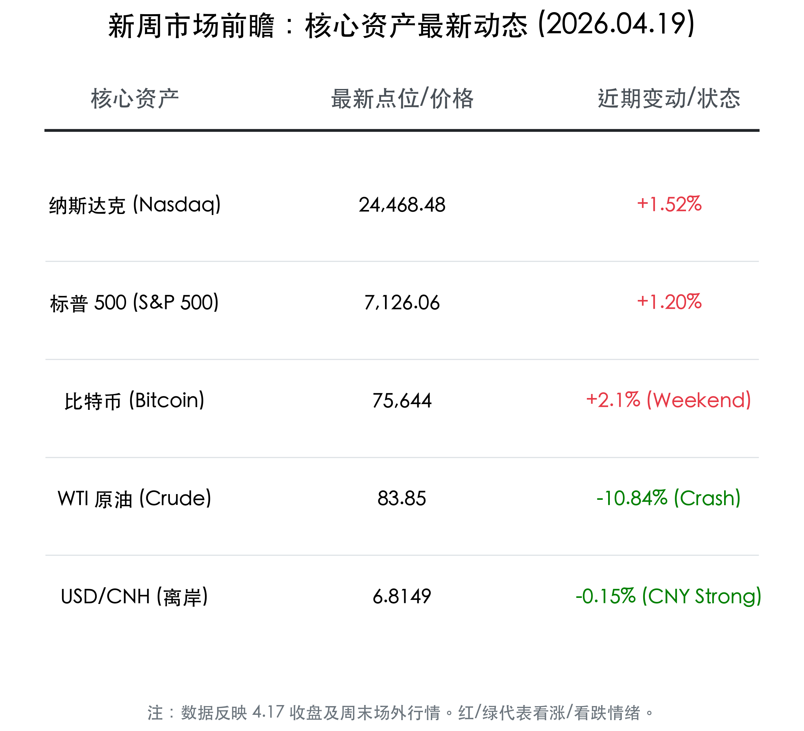

# 2026年4月20日当周全球市场前瞻：中东局势反转，油价狂泻与美股连胜的“交响乐”

**日期：2026年04月19日 (星期日)** &nbsp; **时段：[新周展望]**

> **核心摘要**：周末中东局势超预期反转引发油价狂泻10%以上，避险情绪急速消退驱动纳指13连涨。本周进入美联储提名听证会与中国4月政治局会议窗口期，市场正从“地缘博弈”转向“财报季+政策定调”的慢牛逻辑。

## 周末财经重要新闻终极汇总
1. **中东大降温，霍尔木兹海峡“解封”信号**：美、以、伊三方冲突现转折。4月17日伊朗释放开放海峡信号，虽协议细节存分歧，但地缘溢价瞬间坍塌。国际油价崩盘，WTI跌破84美元。
2. **美股开启狂热模式**：地缘警报解除叠加对华关税退还（1万亿元）利好，标普500首破7100点，纳指连涨13日创34年纪录。
3. **华为4.20“黑科技”全爆发**：华为将于周一发布Pura系列及AI眼镜新品。
4. **美联储新主席听证会变数**：凯文·沃什提名听证会可能因技术原因推迟，但其鹰鸽立场仍是全球债市焦点。

## 新一周市场核心博弈逻辑
- **从“油价通胀”到“估值修复”**：油价暴跌将大幅缓解通胀预期，此前受压制的科技股与非银金融板块有望继续补涨。
- **中国政策窗口期**：4月政治局会议临近，市场正聚焦一季度5%增速后的二季度政策追加。
- **美股财报季考验**：特斯拉（4.22）、英特尔等科技巨头财报将验证AI能否从“愿景”变现为“业绩”。

## 本周重磅经济数据与会议前瞻
- **4月20日**：中国4月LPR利率（预计持平）、华为新品发布会。
- **4月21日**：美国零售销售数据（消费强弱风向标）。
- **4月22-24日**：Google Cloud Next 2026（关注TPU新架构及OCS光路交换机）。
- **4月24日**：日本CPI（中东局势对东亚通胀的影响）。

## 头部券商/投行开盘策略点睛
- **中信证券**：A股进入“慢牛”新征程，对地缘政治已表现出“脱敏”特征。建议关注：中国优势制造 + AI基础设施 + 非银金融。
- **中金公司**：预计Q1券商业绩大幅改善。行业配置上建议关注高股息大型银行及资源类大宗商品（铜、铝）的估值修复。

## 今日市场情绪：中东熄火，AI点燃新希望

> Prompt: Futuristic style, A massive desert where black crude oil is gushing out, but it is being frozen and cracked by a giant glowing AI phoenix rising from the silicon valley skyline. Red K-line rain is turning into green digital currency codes in the background. Hyper-realistic, futuristic style., masterpiece, high detail, intricate composition, cinematic lighting, 8k resolution

---
免责声明：内容仅供参考，不构成投资建议。
