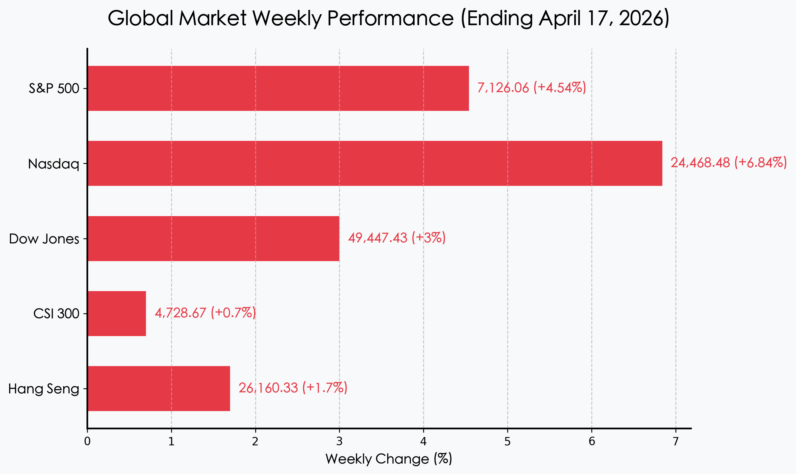

# 全球市场周度复盘：霍尔木兹海峡重开，V型反转下的“和平红利”

**日期：2026年04月19日 (星期日)** &nbsp; **时段：周末复盘**

> **核心摘要**：随着霍尔木兹海峡在周五正式重开，全球能源危机瞬间解除，油价暴跌9%带动美股三大指数全周暴力收涨。纳指录得自1992年以来最长的13连涨，中国一季度GDP超预期达5.0%进一步提振了全球增长信心，市场正从“战争阴霾”快速切换至“和平红利”模式。

## 核心资产周度/日度表现回顾

本周全球市场经历了一场波澜壮阔的V型反转。周初受地缘政治压力低迷，但在周五和平信号释放后，指数爆发式拉升，多项指标创下历史新高。

*   **纳斯达克指数 (Nasdaq)**：收于 **24,468.48**，全周大涨 **+6.84%**。值得注意的是，纳指录得连续第13个交易日上涨，展现了极强的技术面支撑与AI板块的资金回流。
*   **标准普尔 500 (S&P 500)**：收于 **7,126.06**，全周上涨 **+4.54%**。能源股回落但科技与金融板块完美接力。
*   **道琼斯工业指数 (Dow)**：收于 **49,447.43**，全周上涨 **+3.0%**。传统价值股在通胀预期回落中企稳。
*   **沪深 300 (CSI 300)**：收于 **4,728.67**，周五微跌但全周累计上涨 **+0.7%**。主要受益于周初超预期的GDP数据提振。
*   **恒生指数 (HSI)**：收于 **26,160.33**，全周上涨 **+1.7%**。外资对亚太市场的风险偏好显著回升。
*   **原油 (Crude Oil)**：全周暴跌 **-9%**，跌至 **83美元/桶** 附近，成为本周全球流动性改善的最大功臣。

## 过去 48 小时重磅事件深度复盘

1.  **霍尔木兹海峡“终极解封”**：
    > 经过长达七周的封锁，美伊冲突在外交斡旋下取得重大突破，周五正式恢复通航。这一“黑天鹅”的离场不仅瞬间卸掉了原油的战争溢价，更让全球供应链和通胀压力得到根本性释放。市场将其视为“和平红利”的起点。

2.  **中国一季度 GDP 5.0% 超预期**：
    > 中国国家统计局公布数据显示，2026年Q1 GDP同比增长5.0%，高于市场预期的4.8%。高技术制造业（+12.5%）和IT服务业（+10.6%）成为核心引擎。尽管国内消费（+2.4%）仍显疲态，但出口的韧性和工业产出的爆发为全年的“保5”目标打下坚实基础。

3.  **纳指“奇迹十三连阳”**：
    > 在AI大模型全面落地和能源成本下降的双重利好下，纳斯达克综合指数创下1992年以来的最长连涨纪录。TSMC等权重科技股的财报显示，AI算力需求已从单一硬件采购扩展至全产业链应用，机构资金正不计代价地重返科技成长股。

## 下周全球宏观大事预警

*   **能源价格传导效应监测**：关注油价暴跌后，美国CPI预期的下修幅度，这可能直接决定美联储5月的议息基调。
*   **Q1 财报季深度推进**：下周多家中概股及美国科技巨头将发布财报，验证AI对营收的实质贡献。
*   **地缘政治余波**：虽然海峡重开，但仍需关注后续相关地区的驻军动向及外交协议的最终落地情况。

## 顶级机构周末策略内参摘要

*   **摩根士丹利 (Morgan Stanley)**：首席策略师迈克·威尔逊表示，由于通胀威胁的突然消退，全球资产配置正在从避险模式（黄金、现金）快速向“成长+价值”双轮驱动模式切换。上调标普500年终目标位。
*   **高盛 (Goldman Sachs)**：发布报告预测2026年标普500盈利增长将达到12%。分析师强调，能源成本的下降等同于一次“全民减税”，预计美联储将在年底前实施两次降息，以支持经济软着陆。
*   **摩根大通 (JPMorgan)**：特别关注中国市场的结构性机会，认为随着GDP增速企稳，被低估的中资金融和算力基础设施板块具备较强的修复空间。

## 今日市场情绪：和平与复苏的曙光

> Prompt: Surrealism style, A colossal clock tower in the middle of a calm ocean, its hands made of glowing olive branches that sweep away a swirling storm of thick black oil clouds. From the dark mist, a magnificent green phoenix made of digital light rises, its wings spanning across the horizon where the sun is breaking through. A human trader (real person) stands on a bridge of light between two continents, looking at the sunrise with a look of profound relief. Masterpiece, high detail, intricate composition, cinematic lighting, 8k resolution.

---
免责声明：内容仅供参考，不构成投资建议。
