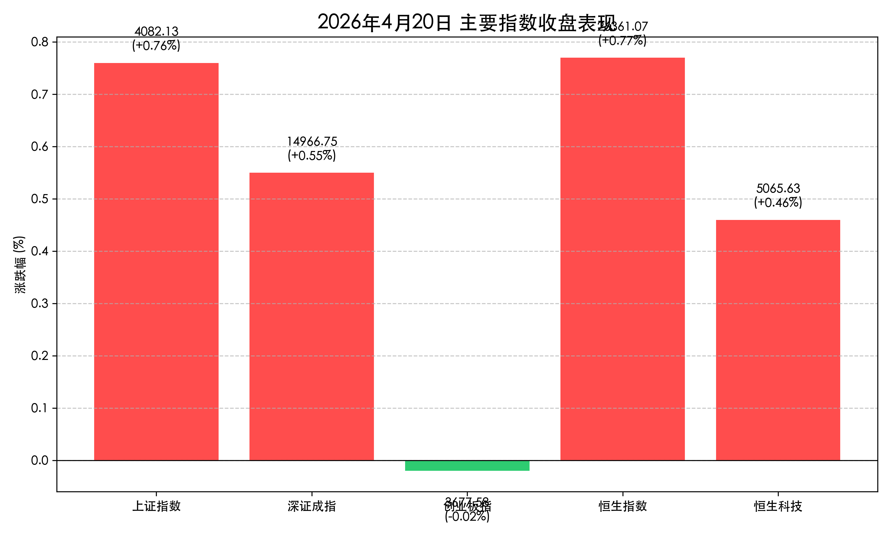
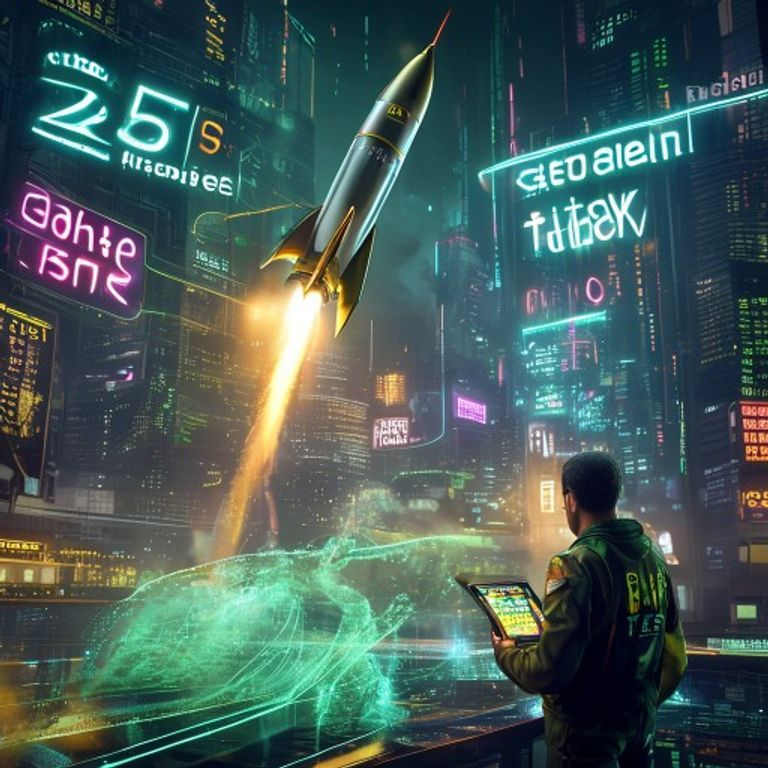

# 商业航天全线爆发，两市成交额突破 2.6 万亿：A 股量化级放量，沪指逼近 4100 点

**日期：2026年04月20日 (星期一)** &nbsp; **时段：晚间收盘**

> **核心摘要**：今日 A 股与港股在 LPR 维持不变的定调下，呈现出极具进攻性的“题材普涨”格局。沪深两市成交额报复性放量至 2.6 万亿元，商业航天概念在政策预期下全线爆发，逾 20 股涨停。虽然创业板指在盘中创下 11 年新高后微幅收跌，但市场整体赚钱效应爆棚，大金融与硬科技共振，市场信心显著回升。

## 核心行情复盘

今日市场交投极度活跃，成交额较前一交易日显著放大约 1500 亿元，显示出场外资金正在加速入场。

*   **上证指数**：报收 **4082.13点**，上涨 **0.76%**。盘中一度冲高至 4098 点，逼近 4100 点重要关口。
*   **深证成指**：报收 **14966.75点**，上涨 **0.55%**，创下逾 4 年新高。
*   **创业板指**：报收 **3677.58点**，微跌 **0.02%**。盘中曾冲破上周五高点，创下近 11 年来的历史新高后小幅回落。
*   **恒生指数**：上涨 **0.77%**，报收 **26361.07点**。
*   **恒生科技指数**：上涨 **0.46%**，报收 **5065.63点**。
*   **板块表现**：
    *   **领涨**：**商业航天**（中国卫星、中国卫通等 20 余股涨停）；**光通信**（G.657.A2 光纤涨价，中天科技涨停）；**液冷服务器**、**国防军工**、**电力电网**。
    *   **领跌**：医药生物、能源金属（锂、钴）、房地产、煤化工。
*   **量化指标**：沪深两市全天成交额达 **2.58万亿至2.61万亿元**，立讯精密单股成交额达 252 亿元，位居全市场第一。

## 核心解读与市场逻辑

> **1. 商业航天：从“星辰大海”到“业绩引擎”**：
> 国家航天局关于 2026 年任务密集实施及政策扶持的预告，直接引爆了商业航天板块。与以往的题材炒作不同，本次爆发伴随着重复使用火箭飞行验证等实质性技术突破，市场正将其视为继 AI 之后的下一个万亿级规模的硬科技增长点。
>
> **2. 2.6 万亿成交额的信号意义**：
> 这种规模的放量通常意味着市场已从“存量博弈”转向“增量拉升”。尽管创业板指在高位出现了缩量调整，但主板的补涨和题材的轮动显示出资金对 4000 点上方的承接力极强。
>
> **3. 货币政策的定心丸**：
> 4 月 LPR 维持不变符合预期，连续 11 个月的“按兵不动”传递出宏观政策的定力，也消除了市场对于“过快收紧”的担忧，为科技成长股的持续估值修复提供了稳定的流动性环境。

## 政策脉动

*   **LPR 保持稳定**：央行授权公布，1 年期 LPR 为 3.00%，5 年期以上 LPR 为 3.50%，均与上月持平。
*   **航天政策红利**：国家航天局宣布 4 月 24 日“中国航天日”将发布深空探测及商业航天扶持政策，多型重复使用火箭将开展飞行验证。
*   **产业互联网布局**：上海发布行动方案，聚焦新能源汽车、电子信息等领域，力争到 2028 年打造产业互联网标杆平台。

## 最新机构观点

*   **华泰证券 (Huatai Securities)**：
    > “港股市场正经历从情绪驱动向业绩驱动的过渡。建议短期关注互联网龙头盈利筑底后的弹性，中期超配半导体、大模型等具备内生增长动力的板块。”
*   **中信证券 (CITIC Securities)**：
    > “预计上市银行一季报表现良好，高分红品种在当前波动环境下仍具配置价值。全市场资金面充裕，看好金融与科技板块的轮动机会。”
*   **巨丰投顾 (Jufeng Investment)**：
    > “市场在前期大涨后进入震荡整固期是健康的。目前的放量显示出多头情绪占据绝对优势，建议关注商业航天、AI 应用等高景气领域的低吸机会。”

## 今日市场情绪：题材爆发与信心回归

今日市场情绪如同一枚在万亿级 Token 与万亿级成交额共同助推下腾空而起的商业火箭。当沪指逼近 4100 点，创业板刷新 11 年纪录，投资者眼中的不再是震荡的迷茫，而是属于硬科技时代的星辰大海。

> Prompt: Cyberpunk style, A sleek, futuristic commercial rocket launching from a glowing holographic terminal. The rocket trail is made of flowing gold and green data streams. In the background, a sprawling digital metropolis is illuminated by massive neon signs showing '2.6T Turnover' and 'A-Share Breakout'. A human trader (real person) in a futuristic suit is holding a high-tech tablet, watching the launch with a look of intense focus and ambition. Masterpiece, high detail, intricate composition, cinematic lighting, 8k resolution.

**情绪简述**：当成交额突破 2.6 万亿，每一条闪烁的 neon 信号都在诉说着市场的狂欢。商业航天的引擎声不仅响彻在酒泉，更回荡在每一个交易席位。这不仅是点位的冲锋，更是一场关于中国硬科技溢价的集体共识。

---
免责声明：内容仅供参考，不构成投资建议。
