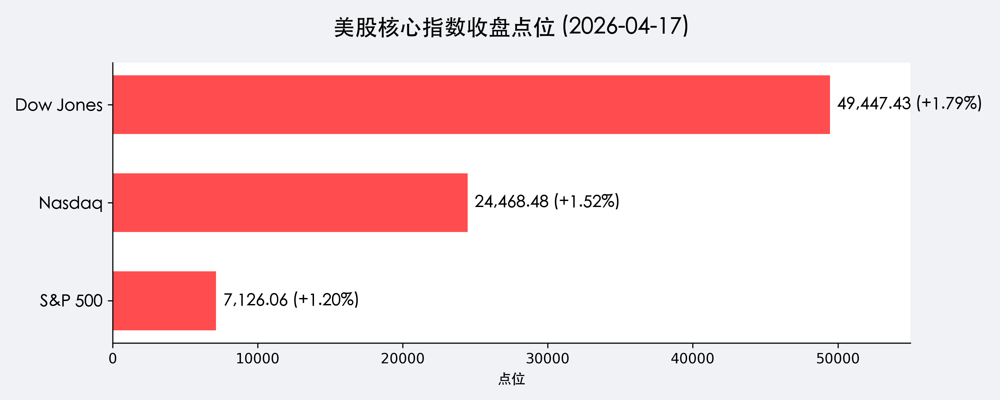
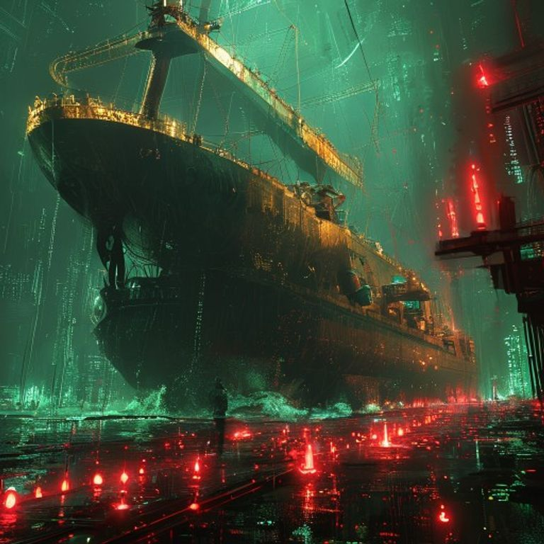

# 震荡加剧：海峡局势惊人反转，周末油价暴涨重燃通胀疑云

**日期：2026年04月20日 (星期一)** &nbsp; **时段：新周展望**

> **核心摘要**：上周五美股因“和平曙光”创下历史新高的狂欢在周末戛然而止。美国突发实施港口封锁，伊朗则要求通过加密货币支付海峡通行费，布伦特原油瞬间重返 100 美元大关。本周全球市场将面临从“通胀放缓预期”到“能源供应危机”的剧烈回摆，纳指 13 连涨的奇迹面临严峻考验。

## 周末财经要闻终极汇总

1.  **霍尔木兹海峡局势惊现“回马枪”**：
    > 尽管周五传出复航消息，但周末局势极速恶化。美军宣布对伊朗主要港口实施海上封锁，伊朗随即回应称，任何通过霍尔木兹海峡的商业船只必须使用加密货币（BTC 或其央行数字货币）支付通行费。
2.  **原油价格报复性反弹**：
    > 受封锁消息刺激，布伦特原油期货价格在周末场外交易中一度突破 **100 美元/桶**。航空业受到直接冲击，全球多家航空公司宣布因燃油附加费飙升而取消部分国际航班。
3.  **IMF-世界银行春季会议聚焦 AI 网络风险**：
    > 在华盛顿召开的会议上，各国财长不仅对中东局势表示担忧，还特别提到了 Anthropic 的 "Mythos" 等大模型可能带来的系统性金融网络风险。欧洲央行（ECB）已宣布对银行的 AI 抵御能力展开专题调研。
4.  **美国人口结构新警报**：
    > 官方数据显示 2025 年美国生育率降至 1.57 的历史低点。这一长周期负面因素虽不直接影响今日开盘，但已在债市引发对社保基金长期偿付能力的担忧。

## 新一周市场核心博弈逻辑

本周开盘的核心矛盾点在于：**能源通胀的回归是否会终结 AI 驱动的科技牛市？**

*   **能源 vs. 科技的跷跷板**：周五纳指的 13 连涨很大程度上受益于 10 年期美债收益率（4.244%）的回落。若油价维持在 100 美元上方，二次通胀预期将迫使美债利率反弹，进而压制高估值的 AI 成长股。
*   **避险资产的回归**：黄金（$4,868.10）和加密货币（由于伊朗的“过路费”政策）本周可能表现出极强的避险属性。
*   **流动性挤压**：关注地缘政治冲突是否会导致全球航运成本（BDI 指数）再度飙升，从而在全球范围内产生新的供应链压力。

## 本周重磅经济数据与会议前瞻

*   **周一 (4月20日)**：关注中国 A 股及港股开盘对周末中东局势的定价，观察中东主权基金的调仓动向。
*   **周三 (4月22日)**：美国 3 月核心零售销售数据，将验证在高通胀阴霾下美国消费者的真实购买力。
*   **周四 (4月23日)**：多家中概股及美国科技股发布季报，市场将严苛审视其 AI 业务在能源成本上涨背景下的盈利韧性。
*   **全周**：持续关注 IMF 春季会议关于全球金融稳定和 AI 监管的进一步公报。

## 头部券商/投行开盘策略点睛

*   **高盛 (Goldman Sachs)**：发布紧急研报建议投资者将部分获利回吐的科技股头寸转向能源和原材料板块。高盛认为，目前的布伦特原油 100 美元是“脆弱的平衡”，极高的波动率可能导致本周市场出现 2%-3% 的双向震荡。
*   **摩根大通 (JPMorgan)**：特别强调了加密货币在支付清算中的“强制化应用”风险。小摩认为，若该趋势蔓延，将对现有的美元清算体系产生长远且深远的影响。
*   **中金公司 (CICC)**：建议关注国内“三桶油”及航运龙头在波动中的防御价值。认为 A 股在一季度 GDP 5.0% 的支撑下具备更强的抗压韧性。

## 今日市场情绪：中东风暴眼中的惊涛骇浪

> Prompt: Cyberpunk style, A massive high-tech oil tanker trapped in a stormy digital sea of glowing red and green K-line candles, with a giant golden scale in the background being tilted by a single heavy drop of black oil. A human trader (real person) stands on the deck looking at the digital storm. Masterpiece, high detail, intricate composition, cinematic lighting, 8k resolution.

---
免责声明：内容仅供参考，不构成投资建议。
