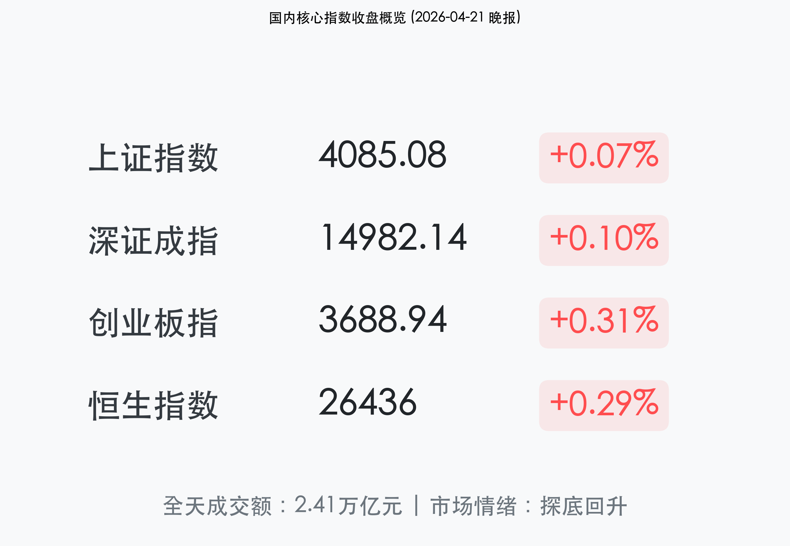
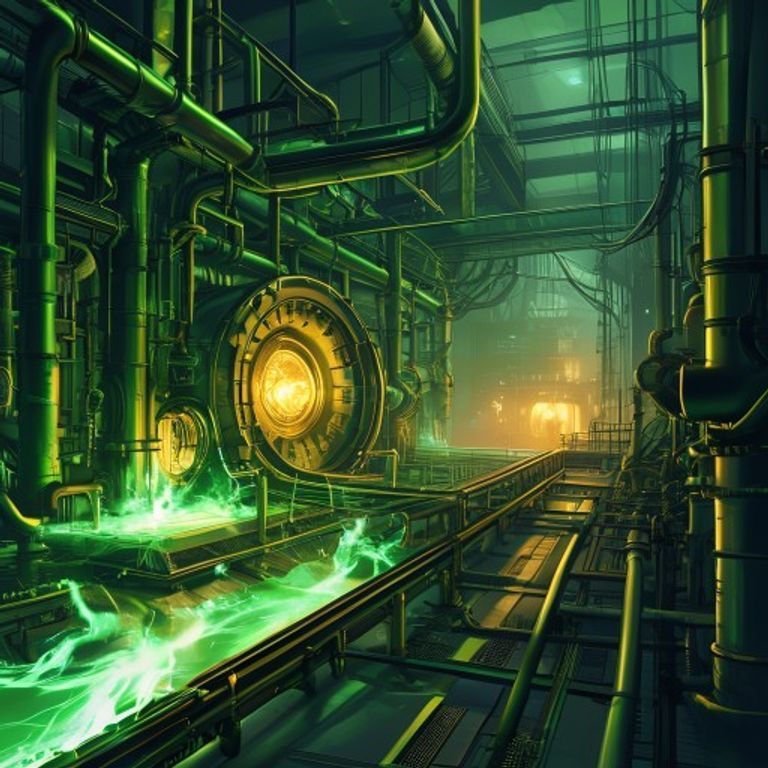

# 【金融早知道】4月21日收盘报：探底回升再现，万亿成交下的“红肥绿瘦”

**日期：2026年04月21日 (星期二)** &nbsp; **时段：收盘报**

> **核心摘要**：今日A股市场呈现典型的探底回升走势，三大指数午后集体翻红，沪指站稳4000点上方。尽管指数收高，但全场超3400只个股下跌，业绩验证成为当前结构性行情的“试金石”，英维克等AI龙头因业绩不及预期惨遭跌停。

## 核心行情复盘

今日A股三大指数早盘受AI权重股拖累震荡走低，创业板指一度跌超1.5%，但午后在电力、银行及工业气体板块的带动下顽强翻红。港股方面，恒生指数表现稳健，内资银行股集体发力撑起指数。

*   **上证指数**：报收 **4085.08点**，上涨 **0.07%**。
*   **深证成指**：报收 **14982.14点**，上涨 **0.10%**，续创逾4年新高。
*   **创业板指**：报收 **3688.94点**，上涨 **0.31%**。
*   **恒生指数**：报收 **26436点**，上涨 **0.29%**。
*   **成交额**：沪深两市全天成交 **2.41万亿元**，较前一交易日缩量约1700亿元，仍处于极高活跃区间。

### 领涨/领跌行业分析
1.  **领涨：工业气体与绿电**
    *   受氦气价格大涨刺激，**华特气体**20CM涨停，金宏气体、广钢气体大幅跟涨。
    *   一季度用电量数据超预期，电力板块掀起涨停潮，华电辽能、粤电力A封板。
2.  **领跌：AI硬件与液冷服务器**
    *   千亿龙头**英维克**因一季报不及预期开盘一字跌停，天孚通信大跌近6%，反映出市场对高位题材股业绩兑现的极度敏感。

---

## 核心解读与市场逻辑

> **业绩容错率降低**：当前正值一季报披露密集期，市场逻辑已从“预期驱动”转向“业绩验证”。资金对于“业绩miss”采取零容忍态度，而对于业绩超预期的绩优股（如天齐锂业、大族激光）则表现出极强的抱团趋势。
>
> **宏观流动性观察**：尽管4月LPR报价维持不变，但银行间市场资金面呈现“极致宽松”态势，隔夜利率与政策利率出现倒挂，显示内生性融资需求仍待进一步激发。

---

## 政策脉动

*   **LPR“按兵不动”**：4月20日贷款市场报价利率（LPR）连续11个月保持不变，1年期为3.0%，5年期以上为3.5%。显示政策进入观察期。
*   **成品油价年内首降**：4月21日24时起，汽、柴油价格每吨下调约500元以上，有助于降低物流成本及输入性通胀压力。
*   **证监会立法计划**：印发2026年度立法计划，重点修订上市公司证券发行管理办法，强化资本约束。

---

## 最新机构观点

*   **中信证券**：建议二季度布局高确定性板块，重点关注**存储材料、核电材料、OLED材料**。同时坚定看好商业航天长期发展。
*   **高盛 (Goldman Sachs)**：维持对美股的乐观预期，将标普500年底目标价调升至 **7600点**，认为AI相关投资是盈利增长的核心引擎。
*   **中金公司**：关注到3月PPI同比转正（+0.5%），终结41个月负增长。尽管是“输入型涨价”，但对于改善企业盈利预期具有积极意义。

---

## 今日市场情绪：探底回升，绩优为王

> Prompt: A futuristic power plant where glowing green energy flows through helium-cooled pipes, with a solid golden bank vault visible in the distant background. Sci-fi manga style, cinematic lighting.

**免责声明**：内容仅供参考，不构成投资建议。
