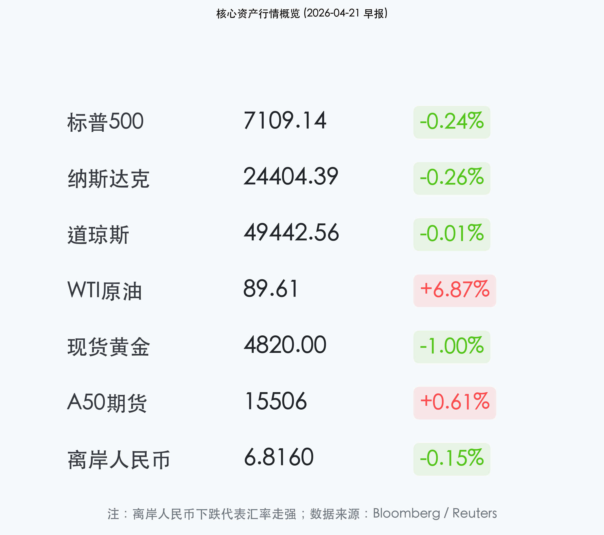

# 晨报：中东“霍尔木兹风险”再起，原油单日飙升7%冲击全球风险情绪

**日期：2026年04月21日 (星期二)** &nbsp; **时段：早报**

> **核心摘要**：地缘政治局势再度成为全球市场主旋律。美军扣押伊朗油轮引发霍尔木兹海峡封锁担忧，WTI原油单日暴涨近7%。受此影响，美股三大指数集体收跌，避险资产黄金与离岸人民币表现坚韧。市场焦点正转向中东停火协议的最后期限及二次通胀风险。

## 核心行情复盘

周一全球市场呈现明显的“风险厌恶”特征。能源板块独自走强，而科技与医疗板块受利率担忧拖累走低。

*   **美股表现**：标普500指数下跌 **0.24%**，报 **7109.14** 点；纳斯达克指数下跌 **0.26%**，报 **24404.39** 点；道琼斯工业指数微跌 **0.01%**，表现相对抗跌。
*   **能源飙升**：WTI原油收涨 **6.87%**，报 **89.61** 美元/桶，反映了市场对能源供应链断裂的极端担忧。
*   **避险资产**：10年期美债收益率持稳于 **4.25%**；现货黄金小幅回落至 **4820** 美元/盎司；离岸人民币 (USD/CNH) 报 **6.8160**，受益于中国强劲的GDP数据，汇率创下3年新高。
*   **A股前瞻**：富时中国A50期货上涨 **0.61%**，预示A股开盘具备一定韧性。

## 核心解读与市场逻辑

> **“霍尔木兹风险”溢价回归**：
> 市场昨日的波动核心源于“地缘风险 premium”的重新定价。美海军在海域扣押伊朗油轮的消息，直接点燃了市场对伊朗可能封锁霍尔木兹海峡的恐惧。作为全球原油贸易的咽喉，该海峡的任何变动都会瞬间扭转通胀预期。

> **能源通胀 vs. 科技成长**：
> 投资者开始担忧，如果油价持续站稳在 90 美元上方，将迫使美联储在更长时间内维持高利率（Higher for Longer），这对于目前处于历史高位、估值昂贵的 AI 科技板块构成了实质性利空。

## 政策脉动

*   **中国一季度GDP超预期**：此前公布的 4.8% GDP增速显著优于市场预期的 4.5%。高盛指出，中国在能源储备和新能源转型方面的领先地位，使其在此轮原油冲击中表现出比欧美更强的宏观韧性。
*   **PBOC 稳汇率信号**：离岸人民币的走强不仅反映了基本面好转，也体现了监管层在复杂地缘环境下维持汇率稳定的决心。

## 最新机构观点

*   **高盛 (Goldman Sachs)**：将 Q2 布伦特原油预测上调至 **90 美元/桶**，并警告地缘政治冲突可能导致美国 GDP 出现约 **0.4%** 的拖累。
*   **摩根士丹利 (Morgan Stanley)**：维持布伦特原油在 2026 年剩余时间高于 **80 美元/桶** 的预测，认为油价的波动将是本周压制成长股波动率的主要变量。
*   **摩根大通 (JP Morgan)**：首席执行官杰米·戴蒙指出，美国经济依然“富有弹性”，但地缘政治的不确定性是目前最大的下行风险。

## 今日市场情绪：原油海啸与避险孤岛

> Prompt: Surrealism style, A massive black tidal wave made of liquid crude oil crashing against a wall of glowing computer screens showing falling red stock tickers, in the distance a golden lighthouse shaped like a bull stands firm casting a green light, a human trader (real person) watching from a small boat, cinematic lighting, dramatic atmosphere, masterpiece, high detail, intricate composition, cinematic lighting, 8k resolution

---
免责声明：内容仅供参考，不构成投资建议。
