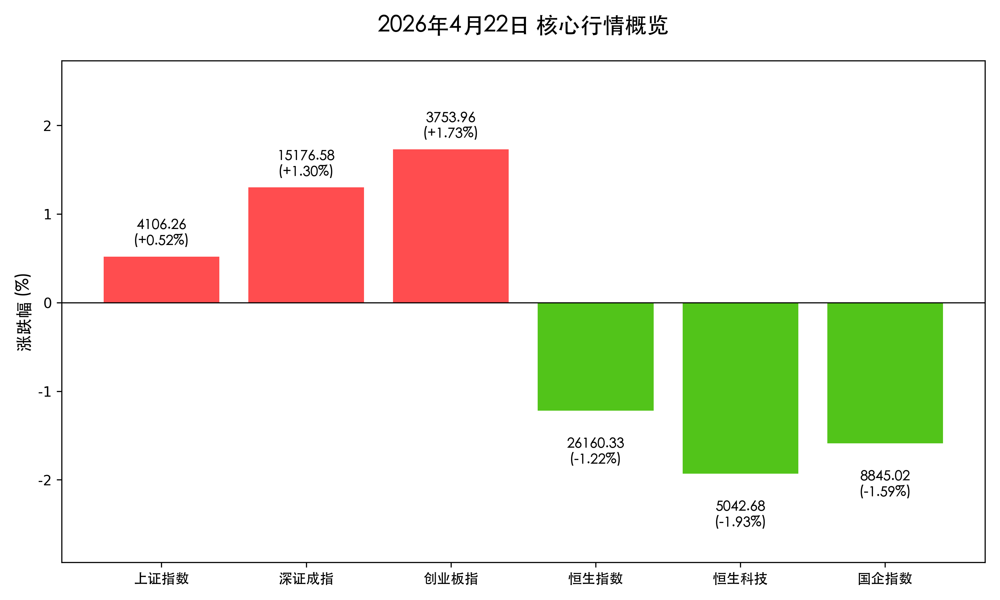

# 4100点收复！A股结构性行情爆发，港股受科技股拖累回调

**日期：2026年04月22日 (星期三)** &nbsp; **时段：收盘报**

> **核心摘要**：沪指今日重返4100点大关，硬科技板块在AI与6G政策利好刺激下集体爆发；与此同时，港股市场受权重科技股走弱及宁德时代H股减持传闻影响，三大指数集体收跌，市场呈现明显的区域分化。

## 核心行情复盘

今日A股市场在政策利好刺激下低开高走，量能显著放大；港股则全天震荡走低。

*   **上证指数**：收于 **4106.26** 点，上涨 **+0.52%**。
*   **深证成指**：收于 **15176.58** 点，上涨 **+1.30%**。
*   **创业板指**：收于 **3753.96** 点，上涨 **+1.73%**。
*   **恒生指数**：收于 **26160.33** 点，下跌 **-1.22%**。
*   **恒生科技指数**：收于 **5042.68** 点，下跌 **-1.93%**。
*   **成交额**：A股全天成交额达 **2.58万亿元**，较前一交易日放量；港股成交仍集中在腾讯、宁德时代H股等头部标的。

## 核心解读与市场逻辑

> **A股：硬科技驱动的结构性牛市**
> 市场呈现典型的“冰火两重天”。光模块（CPO）、半导体及通信设备等板块在政策明确支持AI与6G发展的刺激下全线爆发。中际旭创、新易盛等行业龙头再创历史新高。这反映了市场资金对“生产性服务业扩能提质”政策的高度认可。然而，部分高估值题材股因一季报业绩不及预期出现剧烈调整，显示出市场在业绩验证期的审慎。

> **港股：权重股与减持传闻双重承压**
> 港股走弱主因在于权重科技股集体回调。此外，市场传闻中石化（香港）计划减持宁德时代H股，导致宁德时代H股大跌逾5%，并引发锂电池及相关产业链板块整体下挫。地缘资金流向的短期波动也对市场情绪造成了一定挤压。

> **债市：避险情绪暗流涌动**
> 30年期国债期货主力合约创下2025年12月以来新高。在股市结构性分化的背景下，部分追求稳健收益的资金流向债市，反映出市场对未来宏观经济修复节奏仍存在一定程度的博弈。

## 政策脉动

*   **国务院服务业新政**：印发《关于推进服务业扩能提质的意见》，重点提到强化 **AI、6G、算力** 等科技服务支撑，全链条补强生产性服务业。
*   **生育支持政策联推**：十五部门联合发文，探索住房、出行、消费等多领域联动的生育支持，旨在通过政策组合拳提振长期消费预期。
*   **应急预案修订**：国家层面新一轮应急预案制修订工作将于年底前完成，强化了社会治理与安全保障的预期。

## 最新机构观点

*   **国泰君安（黄燕铭）**：明确指出“哑铃型”行情已经结束，未来A股的机会将更多集中在 **中盘蓝筹股**，建议投资者关注盈利能力稳定的细分行业龙头。
*   **中泰证券**：认为A股不存在大幅下行的系统性风险，当前权益市场表现强劲，**成长股显著优于价值股**，建议布局高景气度科技赛道。
*   **摩根士丹利**：预期锂市场将在2026年下半年步入供应短缺，目前是布局 **固态电池及锂资源** 板块的战略窗口期。

## 今日市场情绪：硬科技领跑下的结构性复苏

> Prompt: Cyberpunk style, A digital dragon made of glowing 6G circuits and AI nodes is soaring upwards from a futuristic Shanghai skyline, while in the background, a falling star made of heavy mechanical gears (representing old tech) crashes into a dark Hong Kong harbor., masterpiece, high detail, intricate composition, cinematic lighting, 8k resolution

---
免责声明：内容仅供参考，不构成投资建议。
