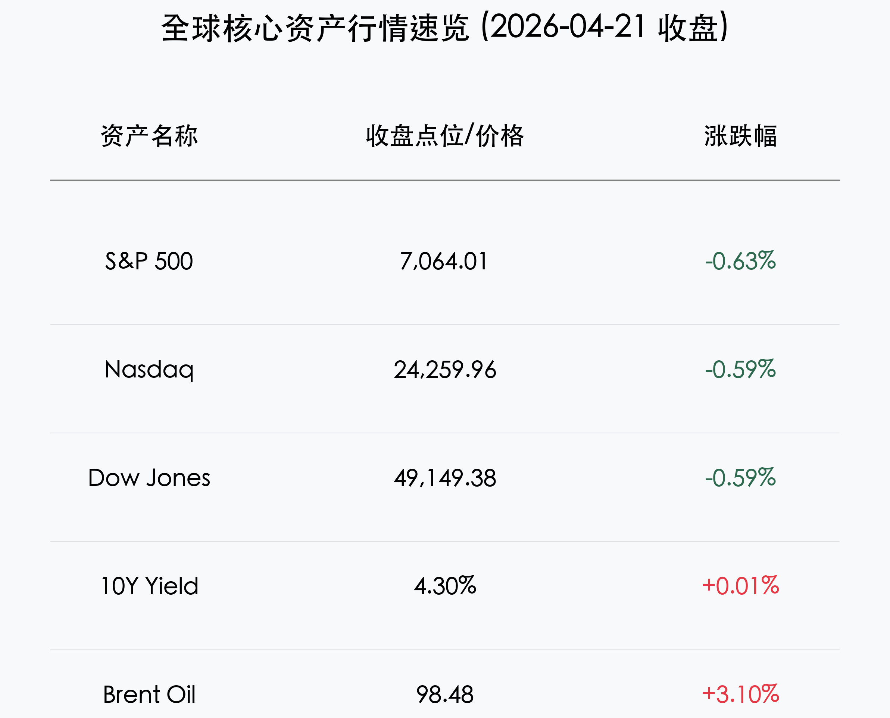

# 晨报：地缘迷雾笼罩，美股三大指数集体回落，凯文·沃什重申联储独立性

**日期：2026年04月22日 (星期三)** &nbsp; **时段：早报**

> **核心摘要**：伊朗停火谈判的不确定性再度引发市场波动，布伦特原油重回 98 美元关口。美股三大指数受地缘政治及苹果公司重大人事变动拖累全线收跌。美联储候任主席凯文·沃什在听证会上强调货币政策独立性，市场静待下周议息会议。

## 核心行情复盘

周二全球市场在一片不确定性中震荡下行。尽管早盘一度因联合健康强劲财报而冲高，但午后地缘政治利空消息导致指数掉头向下。

*   **美股表现**：标普500指数下跌 **0.63%**，报 **7,064.01** 点；纳斯达克指数下跌 **0.59%**，报 **24,259.96** 点；道琼斯工业指数下跌 **0.59%**，报 **49,149.38** 点。
*   **重磅个股**：**联合健康 (UNH)** 大涨 **7.0%**，部分抵消了道指跌幅；**苹果 (AAPL)** 下跌 **2.5%**，首席执行官库克宣布将于9月卸任。
*   **能源与商品**：布伦特原油暴涨 **3.1%**，收报 **98.48** 美元/桶；现货黄金持稳于 **4,800** 美元/盎司上方。
*   **债市动态**：10年期美债收益率攀升至 **4.30%** 左右，市场正重新定价通胀压力。

## 核心解读与市场逻辑

> **“伊朗迷雾”下的原油溢价**：
> 市场昨日的剧烈波动主要受伊朗停火谈判进展不顺拖累。尽管收盘后特朗普总统宣布延长停火，但交易时段内的不确定性促使交易员纷纷涌向原油等避险资产，推升了二次通胀的担忧。

> **美联储领导层交替的“独立性”信号**：
> 候任主席凯文·沃什在参议院听证会上的证词备受关注。他强调了联储的独立性，并对当前政策表现出“质疑精神”。这暗示未来美联储的政策路径可能更具灵活性，甚至在AI驱动生产力提升的背景下，对通胀的容忍度会有所不同。

## 政策脉动

*   **沃什听证会焦点**：强调货币政策应独立于政治干预，同时关注AI对长期通胀的压制作用。
*   **FOMC 预期**：市场普遍预期下周议息会议将维持利率在 **3.5% - 3.75%** 区间不变。

## 最新机构观点

*   **高盛 (Goldman Sachs)**：维持对美股的建设性看法，上调 S&P 500 年终目标至 **7,600** 点，认为 AI 投资将贡献今年 40% 的 EPS 增长。
*   **摩根士丹利 (Morgan Stanley)**：认为当前处于牛市中后期，但 AI 生产力浪潮将推动市场领导地位从科技巨头向更广泛的行业扩散。
*   **摩根大通 (JP Morgan)**：警告地缘政治仍是最大的下行风险，建议投资者在能源和国防板块保持防御性配置。

## 今日市场情绪：机械枭雄与地缘风暴

> Prompt: Surrealism style, A mechanical owl made of silicon and gears, perched on a branch made of fiber optic cables, watching a storm of red lightning over a digital ocean. The owl's eyes glow with a questioning spirit. In the background, a golden scale is slowly tilting under the weight of a giant oil barrel. A human trader (real person) stands on a nearby cliff, holding a glowing tablet and looking at the mechanical owl with a mixture of awe and caution., masterpiece, high detail, intricate composition, cinematic lighting, 8k resolution

---
免责声明：内容仅供参考，不构成投资建议。
