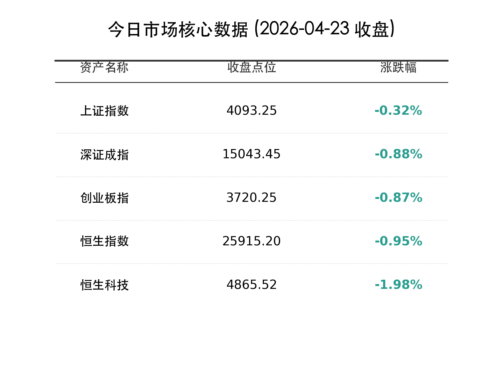
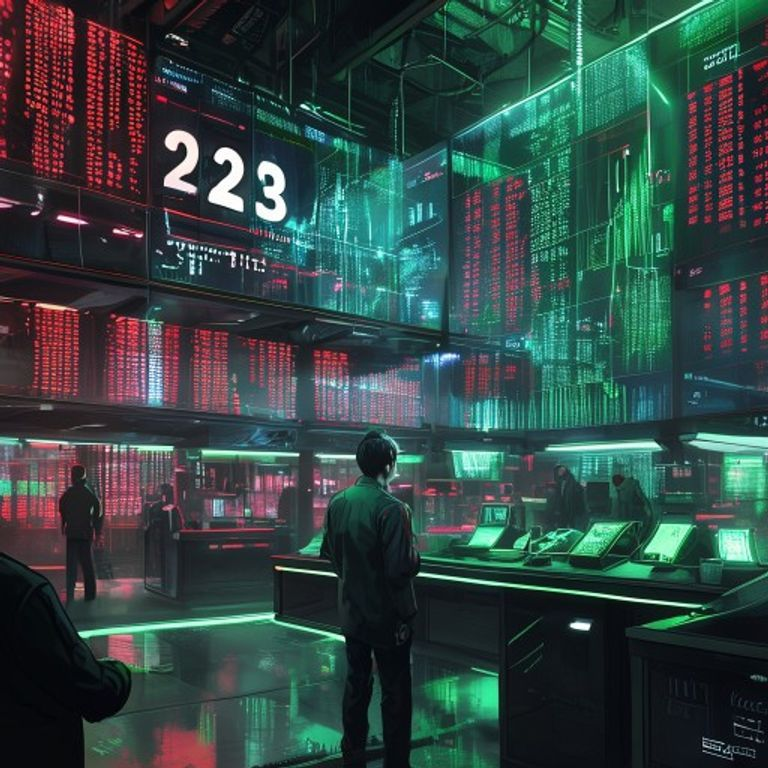

# 收盘报：沪指止步五连阳，2.8万亿巨量震荡，电力白酒逆势撑盘

**日期：2026年04月23日 (星期四)** &nbsp; **时段：晚报**

> **核心摘要**：A股与港股全天呈现“高开低走”的剧烈分化态势，全市场成交额突破2.8万亿元创下阶段新高。前期强势的AI与CPO板块遭遇获利盘大规模兑现，而受政策利好的绿色电力及具避险属性的白酒、红利板块则发挥了关键的托底作用。

## 核心行情复盘

周四市场在经历连续上涨后迎来了显著的震荡分化。受美股创新高刺激，指数早盘集体高开，但随后由于高位题材股（尤其是AI算力）的获利回吐，指数一路走低，全市场超4100只个股下跌，赚钱效应降至冰点。

*   **A股表现**：上证指数上涨 **-0.32%**，报 **4093.25** 点；深证成指下跌 **0.88%**，报 **15043.45** 点；创业板指下跌 **0.87%**，报 **3720.25** 点。
*   **港股表现**：恒生指数下跌 **0.95%**，失守26000点关口；恒生科技指数大跌 **1.98%**，科技权重股集体回调。
*   **成交额**：两市合计成交达 **2.82万亿元**，较前一交易日显著放量，显示出在高位区间资金博弈异常激烈。
*   **领涨板块**：**大消费**表现亮眼，迎驾贡酒涨停，贵州茅台重回升势；**电力与绿电**受政策利好爆发，节能风电、绿发电力等多股封板；**能源周期**（石油、煤炭）与**银行红利**股维持强势。
*   **领跌板块**：**AI算力与CPO**遭遇“滑铁卢”，中际旭创、天孚通信等高位跳水；**半导体**与**有色金属**同样表现低迷。

## 核心解读与市场逻辑

> **高位放量分化的本质：获利盘的集中出逃**
> 今日2.82万亿的成交额伴随指数回落，反映了典型的高位震荡特征。前期以AI为代表的科技主线积累了巨额获利，在利好兑现及地缘政治变动下，资金流出意愿极强。这种“指数抗跌、个股普跌”的背后，是存量资金从高价题材股向低位防御板块（如白酒、电力）的快速大迁徙。

> **电力：从“基建”到“能源革命”的重估**
> 绿色电力板块的集体爆发，并非单纯的避险，而是对“节能降碳”核心政策的定价。随着AI算力对电力需求的指数级增长，电力已从传统的公共事业转变为AI时代的“核心基础设施”，其红利属性与成长属性正在发生深度耦合。

## 政策脉动

*   **节能降碳新政**：中办、国办发布《关于更高水平更高质量做好节能降碳工作的意见》，明确提出合理控制煤电装机规模，大力发展非化石能源，推动新增清洁能源覆盖全社会新增用电需求。
*   **金融安全总体战**：联席会议决定自2026年起开展为期三年的防范和打击非法金融活动总体战，强化金融安全监管，这对引导资金流向正规渠道具有长期利好。
*   **广东AI应用方案**：广东省印发方案，加速人工智能在自动驾驶、智能座舱等全域全行业的高水平应用，为本地产业链提供长期政策支撑。

## 最新机构观点

*   **中金公司 (CICC)**：认为当前市场处于“一季报业绩落地期”与“高位筹码交换期”的重合点。虽然短期波动加大，但市场底部重心已稳步上抬，回调即是布局优质红利资产与核心赛道的良机。
*   **中信证券 (CITIC)**：指出当前AI板块的调整属于典型的“牛市多长阴”，在经历了前期的估值扩张后，市场正在寻找更具确定性的业绩支撑。建议关注电力电子、智能电网等“AI+能源”交叉领域。
*   **国泰君安 (GTJA)**：强调在地缘风险尚未完全出清的情况下，高股息的“三高”（高股息、高现金流、高确定性）资产仍是当下最优的避险品种。

## 今日市场情绪：高位震荡中的守望

> Prompt: Cyberpunk Anime style, A futuristic stock exchange with a massive holographic display showing a total turnover of '2.82T'. On the trading floor, the 'Tech & AI' sector stalls are flickering with red glitch effects, while the 'Green Energy' and 'Traditional Consumer' areas are bathed in a serene, powerful green glow. A veteran trader (real person) is seen calmly adjusting a green power cell, amidst the chaotic market turbulence., masterpiece, high detail, intricate composition, cinematic lighting, 8k resolution

---
免责声明：内容仅供参考，不构成投资建议。
