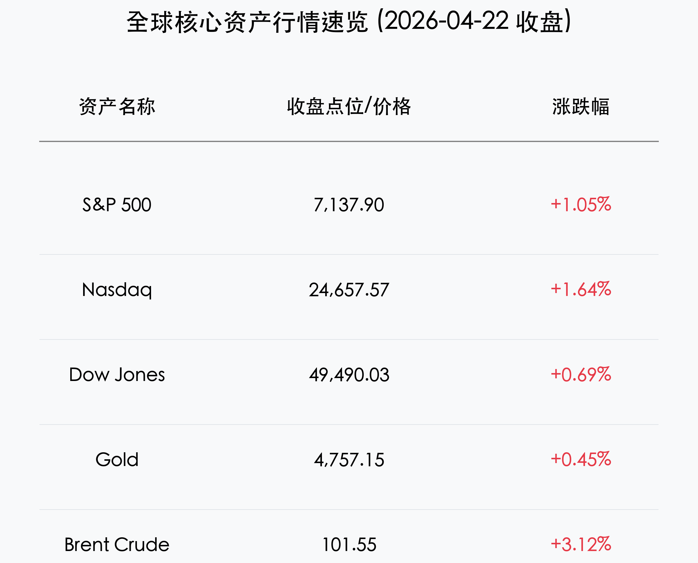
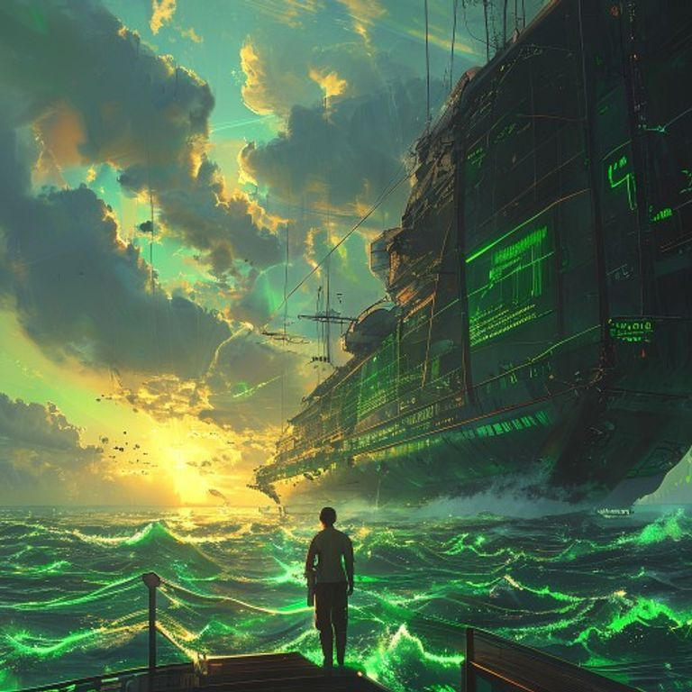

# 晨报：美股标普纳指双创历史新高，地缘僵局破冰点燃“解脱交易”

**日期：2026年04月23日 (星期四)** &nbsp; **时段：早报**

> **核心摘要**：伊朗停火期限无限期延长极大缓解了中东紧张局势，标普500与纳斯达克指数双双刷新历史纪录。强劲的企业财报，特别是 GE Vernova 在电力设备领域的爆发，配合大麻合法化预期升温，共同推动了这一场属于风险资产的狂欢。

## 核心行情复盘

周三全球市场迎来“全线飘红”的狂欢时刻。受地缘政治利好与超预期财报的双重驱动，美股主要指数从开盘起便一路走高，并最终以近乎全天最高点收盘。

*   **美股表现**：标普500指数上涨 **1.05%**，报 **7,137.90** 点，刷新历史新高；纳斯达克指数飙升 **1.64%**，报 **24,657.57** 点，同样创下历史纪录；道琼斯工业指数上涨 **0.69%**，报 **49,490.03** 点。
*   **领涨板块**：**GE Vernova** 因数据中心电力需求激增而暴涨 **13.6%**；**大麻板块**（Tilray +14.2%, Canopy Growth +20.2%）受白宫行政令利好全线喷发。
*   **能源与商品**：尽管地缘风险缓解，但由于供应链中断担忧尚存，布伦特原油仍维持在 **101.55** 美元/桶；黄金期货小幅上涨至 **4,757.15** 美元/盎司。
*   **恐慌指数**：VIX 指数下跌 **3.03%** 至 **18.91**，显示出市场防御心态的显著消退。

## 核心解读与市场逻辑

> **“伊朗悬念”的阶段性落幕**：
> 特朗普总统宣布无限期延长伊朗停火期限，这一动作被市场解读为重大外交突破。此前积压的避险情绪迅速转化为“解脱交易（Relief Trade）”，资金疯狂涌入成长性资产，尤其是对流动性和风险偏好极其敏感的科技板块。

> **电力：AI 浪潮下的“新石油”**：
> GE Vernova 的强劲财报再次向市场证明，AI 的尽头是能源。数据中心建设带来的电网升级需求已成为确定性极高的投资主线，这种从单纯的“算力崇拜”向“能源基础设施”的认知迁移，正在重塑标普 500 的板块贡献结构。

## 政策脉动

*   **白宫行政令**：拜登政府签署行政令，加速 DEA 对大麻的重新分类进程，这被视为大麻产业迈向联邦合法化的关键一步。
*   **美联储动向**：虽然市场欢欣鼓舞，但亚特兰大联储报告显示商业通胀预期回升，这预示着虽然地缘风险缓解，但核心通胀的“粘性”可能让美联储在下半年的利率决策中保持谨慎。

## 最新机构观点

*   **富达投资 (Fidelity)**：Jurrien Timmer 指出，当前的周期性牛市“虽有波折但并未破裂”，强劲的盈利增长正有效抵消高利率带来的估值压力。
*   **巴克莱 (Barclays)**：提醒投资者，虽然停火延长是利好，但霍尔木兹海峡的封锁尚未完全解除，油价的高企将持续对通胀形成支撑，限制了美联储的操作空间。
*   **摩根士丹利 (Morgan Stanley)**：建议关注下半年可能的债务上限博弈与美国中期选举带来的波动，当前的历史高位可能面临技术性调整压力。

## 今日市场情绪：曙光下的解脱之航

> Prompt: Cyberpunk Anime style, A futuristic merchant ship sailing through a sea of glowing green digital waves representing record-high market indices, under a golden sunrise representing a geopolitical ceasefire. In the background, heavy grey war clouds are dissipating to reveal a clear blue sky. A human trader (real person) stands on the deck, looking ahead with a sense of relief and optimism., masterpiece, high detail, intricate composition, cinematic lighting, 8k resolution

---
免责声明：内容仅供参考，不构成投资建议。
