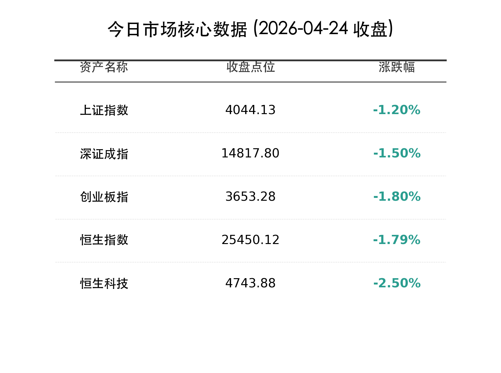
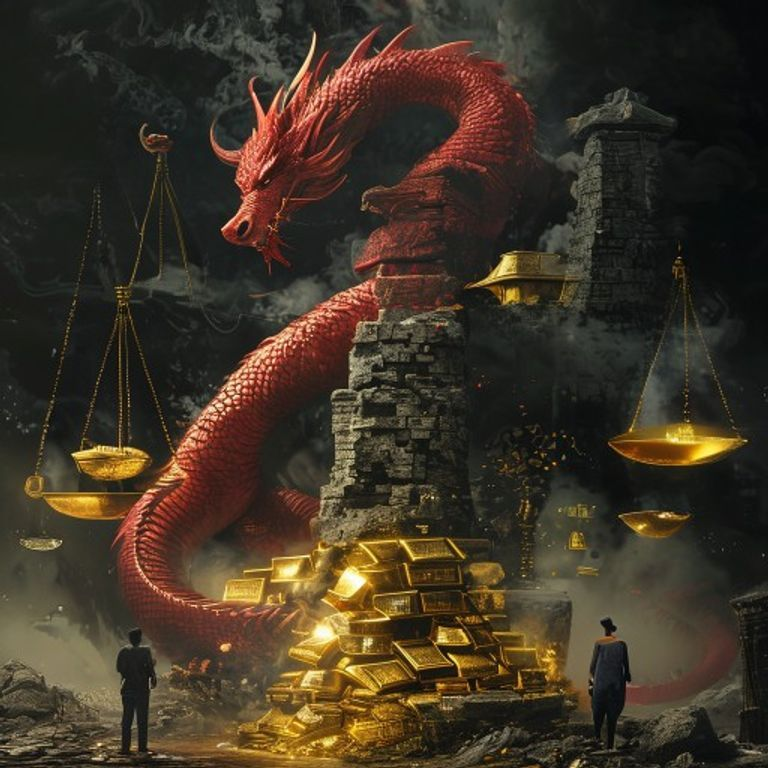

# 收盘报：特朗普“最后通牒”重挫亚太，金油齐飞 A 股失守 4050 关口

**日期：2026年04月24日 (星期五)** &nbsp; **时段：晚报 (16:30)**

> **核心摘要**：特朗普针对霍尔木兹海峡的“格杀勿论”指令引发全球能源恐慌，布伦特原油站上 105 美元，亚太股市全线承压。A 股三大指数放量下跌，创业板指跌近 2% 回踩 3650 点，避险情绪推动黄金与石油贸易板块逆势走强。

## 核心行情复盘

周五 A 股市场受隔夜美股走弱及地缘政治局势骤然紧张影响，呈现单边震荡下行走势。市场避险情绪急剧升温，高位题材股遭到资金无情抛售。

*   **上证指数**：报收 **4044.13点**，下跌 **1.20%**，失守 4050 点支撑位。
*   **深证成指**：报收 **14817.80点**，下跌 **1.50%**。
*   **创业板指**：报收 **3653.28点**，下跌 **1.80%**，回踩 20 日均线支撑。
*   **恒生指数**：报收 **25450.12点**，下跌 **1.79%**。
*   **恒生科技指数**：报收 **4743.88点**，下跌 **2.50%**。
*   **成交额**：沪深两市合计成交 **2.55万亿元**，较前一交易日略有缩量，但仍处于极高位。全市场超 4500 只个股下跌，赚钱效应降至冰点。

### 领涨/领跌行业分析
1.  **领涨：石油贸易与黄金避险**
    *   受国际原油价格突破 100 美元刺激，**中国石油**、**中国海油**逆势走强，**泰山石油**、**国际实业**封涨停。
    *   金价重回 4800 美元附近，**中金黄金**、**赤峰黄金**表现坚挺。
2.  **领跌：航空运输与算力科技**
    *   油价上涨直接推升航油成本，**中国国航**、**南方航空**大跌超 5%。
    *   AI 算力板块持续回撤，**源杰科技**、**中际旭创**等前期牛股领跌，显示出高位筹码松动的迹象。

## 核心解读与市场逻辑

> **“霍尔木兹风险”重塑定价基石**
> 特朗普总统的强硬表态使地缘政治溢价迅速成为市场的主导逻辑。当“能源安全”与“通胀预期”重新占据高位，此前基于“经济软着陆”和“流动性宽松”的乐观定价逻辑面临剧烈修正。A 股市场的巨额成交伴随指数走弱，反映出存量资金正在进行剧烈的调仓换股，从科技成长向防御红利撤退。

> **创业板的“高位修整”**
> 在刷新 11 年新高后，创业板指连续两日回调，本质上是对前期超涨斜率的修正。算力链作为本轮牛市的“发动机”，其股价表现与全球科技巨头的 Capex 预期高度相关。在地缘动荡导致的供应链不确定性面前，资金倾向于先行锁定利润。

## 政策脉动

*   **能源安全保障会议**：国家发改委紧急召开能源保供会议，强调要多措并举增加原油与天然气储备，确保能源供应链韧性，应对外部地缘冲击。
*   **跨境资本流动监测**：外汇局表示将加强对跨境资金流动的实时监测，严厉打击利用地缘事件进行的非法套利活动，维护金融市场稳定。
*   **国防装备建设加速**：相关部门印发通知，要求加快“十五五”规划下的重点国防项目落地，受此影响，军工板块尾盘出现明显异动拉升。

## 最新机构观点

*   **中信证券 (CITIC)**：认为短期市场波动受情绪面主导，建议投资者增加对**上游资源（石油、金属）**及**高分红红利资产**的配置，作为应对波动率上升的护城河。
*   **申万宏源 (SWS)**：指出当前 A 股已进入“业绩披露中后期”，需警惕地缘冲突引发的全球通胀二次反弹。建议关注具备定价权的行业龙头。
*   **摩根大通 (J.P. Morgan)**：尽管短期亚太股市受压，但中国经济的一季度强劲表现提供了基本面底座，回调后具备较强的修复弹性。

## 今日市场情绪：负重前行，油影重重

今日市场情绪如同一头在原油风暴中艰难前行的巨龙，背负着高企的成本压力与地缘阴云，在波动的浪尖寻找新的平衡。

> Prompt: Surrealism style, A giant red dragon coiled around a crumbling stone pillar, looking warily at a horizon engulfed in thick black oil smoke. In the background, a massive golden balance scale is heavily weighted down by a pile of glowing gold bars and a barrel of oil, while a smaller basket of electronic chips and stock tickers is lifted high into the air. A human trader (real person) stands in the shadow, holding a lantern against the darkness., masterpiece, high detail, intricate composition, cinematic lighting, 8k resolution

---
免责声明：内容仅供参考，不构成投资建议。
