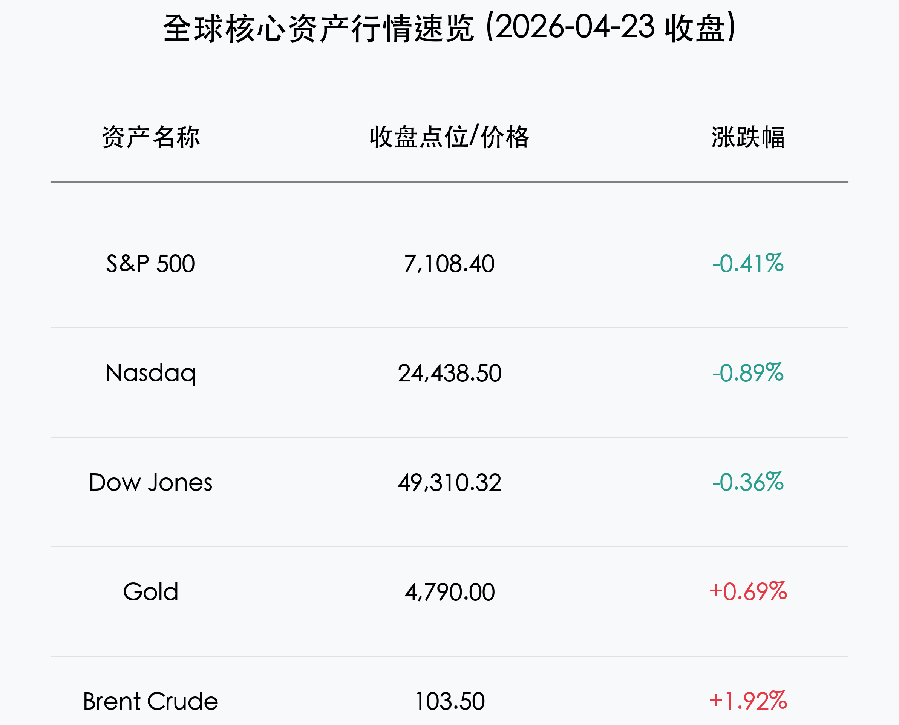
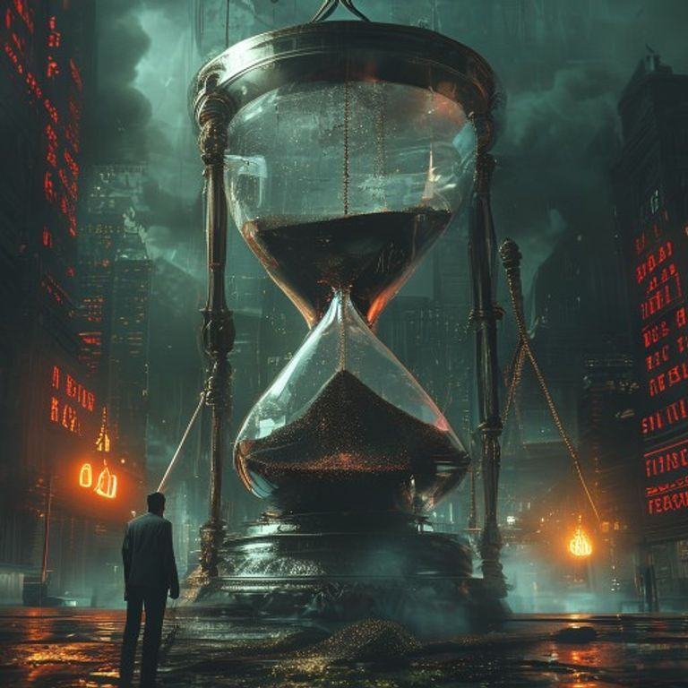

# 晨报：美伊冲突骤然升级油价重回三位数，科技股承压标普纳指双双回调

**日期：2026年04月24日 (星期五)** &nbsp; **时段：早报**

> **核心摘要**：美伊冲突在霍尔木兹海峡发生剧烈升级，特朗普总统针对布雷水雷的伊朗船只发出“格杀勿论”指令，导致布伦特原油自冲突以来首次收于100美元上方。地缘政治震荡引发的通胀担忧令10年期美债收益率攀升至4.32%，美股主要指数全线收跌，科技龙头与AI软件板块领跌。

## 核心行情复盘

周四全球市场在一片肃杀氛围中撤回了此前的涨幅。受地缘冲突升级与原油价格飙升的直接冲击，风险资产遭遇显著抛售。

*   **美股表现**：标普500指数下跌 **0.41%**，报 **7,108.40** 点；纳斯达克综合指数下跌 **0.89%**，报 **24,438.50** 点，表现垫底；道琼斯工业指数下跌 **0.36%**，报 **49,310.32** 点。
*   **领跌板块**：**ServiceNow** 因AI竞争加剧担忧暴跌 **17.7%**；**特斯拉 (Tesla)** 下跌 **3.6%**，尽管盈利超预期，但其庞大的机器人与工厂资本支出计划令投资者不安；**IBM** 财报后回撤 **8.3%**。
*   **能源与商品**：**布伦特原油** 飙升至 **103.50** 美元/桶，涨幅约 **1.92%**，盘中一度冲高；**黄金** 受避险情绪支撑，上涨至 **4,790.00** 美元/盎司。
*   **债市动向**：10年期美债收益率升至 **4.32%**，反映出市场对通胀“更高更久”的担忧重新占据上风。

## 核心解读与市场逻辑

> **“霍尔木兹海峡”的战火重燃**：
> 特朗普政府针对伊朗布雷行动的强硬回击，使这一全球能源咽喉要道实际上陷入瘫痪。原油价格重回100美元不仅是地缘风险的体现，更是对全球通胀路径的重大扰动。市场开始重新定价“通胀溢价”，这直接压制了高估值的成长型科技股。

> **AI板块的“幻灭谷”考验**：
> 尽管AI仍是长期主线，但ServiceNow的重挫揭示了市场对“AI落地变现”与“竞争格局恶化”的敏感度正在提升。当估值处于历史高位时，任何微小的利空（如Capex增加或竞争压力）都会被无限放大。

## 政策脉动

*   **五角大楼简报**：美国军方确认在相关海域采取了扣押与打击行动。这一军事行动的直接结果是波斯湾产油国被迫减产约6%，全球能源供应链面临断裂风险。
*   **美联储观察**：虽然4月28-29日的议息会议普遍预期维持利率不变（3.50%–3.75%），但油价的二次冲顶让市场几乎抹去了年内多次降息的博弈空间，目前分析师普遍预计2026年仅有一次25基点的降息。

## 最新机构观点

*   **彭博经济 (Bloomberg Economics)**：指出原油价格重回三位数将使原本趋于平缓的CPI数据面临反弹风险，美联储的政策转向窗口正在收窄。
*   **Morningstar**：分析认为，当前市场的核心矛盾已从“盈利增长”转向“地缘政治导致的二次通胀”。建议投资者增加通胀对冲资产（如黄金、能源）的配置。
*   **高盛 (Goldman Sachs)**：尽管下调了短期科技股配置建议，但仍看好能源基础设施在动荡局势下的现金流稳定性，认为“AI+能源”的逻辑在极端环境下更具韧性。

## 今日市场情绪：黑金阴影下的博弈

> Prompt: Surrealism style, A giant surreal hourglass made of glass and steel. Instead of sand, thick black crude oil is flowing from the top to the bottom. The weight of the oil in the bottom bulb is heavily bending a large golden balance scale. In the background, a dark, stormy financial district with glowing red stock tickers. A human trader (real person) stands in the foreground, looking at the scale with deep concern., masterpiece, high detail, intricate composition, cinematic lighting, 8k resolution

---
免责声明：内容仅供参考，不构成投资建议。
