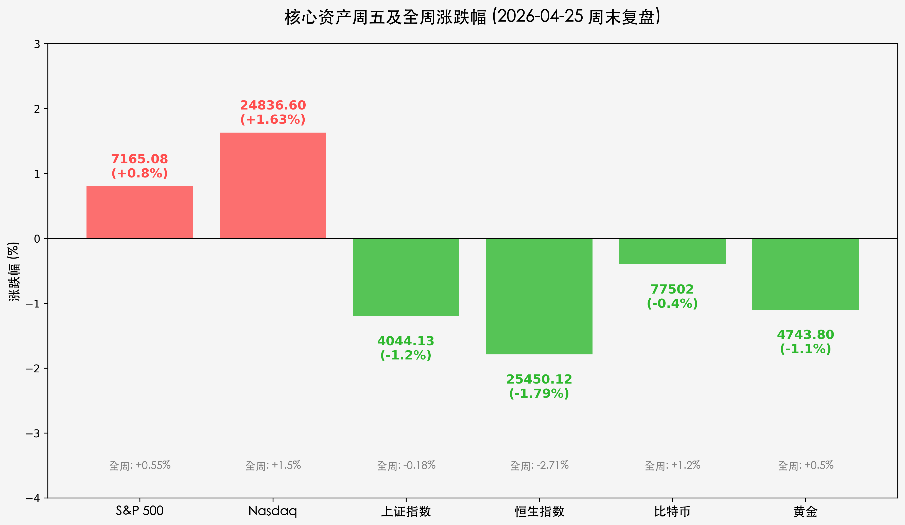
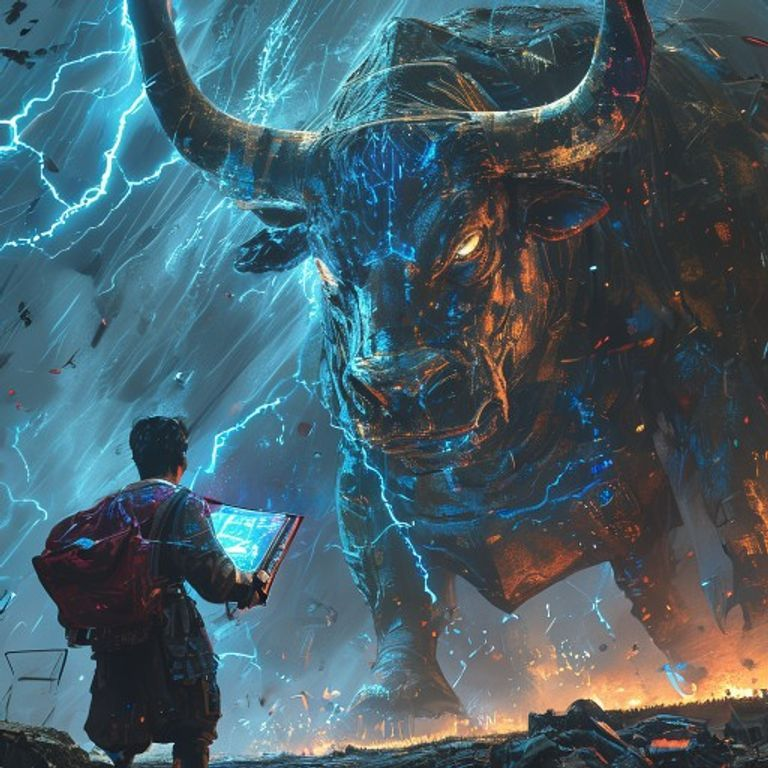

# 周末复盘：芯片之光驱散“最后通牒”阴霾，全球科技牛市进入“算力主权”时代

**日期：2026年04月25日 (星期六)** &nbsp; **时段：周末复盘 (18:30)**

> **核心摘要**：本周全球市场经历从“地缘恐慌”到“科技狂欢”的惊人逆转。特朗普针对霍尔木兹海峡的强硬表态一度重挫亚太股市，但随后隔夜美股在英特尔 23% 的史诗级暴涨带领下全线反攻，纳指与标普 500 再创历史新高。随着黎以停火协议延长及美联储“沃什时代”预期落地，市场正用真金白银为 AI 长期生产力革命投下坚定一票。

## 核心资产周度/日度表现回顾

本周市场呈现“西强东弱”格局，美国科技股在周五的暴力拉升直接逆转了全周的颓势，而亚太市场受地缘溢价扰动幅度较大。

*   **纳斯达克综合指数 (Nasdaq)**：收报 **24,836.60点**，周五上涨 **1.63%**，**全周累计上涨 1.50%**，续写历史辉煌。
*   **标普 500 指数 (S&P 500)**：收报 **7,165.08点**，周五上涨 **0.80%**，**全周累计上涨 0.55%**，成功守住 7100 点关口。
*   **上证指数 (SSE)**：收报 **4044.13点**，周五下跌 **1.20%**，**全周累计微跌 0.18%**，在地缘阴影下维持震荡。
*   **恒生指数 (HSI)**：收报 **25450.12点**，周五下跌 **1.79%**，**全周累计下跌 2.71%**，反映出外资对地缘政治风险的极度敏感。
*   **加密货币与大宗商品**：
    *   **比特币 (BTC)**：报 **77,502美元**，全周宽幅震荡，维持强势上攻态势。
    *   **黄金 (Gold)**：报 **4743.80美元/盎司**，周五受避险情绪减弱回落，全周维持 0.5% 的涨幅。

## 过去 48 小时重磅事件深度复盘

1.  **英特尔“芯片之夜”与 AI 范式转移**：
    > 周五夜间，英特尔发布的超预期财报及代工业务重磅突破，触发了 23.6% 的单日暴涨。这不仅是个股的胜利，更是资本对 AI 基础设施建设“第二波浪潮”的确认。资金正从纯软件层面下沉至底层的“算力主权”——硬件制造与代工，带动费城半导体指数进入无阻力上涨区。

2.  **特朗普“最后通牒”与地缘冷静期**：
    > 特朗普周五关于霍尔木兹海峡的强硬指令一度引发油价在亚太交易时段飙升至 105 美元。然而，随着黎以停火协议的延长及美伊重启对话的传闻，油价在美股开盘后迅速回落至 93 美元。市场正在学会与“特朗普式噪音”共存，将关注点从短期摩擦转向长期经济基本面。

3.  **美联储“沃什接力”步入倒计时**：
    > 鲍威尔调查案的终结，标志着凯文·沃什 (Kevin Warsh) 接任美联储主席已成定局。周末市场广泛讨论“沃什时代”可能的鹰派作风。虽然目前流动性依然宽裕，但其对“规则导向货币政策”的执着，正促使长端美债收益率在高位徘徊，预示着下半年全球资金定价逻辑的深层演变。

## 下周全球宏观大事预警

*   **美联储 4 月议息会议 (4月28-29日)**：虽然维持利率不变是共识，但点阵图调整及对沃什政策预期的对冲将是市场波动源。
*   **科技巨头财报接力**：下周苹果 (Apple) 与亚马逊 (Amazon) 将发布财报，市场将验证 AI 算力支出是否已转化为实际的利润增长。
*   **核心 PCE 价格指数**：周五公布的数据将直接决定通胀预期是否会再次“二次抬头”。

## 顶级机构周末策略内参摘要

*   **高盛 (Goldman Sachs)**：
    > “我们正处于科技长牛的‘硬件先行’阶段。英特尔的突破预示着美股制造业的回流与效率重构。建议维持标普 500 的超配评级，但应逐步增加对估值洼地的防御性布局。”
*   **摩根士丹利 (Morgan Stanley)**：
    > “地缘政治风险溢价已在亚太股市得到充分释放。随着油价回落，下周港股与 A 股有望在外部科技牛市的带动下迎来估值修复，特别是被错杀的算力产业链龙头。”
*   **中信证券 (CITIC)**：
    > “A 股在 4000 点关口具备极强的支撑韧性。随着一季度 GDP 5.0% 的底座夯实，短期情绪波动不改变中期向上趋势。建议关注‘数字底座’与‘能源安全’的双重机会。”

## 今日市场情绪：芯片之光，驱散阴霾

今日市场情绪如同一个身披硅晶装甲的数字战士，高举着由蓝色微芯片凝结而成的盾牌，挡住了地缘冲突与通胀阴云的层层侵袭。在那盾牌的光辉之下，牛市的巨牛正蓄势待发，预示着一个由算力主导的新时代已经降临。

> Prompt: Manga style, A giant digital warrior made of shimmering silicon and glowing blue microchips, raising a radiant shield to deflect a storm of dark, jagged shadows and red lightning. In the background, a massive golden bull rises from the mist, its eyes glowing with confidence. A small human trader (real person) stands safely behind the warrior, holding a digital tablet. Cinematic lighting, intricate details, 8k resolution.

---
免责声明：内容仅供参考，不构成投资建议。
