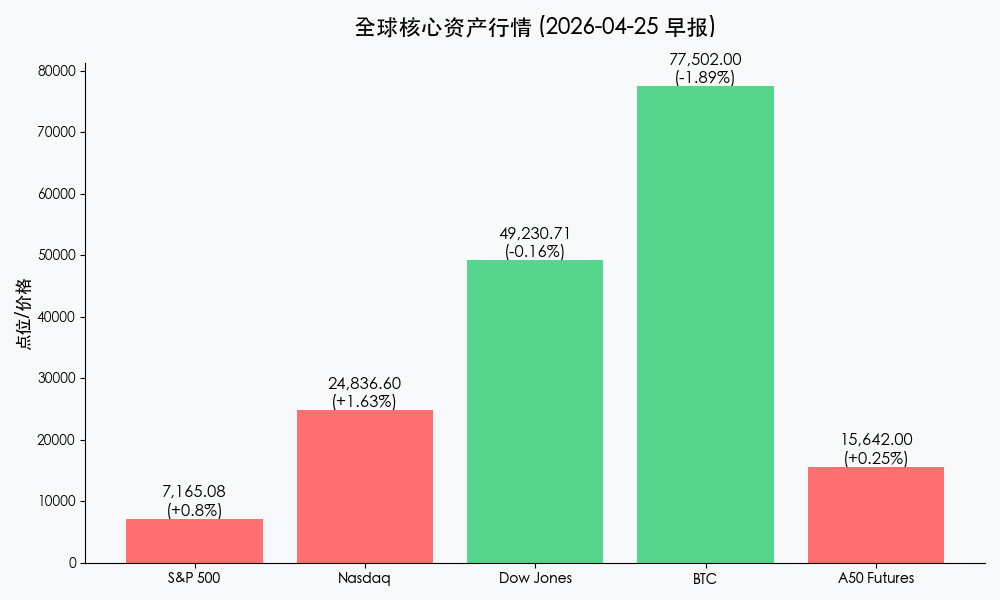
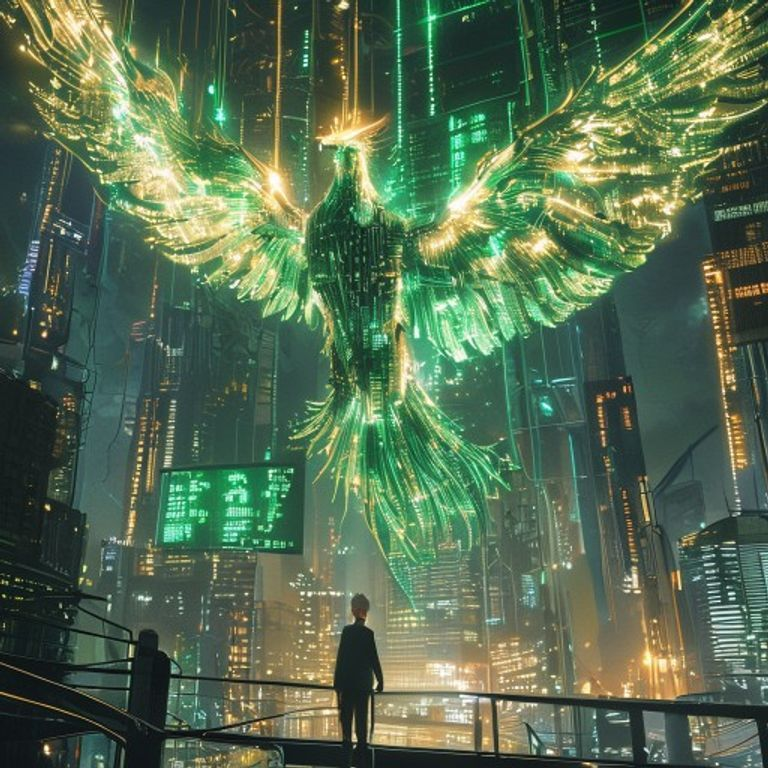

# 早报：纳指标普再创历史新高，芯片之光点燃全球牛市，美联储易主在即

**日期：2026年04月25日 (星期六)** &nbsp; **时段：早报 (08:00)**

> **核心摘要**：美股周五上演疯狂“芯片之夜”，英特尔单日飙升 23% 带动纳指与标普 500 双双刷新历史极值。鲍威尔调查案终结为“鹰派”继任者沃什扫清障碍，地缘局势缓和与强劲经济数据共同支撑风险偏好，全球科技牛市进入新一轮爆发期。

## 核心行情复盘

周五（4月24日）美股市场在半导体板块的暴力拉升下集体走强，纳斯达克与标普 500 指数以前所未有的姿态收于历史最高点。尽管道指微跌，但市场整体赚钱效应极强。

*   **标普 500 指数 (S&P 500)**：收报 **7,165.08点**，上涨 **56.68点**，涨幅 **0.80%**，**再创历史新高**。
*   **纳斯达克综合指数 (Nasdaq)**：收报 **24,836.60点**，上涨 **398.09点**，涨幅 **1.63%**，**再创历史新高**。
*   **道琼斯工业平均指数 (Dow Jones)**：收报 **49,230.71点**，下跌 **79.61点**，跌幅 **0.16%**。
*   **核心债商行情**：
    *   **美债 10 年期收益率**：小幅回落至 **4.31%**，反映出强劲经济数据与避险情绪降温的对冲。
    *   **黄金 (Gold)**：报收 **4743.80美元/盎司**，在地缘担忧减弱背景下维持高位震荡。
    *   **原油 (WTI)**：收于 **93.47美元/桶**，较本周高点显著回落，主要受黎以停火协议延长及美伊谈判预期推动。
*   **加密货币与中国资产 (周六早间)**：
    *   **比特币 (BTC)**：报 **77,502美元**，高位盘整。
    *   **富时中国 A50 期货**：报 **15,642点**，隔夜拉升 **0.25%**，预示下周 A 股开盘情绪偏正面。
    *   **离岸人民币 (USD/CNH)**：报 **6.824**，汇率保持坚挺。

### 领涨/领跌行业分析
1.  **领涨：半导体与 AI 算力（18 连阳奇迹）**
    *   **英特尔 (Intel)**：单日暴涨 **23.6%**，受超预期财报及代工业务重磅突破刺激。
    *   **AMD**：大涨 **13.9%**；**英伟达 (Nvidia)**：上涨 **4.3%**，费城半导体指数续写辉煌。
2.  **领跌：传统工业与避险防御**
    *   在科技股极度吸血效应下，传统工业蓝筹表现低迷，道指受耐克及传统银行股拖累逆市走弱。

## 核心解读与市场逻辑

> **“沃什时代”倒计时：美联储的鹰派转型**
> 随着美国司法部终止对鲍威尔的调查，特朗普提名的继任者**凯文·沃什 (Kevin Warsh)** 已无路障，预计将于 5 月 15 日正式掌舵。沃什此前多次暗示将终止“前瞻性指引”并大幅缩表。市场目前的上涨是基于“短期经济强劲+地缘缓和”的狂欢，但需警惕下半年流动性拐点的隐忧。

> **半导体：从“卖铲人”到“算力主权”**
> 隔夜英特尔的史诗级反弹标志着半导体板块已进入逻辑重估阶段。在 AI 基础设施建设依然供不应求的背景下，资金从高估值软件向“硬科技制造”回归。纳指突破 24000 点不仅仅是数字，更是全球资金对 AI 长期生产力革命的终极投票。

## 政策脉动

*   **中东和平曙光**：黎以停火协议获准延长，且美伊重启外交对话的消息极大地缓解了“第二次通胀冲击”的风险。
*   **美联储 4 月议息会议前瞻**：市场一致预期 4 月 28-29 日将维持利率在 **3.50%-3.75%** 不变。
*   **强劲经济数据支持**：纽约联储上调 Q1 GDP 预期至 2.4%，3 月零售销售环比增长 1.7%，显示出美国消费韧性极强，为美股高估值提供了“软着陆”底座。

## 最新机构观点

*   **高盛 (Goldman Sachs)**：将标普 500 年底目标点位调升至 7500 点，认为 AI 带来的全行业全要素生产率提升才刚刚开始。
*   **摩根士丹利 (Morgan Stanley)**：警告称当前科技股拥挤度达到历史极值，虽然短期动能强劲，但投资者应关注 5 月美联储领导层更迭可能带来的政策风格剧变。
*   **中金公司 (CICC)**：认为海外科技股的强势将通过 A50 和港股科技龙头传导，下周 A 股有望在外部环境回暖带动下重拾升势。

## 今日市场情绪：科技凤凰，涅槃云端

今日市场情绪如同一只由翡翠电路板与金色光辉凝结而成的凤凰，在全球算力的轰鸣声中冲破地缘迷雾，于纳斯达克的巅峰展翅翱翔，映照出数字时代的繁荣盛景。

> Prompt: Manga style, A majestic phoenix made of glowing emerald circuit boards and golden light, soaring above a futuristic cityscape of silicon towers. In the background, a massive digital scoreboard shows glowing green numbers and record highs. A small human trader (real person) stands on a high balcony, looking up in awe at the phoenix., masterpiece, high detail, intricate composition, cinematic lighting, 8k resolution

---
免责声明：内容仅供参考，不构成投资建议。
