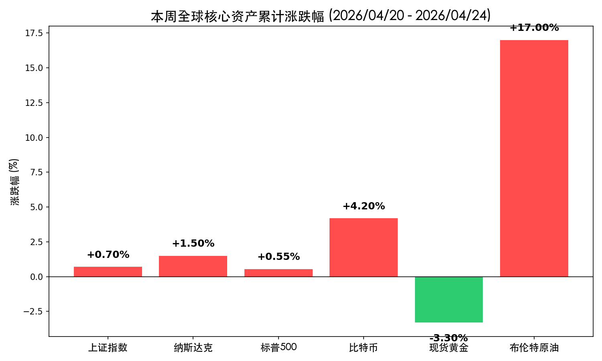
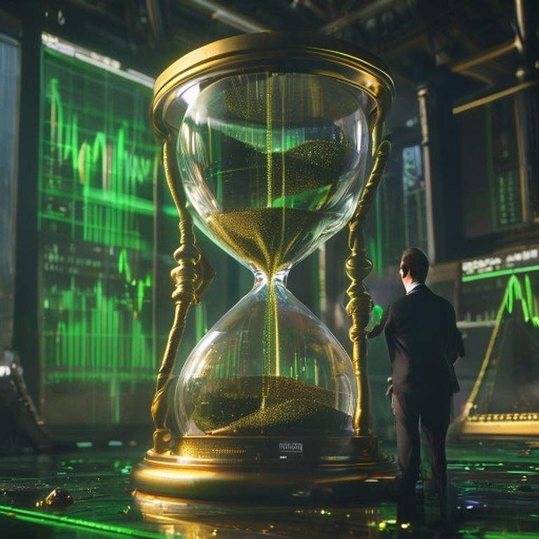

# 新周展望：霍尔木兹“双封锁”阴云笼罩，超级周拉开“算力与利率”决战大幕

**日期：2026年04月26日 (星期日)** &nbsp; **时段：新周展望 (16:30)**

> **核心摘要**：本周末霍尔木兹海峡局势进入“双封锁”僵局，原油周涨幅创历史性 17%，能源危机迫在眉睫。下周市场迎来“超级周”考验：美联储议息会议决定利率走向，Alphabet、微软、Meta 等科技巨头财报将验证 AI 算力变现逻辑。

## 周末财经要闻终极汇总

本周末，地缘政治与能源供应成为了全球市场的唯一焦点，其影响正迅速向供应链下游渗透。

*   **霍尔木兹海峡“双封锁”态势成型**：
    > 伊朗方面继 seizure 扣押两艘集装箱船后，重申“秩序与安全”为红线；而美方实施的“远端封锁”已拦截至少 28 艘伊朗关联船舶。这种“相互封锁”导致海峡航运基本停滞，全球 1/3 的化肥供应及大量原油受阻。
*   **原油市场进入“历史级”波动期**：
    > 布伦特原油本周累计上涨 17% 至 **106.30 美元/桶**。IEA 警告称，若局势持续，这可能演变为全球原油市场历史上最大的供应中断，全球供应缺口或超 1000 万桶/日。
*   **外交斡旋陷入冰点**：
    > 尽管特朗普总统无限期延长停火协议，但伊朗方面拒绝立即重返谈判桌，双方在伊斯兰堡的博弈进入“深水区”，市场对短期达成和平协议的预期显著降温。

## 新一周市场核心博弈逻辑

下周市场的定价逻辑将从“地缘恐慌”转向“基本面硬核碰撞”。

1.  **“通胀幽灵”与美联储的平衡术**：
    > 油价飙升导致的二次通胀风险已无法回避。周三的 FOMC 会议上，市场将极度关注美联储是否会因为能源成本推升 PPI 而调整其利率路径预期。目前市场普遍预期维持现状，但联储对“沃什时代”开启前的鹰派措辞可能是最大波动源。
2.  **Big Tech 财报：AI 算力的“真金白银”考验**：
    > 科技巨头的 AI CAPEX（资本支出）指引将决定半导体板块的延续性。如果 Alphabet 和微软能证明其 AI 投入已转化为实际的订阅增长或广告效率提升，则纳指有望顶住通胀压力续创新高。
3.  **中国资产的“盈利驱动”逻辑验证**：
    > 随着中国 PPI 41个月来首次转正，A 股正从估值修复向盈利兑现转型。下周四发布的官方 PMI 数据将是验证制造业复苏强度的核心指标。

## 本周重磅经济数据与会议前瞻

*   **4月28日 (周二)**：Alphabet (GOOGL)、微软 (MSFT)、Meta 财报（决定科技股风向）；日本央行利率决议。
*   **4月29日 (周三)**：**美联储 (FOMC) 利率决议及新闻发布会**（全球资产定价之锚）；特斯拉 (TSLA) 财报。
*   **4月30日 (周四)**：**美国 3 月 PCE 物价指数**（联储最关注的通胀指标）；亚马逊、苹果、英特尔财报；欧央行 (ECB) 利率决议；中国 4 月制造业 PMI。

## 头部券商/投行开盘策略点睛

*   **高盛 (Goldman Sachs)**：
    > “尽管地缘风险推高了波动率，但我们仍看好具备‘算力主权’的半导体龙头。下周 Big Tech 的财报将是分水岭，建议在 PCE 数据公布前保持中性配置，关注能源对冲工具。”
*   **摩根大通 (JPMorgan)**：
    > “霍尔木兹局势已将避险溢价推至极致。若下周美联储释放足够的‘定力’信号，市场可能出现‘利空出尽’式的报复性反弹。重点关注高股息资产作为防御底仓。”
*   **中信证券 (CITIC)**：
    > “A 股 4000 点关口支撑力度源于 PPI 触底回升带来的工业企业利润预期改善。建议关注‘数字底座’与‘自主化能源’两条主线，利用震荡机会布局被地缘情绪误伤的白马蓝筹。”

## 今日市场情绪：能源沙漏，计时的超级周

今日市场情绪如同一个巨大的黑色沙漏，里面流动的不是沙子，而是深不见底的原油。沙漏的重压让金色的天平缓缓倾斜，而背景中 Big Tech 的数字曲线正试图在通胀的阴影中勾勒出新的繁荣轨迹。交易员们正屏息以待，等待下周“利率与算力”这对双生子的最终裁决。

> Prompt: A massive hourglass filled with black oil instead of sand, its weight bending a golden scale. In the background, a digital screen displays rising green graphs of Big Tech earnings (Alphabet, Microsoft). A human trader (real person) stands in the foreground, looking at the hourglass with a mix of concern and anticipation. Surrealism style, cinematic lighting, 8k resolution.

---
免责声明：内容仅供参考，不构成投资建议。
