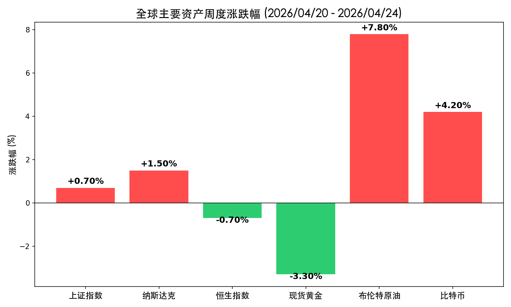
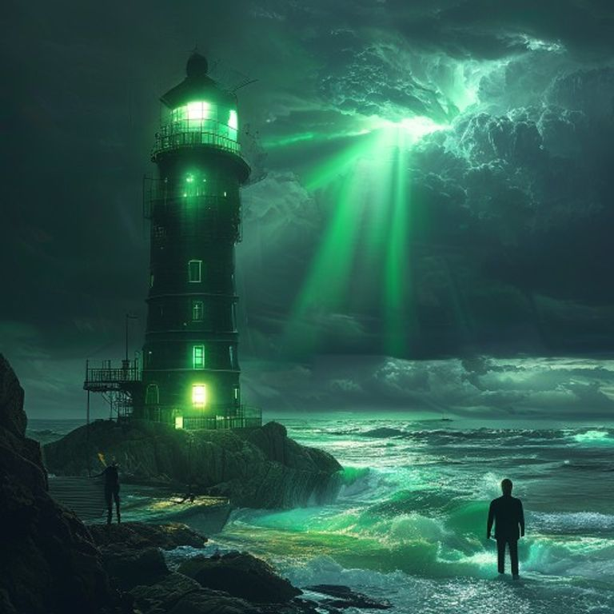

# 全球市场周度复盘：科技光芒穿透地缘阴霾，能源与算力双翼齐飞

**日期：2026年04月26日 (星期日)** &nbsp; **时段：[Morning]**

> **核心摘要**：本周全球市场在美伊冲突导致原油飙升的压力下表现坚韧，纳指受半导体巨头业绩提振创出佳绩。A股冲高回落站稳4000点大关，PPI转正信号开启盈利驱动新逻辑。

## 核心资产周度/日度表现回顾

本周全球资产定价逻辑在“地缘通胀压力”与“科技盈利爆发”之间摇摆。

*   **A股 (上证指数)**：周五收报 **4079.90点** (-0.33%)，全周累计 **上涨 0.7%**。周中一度突破 4100 点创月内新高，成交量能维持在 2.6 万亿以上。
*   **美股 (纳斯达克)**：全周累计 **上涨 1.5%**。英特尔 (Intel) 绩后暴涨 28% 彻底点燃半导体板块，费半指数录得 17 连涨。
*   **港股 (恒生指数)**：全周累计 **下跌 0.7%**，恒生科技指数受获利盘回吐压力走势较弱。
*   **大宗商品**：
    *   **布伦特原油**：暴涨 **7.8%** 至 107.16 美元/桶，受霍尔木兹海峡封锁风险驱动。
    *   **现货黄金**：全周累计 **下跌 3.3%** 至 4690 美元/盎司，避险资金转向防御性科技资产。
*   **加密货币 (BTC)**：全周累计 **上涨 4.2%** 突破 7.9 万美元，ETF 资金持续流入。

## 过去 48 小时重磅事件深度复盘

> **1. 中东局势：冲突升级与能源博弈**
> 霍尔木兹海峡封锁传闻引发能源市场剧震。特朗普表示“不急于结束冲突”令停火预期受挫，原油溢价显著回升。然而，美伊延长的部分停火协议仍为市场留下一线希望，避险黄金因此出现高位回落。
>
> **2. 中国 PPI 41个月来首次转正**
> 3月 PPI 同比增长 0.5%，释放出极强的“再通胀”信号。高盛等机构认为，中国资产的驱动力正从单纯的估值修复转向扎实的盈利增长，这对 A 股 4000 点上方的稳定性提供了核心支撑。
>
> **3. 科技股“超级财报季”开局惊艳**
> 英特尔与英伟达的强劲表现验证了 AI 算力需求的持久性。费城半导体指数的连阳走势成为了美股在通胀担忧下的“定海神针”。

## 下周全球宏观大事预警

*   **周二**：美国 3 月 JOLTs 职位空缺数据。
*   **周三**：美联储官员重要讲话（关注其对油价上涨引发通胀的最新态度）。
*   **周四**：中国 4 月官方制造业 PMI 数据发布。
*   **全周关注**：霍尔木兹海峡通航状态的任何变化。

## 顶级机构周末策略内参摘要

*   **高盛 (Goldman Sachs)**：维持中国股市“增持”评级，预计 2026 年盈利增速将回升至 14%，看好上海、深圳房地产市场率先触底带来的财富效应。
*   **摩根大通 (JPMorgan)**：认为当前是布局中国股票的“黄金切入点”，AI 投资仍是全球配置的核心，预测 2026 年全球股市仍有双位数增长空间。
*   **中金公司 (CICC)**：A 股/港股牛市格局未变，建议关注能源、硬科技及高股息资产的均衡配置，PPI 转正将加速上游行业利润释放。

## 今日市场情绪：芯片灯塔，映照红海

今日市场情绪如同一座由翠绿芯片构筑的坚定灯塔，在油轮般的乌云与红色的地缘波浪中矗立，其放射出的算力之光不仅平复了通胀的喧嚣，更为迷航的资本指明了数字繁荣的彼岸。

> Prompt: Surrealism style, A giant lighthouse shaped like a glowing green microchip standing firmly on a rocky shore, casting a brilliant emerald light across a turbulent dark sea. In the background, massive storm clouds in the shape of oil tankers are being dispelled by the microchip's light. A human trader (real person) stands on the balcony of the lighthouse, looking at the horizon., masterpiece, high detail, intricate composition, cinematic lighting, 8k resolution

---
免责声明：内容仅供参考，不构成投资建议。
