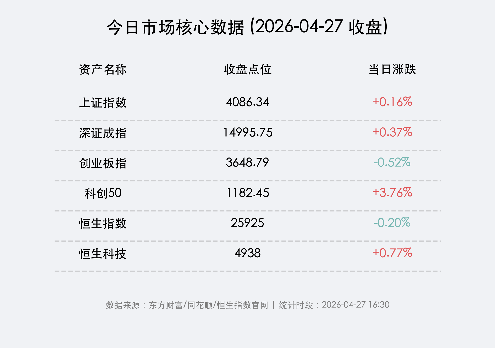
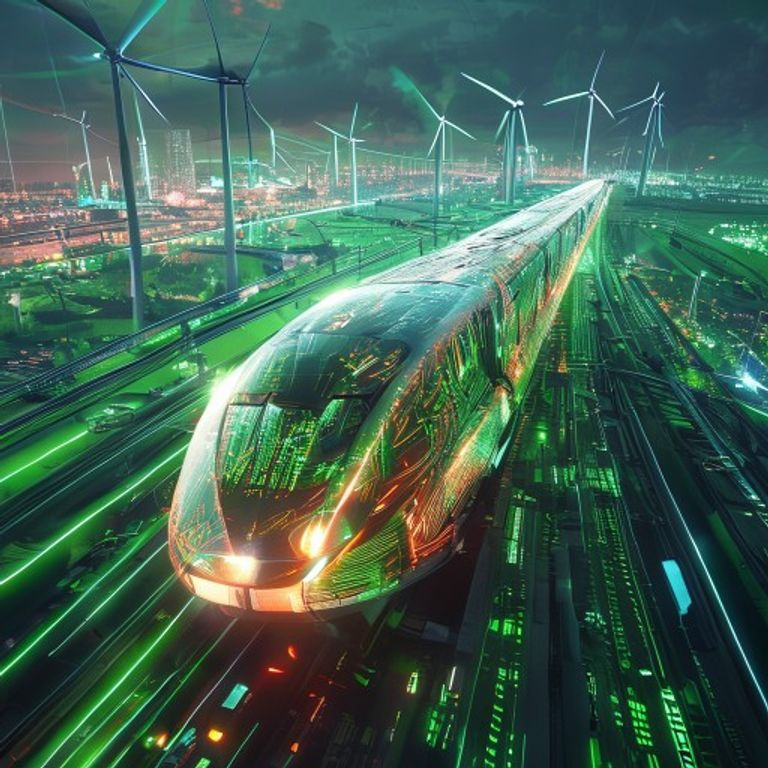

# 收盘报：科创板全线爆发，芯片产业链掀起涨停狂潮

**日期：2026年04月27日 (星期一)** &nbsp; **时段：晚报 (16:30)**

> **核心摘要**：今日 A 股呈现极强的板块效应，科创 50 指数在大基金三期投向明确及半导体国产化提速的利好下全线爆发，收盘大涨 **3.76%**。尽管北向资金小幅流出防御蓝筹，但两市成交额仍维持在 **2.59 万亿元** 的超高水位，市场风格正从题材博弈加速转向“业绩+政策”双驱动的成长主线。

## 核心行情复盘

周一 A 股市场呈现分化走势，科创板在半导体产业链的带动下成为全场焦点。市场资金在年报披露窗口期表现出强烈的“择优而入”特征，绩优科技股受到狂热追捧。

*   **上证指数**：报收 **4086.34点**，上涨 **0.16%**，继续稳固 4000 点上方阵地。
*   **深证成指**：报收 **14995.75点**，上涨 **0.37%**。
*   **创业板指**：报收 **3648.79点**，微跌 **0.52%**，受部分权重医疗股拖累表现稍弱。
*   **科创 50 指数**：报收 **1182.45点**，大幅上涨 **3.76%**，领跑全场。
*   **恒生指数**：报收 **25925点**，下跌 **0.20%**。
*   **恒生科技指数**：报收 **4938点**，上涨 **0.77%**。
*   **成交额**：沪深两市全天成交额合计 **2.59万亿元**，较上一交易日小幅缩量，但已连续多日保持在 2 万亿关口之上。

### 领涨/领跌行业分析
1.  **领涨：半导体与机器人**
    *   半导体产业链全线爆发，中芯国际、华虹半导体等巨头大涨，芯片、先进封装、电子化学品板块多股涨停，市场预期“大基金三期”将重点投向先进制程。
    *   受“十五五”电力规划万亿投资落地及 AI 算力电力需求提振，绿电及高端制造机器人概念表现活跃。
2.  **领跌：资源品与避险板块**
    *   稀土、小金属板块回撤明显，前期受地缘局势驱动的资源股出现获利回吐。
    *   白酒、航海装备表现平平，资金从防御性板块抽离，流向高弹性的科技赛道。

## 核心解读与市场逻辑

> **“科创牛”的底层逻辑：从估值修复到业绩验证**
> 今日科创 50 的异动并非偶然。随着年报披露步入尾声，半导体行业一季度的强劲复苏数据为市场注入了强心针。在“自主可控”战略与 AI 硬件爆发的双重驱动下，半导体已不仅仅是题材，而是具备明确利润增长预期的核心赛道。

> **流动性管理精准，MLF 延续缩量平价**
> 央行今日开展 4000 亿元 MLF 操作，实现净回笼 2000 亿元。这显示出监管层在保持流动性合理充裕的同时，更倾向于精准投放，避免资金在金融体系内空转，引导资金流向新质生产力领域。

## 政策脉动

*   **“十五五”电力基建规划落地**：明确了万亿级别的投资规模，特别强调了数据中心绿电占比需不低于 80%，这为电力设备和新能源发电提供了长期的增长斜率。
*   **打击财务造假专项行动**：证监会部署 2026 年专项行动，严厉打击财务造假，旨在净化市场环境，推动资金向合规、绩优的头部企业集中。
*   **交易制度优化**：三大交易所将盘后固定价格交易扩展至全部 A 股，进一步提升了市场的交易便利性与流动性覆盖度。

## 最新机构观点

*   **中信证券 (CITIC)**：认为当前市场正处于“风格切换”的关键期，建议投资者坚定拥抱**半导体、国产算力**等硬科技主线，警惕月底部分绩差股的退市风险。
*   **银河证券 (Galaxy Securities)**：看好 AI 驱动下的消费电子和 PCB 板块，认为 AI 手机与 PC 的换机潮将成为二季度电子板块超额收益的主要来源。
*   **中金公司 (CICC)**：指出 A 股整体估值仍处于历史合理区间，随着 PPI 数据的转正，工业企业利润回升将支撑指数重心稳步上移。

## 今日市场情绪：硬核科技的“狂飙”时刻

今日市场情绪如同一列由芯片和绿能驱动的未来列车，在数字激光铺就的轨道上全速前进。投资者对国产替代的坚定信心与对 AI 时代的无限憧憬，共同交织成一幅科技狂飙的视觉盛宴。

> Prompt: Cyberpunk style, A high-speed train made of glowing semiconductor wafers and circuit patterns, racing along a green laser track powered by giant wind turbines. A human trader (real person) stands in the cockpit, looking forward confidently. The background is a mix of high-tech cities and renewable energy fields., masterpiece, high detail, intricate composition, cinematic lighting, 8k resolution

---
**免责声明**：内容仅供参考，不构成投资建议。市场有风险，投资需谨慎。
